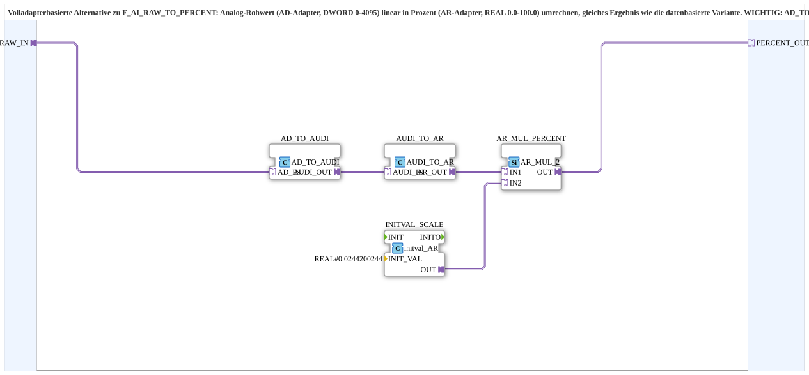

# F_AI_RAW_TO_PERCENT_AD

* * * * * * * * * *

## Einleitung

`F_AI_RAW_TO_PERCENT_AD` ist die volladapterbasierte Alternative zu [`F_AI_RAW_TO_PERCENT`](./F_AI_RAW_TO_PERCENT.md): derselbe rohe Analog-Rohwert (0-4095) wird über AD-/AR-Adapter statt über normale Datenverbindungen linear in Prozent umgerechnet — identisches Ergebnis, andere Verdrahtungsart.

> **⚠️ Wichtiger Hinweis aus dem Baustein-Kommentar:** `AD_TO_AR`/`F_DWORD_TO_REAL` wäre hier **falsch** — das ist eine Bit-Reinterpretation (IEEE754-Cast), keine numerische Umwandlung (siehe `forte_real.cpp`, `CIEC_REAL::setValue`, `case e_DWORD: setValueSimple`). Der korrekte Weg ist `AD_TO_AUDI` (Bit-Reinterpretation DWORD→UDINT, hier gültig, gleiche Bitbreite/Darstellung) gefolgt von `AUDI_TO_AR` (nutzt intern `F_UDINT_TO_REAL`, echte numerische Umwandlung). Details siehe [Numerisch vs. bitweise: Die Konvertierungs-Falle in FORTE](../../../../Bibliotheken/ExternalLibraries/adapter/conversion/unidirectional/Numerisch_vs_Bitweise.md).

## Verwendete Funktionsbausteine (FBs)

### Sub-Bausteine: F_AI_RAW_TO_PERCENT_AD

- **Typ**: SubAppType
- **Verwendete interne FBs**:
    - **AD_TO_AUDI**: `adapter::conversion::unidirectional::AD_TO_AUDI` — Bit-Reinterpretation DWORD-Adapter→UDINT-Adapter.
    - **AUDI_TO_AR**: `adapter::conversion::unidirectional::AUDI_TO_AR` — echter numerischer Cast UDINT-Adapter→REAL-Adapter.
    - **INITVAL_SCALE**: `adapter::types::unidirectional::AR::initval::initval_AR` — liefert die Konstante `REAL#0.0244200244` (= 100/4095) als Adapter.
    - **AR_MUL_PERCENT**: `adapter::iec61131::arithmetic::AR_MUL_2` — Multiplikation zweier REAL-Adapter.
- **Funktionsweise**: `RAW_IN` (AD-Adapter, 0-4095) → `AD_TO_AUDI` → `AUDI_TO_AR` → multipliziert mit der Konstante → `PERCENT_OUT` (AR-Adapter, 0.0-100.0).

## Programmablauf und Verbindungen

1. `RAW_IN` → `AD_TO_AUDI.AD_IN` → `AD_TO_AUDI.AUDI_OUT` → `AUDI_TO_AR.AUDI_IN` → `AUDI_TO_AR.AR_OUT` → `AR_MUL_PERCENT.IN1`.
2. `INITVAL_SCALE.OUT` (Konstante 0.0244200244) → `AR_MUL_PERCENT.IN2`.
3. `AR_MUL_PERCENT.OUT` → `PERCENT_OUT`.

## Technische Besonderheiten

- **Bewusstes Negativ-Beispiel im Kommentar**: Der Baustein-Kommentar dokumentiert explizit, warum `AD_TO_AR` hier falsch wäre — eine seltene, aber wertvolle "Anti-Pattern"-Dokumentation direkt im Quellcode.
- **Adapterkonstante statt Parameter**: Die Skalierungskonstante wird über `initval_AR` als Adapter bereitgestellt statt als klassischer FB-Parameter — konsistent mit der volladapterbasierten Philosophie des Bausteins.

## Anwendungsszenarien

- Wie `F_AI_RAW_TO_PERCENT`, aber für SubApp-Netzwerke, die durchgängig auf Adapterverbindungen statt klassischen Datenverbindungen aufgebaut sind.

## Zusammenfassung

`F_AI_RAW_TO_PERCENT_AD` liefert dieselbe numerisch korrekte DWORD→REAL-Prozentumrechnung wie `F_AI_RAW_TO_PERCENT`, vollständig adapterbasiert — und dokumentiert dabei explizit die Bit-Reinterpretations-Falle, die bei einer naiven `AD_TO_AR`-Verdrahtung entstünde.

---

### 🌐 Passende Themen-Unterseiten auf ms-muc-docs.de

- [🌐 Eclipse 4diac IDE & Farb-Referenz auf ms-muc-docs.de](https://www.ms-muc-docs.de/iec-61499/eclipse-4diac/)
