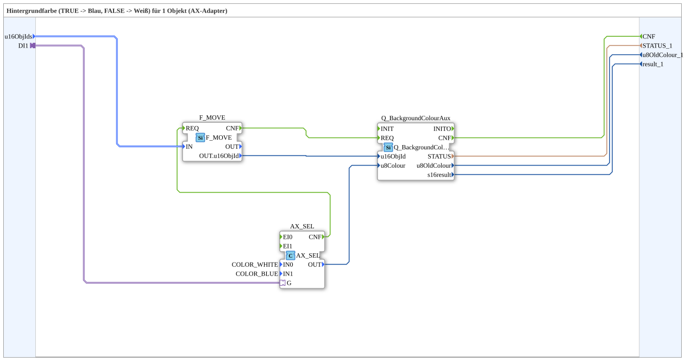

# GreenBlueBackground1_aux_AXS

* * * * * * * * * *

## Einleitung

`GreenBlueBackground1_aux_AXS` schaltet die VT-Hintergrundfarbe eines Objekts anhand eines booleschen Selector-Signals: `TRUE` → **Blau**, `FALSE` → **Weiß**. Das Selector-Signal kommt über einen `AX`-Adapter-Socket (`DI1`). Die Objekt-ID wird über den strukturierten Typ `s1ObjectID` (`u16ObjIds`) übergeben.

Allgemeines Muster (Selector → `AX_SEL`/`F_SEL` → `Q_BackgroundColour`) siehe [Background-Farbbausteine (gemeinsames Muster)](./Background-Farbbausteine.md).

## Zusammenfassung

Eine von vielen Varianten der Background-Farbbausteine-Familie: Farbpaar Blau/Weiß, 1 Objekt, Adapter-Selector, struct. Objekt-ID.

---

### 🌐 Passende Themen-Unterseiten auf ms-muc-docs.de

* [🌐 Eclipse 4diac IDE & Farb-Referenz auf ms-muc-docs.de](https://www.ms-muc-docs.de/iec-61499/eclipse-4diac/)
