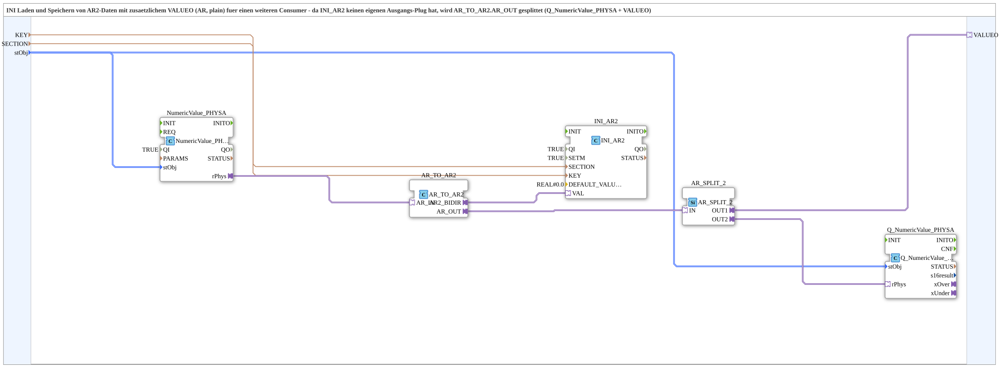

# INI_IN_AND_STORE_AR2

* * * * * * * * * *

## Einleitung

`INI_IN_AND_STORE_AR2` ist die AR2-Adapter-Variante von [`INI_IN_AND_STORE_AR`](./INI_IN_AND_STORE_AR.md): ein per VT eingegebener physikalisch skalierter REAL-Wert (`NumericValue_PHYSA`) wird persistent in einer INI-Datei gespeichert (`eclipse4diac::storage::INI_AR2`, Speicherung ueber den AR2-Adaptersocket statt Klartextwert). Da `INI_AR2` keinen eigenen Ausgangs-Plug besitzt, wird der `AR_TO_AR2`-Ausgang per `AR_SPLIT_2` verdoppelt: einmal zurueck auf die VT-Anzeige (`Q_NumericValue_PHYSA`), einmal nach aussen auf `VALUEO` fuer einen weiteren Consumer.

Allgemeines Muster siehe [INI_IN_AND_STORE / NVS_IN_AND_STORE (gemeinsames Muster)](./INI-NVS-Speicherbausteine.md).

## Technische Besonderheiten

- `SETM=TRUE`: eine Live-Aenderung waehrend des laufenden Betriebs wird sofort bestaetigt/zurueckgemeldet, nicht nur beim Boot - wichtig, da der frische Wert im selben Lauf ueber `VALUEO` weiterverwendet werden kann.
- `AR_TO_AR2` wandelt den plain-AR-Wert des VT-Eingabefelds in den bidirektionalen AR2-Adapter, den `INI_AR2` fuer die Speicherung erwartet.

## Zusammenfassung

AR2-Adapter-Variante der INI-Speicherfamilie, mit zusaetzlichem `VALUEO`-Ausgang fuer einen weiteren Consumer.

---

### 🌐 Passende Themen-Unterseiten auf ms-muc-docs.de

- [🌐 Eclipse 4diac IDE & Farb-Referenz auf ms-muc-docs.de](https://www.ms-muc-docs.de/iec-61499/eclipse-4diac/)
