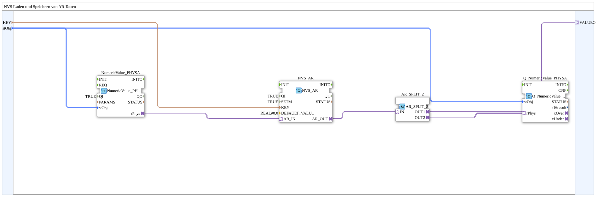

# NVS_IN_AND_STORE_AR

* * * * * * * * * *

## Einleitung

`NVS_IN_AND_STORE_AR` speichert einen über VT eingegebenen physikalisch skalierten REAL-Wert (AR-Adapter) persistent im ESP32-Flash (NVS) — sonst identisch zu [`INI_IN_AND_STORE_AR`](./INI_IN_AND_STORE_AR.md).

Allgemeines Muster siehe [INI_IN_AND_STORE / NVS_IN_AND_STORE (gemeinsames Muster)](./INI-NVS-Speicherbausteine.md).

## Zusammenfassung

NVS-Pendant zu `INI_IN_AND_STORE_AR`.

---

### 🌐 Passende Themen-Unterseiten auf ms-muc-docs.de

* [🌐 Eclipse 4diac IDE & Farb-Referenz auf ms-muc-docs.de](https://www.ms-muc-docs.de/iec-61499/eclipse-4diac/)
