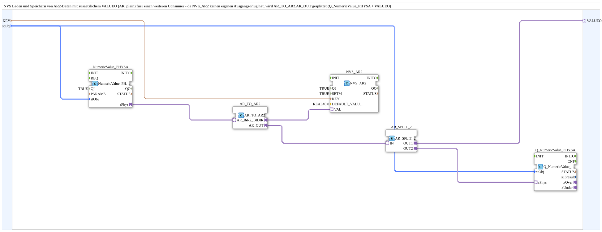

# NVS_IN_AND_STORE_AR2

* * * * * * * * * *

## Einleitung

`NVS_IN_AND_STORE_AR2` ist die AR2-Adapter-Variante von `NVS_IN_AND_STORE_AR` (ESP32-Flash-Speicherung statt INI-Datei): ein per VT eingegebener physikalisch skalierter REAL-Wert wird ueber `logiBUS::storage::esp32_nvs::NVS_AR2` persistent im NVS-Flash gespeichert. Da `NVS_AR2` (anders als die INI-Variante) auch kein eigenes `SECTION` kennt, entfaellt dieser Parameter gegenueber `INI_IN_AND_STORE_AR2`. Wie dort wird `AR_TO_AR2.AR_OUT` per `AR_SPLIT_2` verdoppelt: VT-Anzeige (`Q_NumericValue_PHYSA`) + `VALUEO` fuer einen weiteren Consumer.

Allgemeines Muster siehe [INI_IN_AND_STORE / NVS_IN_AND_STORE (gemeinsames Muster)](./INI-NVS-Speicherbausteine.md).

## Technische Besonderheiten

- `SETM=TRUE`, gleiche Begruendung wie bei [`INI_IN_AND_STORE_AR2`](./INI_IN_AND_STORE_AR2.md): Live-Aenderungen werden sofort bestaetigt, nicht erst beim naechsten Boot.
- Kein `SECTION`-Parameter, da NVS-Keys flach organisiert sind (kein INI-Abschnittskonzept).

## Zusammenfassung

AR2-Adapter-Variante der NVS-Speicherfamilie (ESP32-Flash statt INI-Datei), mit zusaetzlichem `VALUEO`-Ausgang.

---

### 🌐 Passende Themen-Unterseiten auf ms-muc-docs.de

- [🌐 Eclipse 4diac IDE & Farb-Referenz auf ms-muc-docs.de](https://www.ms-muc-docs.de/iec-61499/eclipse-4diac/)
