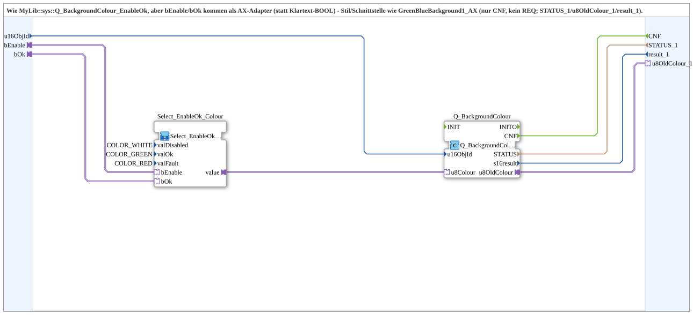

# Q_BackgroundColour_EnableOk_AX

* * * * * * * * * *

## Einleitung

`Q_BackgroundColour_EnableOk_AX` entspricht `Q_BackgroundColour_EnableOk`, aber `bEnable`/`bOk` kommen als AX-Adapter (statt Klartext-BOOL) - Stil/Schnittstelle wie die bestehende GreenBlueBackground1_AX/GreenRedBackground1_AX-Familie: nur `CNF` (kein `REQ`), zusaetzlich `STATUS_1`/`u8OldColour_1`/`result_1` als benannte Ausgaenge.

## Verwendete Funktionsbausteine (FBs)

- **Select_EnableOk_Colour** (SubApp, Typ `MyLib::sys::Select_EnableOk_AX`): `valDisabled=COLOR_WHITE`, `valOk=COLOR_GREEN`, `valFault=COLOR_RED`.
- **Q_BackgroundColour** (`isobus::UT::Q::Q_BackgroundColour_AUS`): AUS-Adapter-Variante, schreibt die Farbe auf `u16ObjId` und liefert `u8OldColour_1` (alte Farbe) als AUS-Adapter zurueck.

## Zusammenfassung

AX-Adapter-Variante von [`Q_BackgroundColour_EnableOk`](../../MyLib_B/sys/Q_BackgroundColour_EnableOk.md), passend zur bestehenden GreenBlueBackground1_AX/GreenRedBackground1_AX-Familie.

---

### 🌐 Passende Themen-Unterseiten auf ms-muc-docs.de

- [🌐 Eclipse 4diac IDE & Farb-Referenz auf ms-muc-docs.de](https://www.ms-muc-docs.de/iec-61499/eclipse-4diac/)
