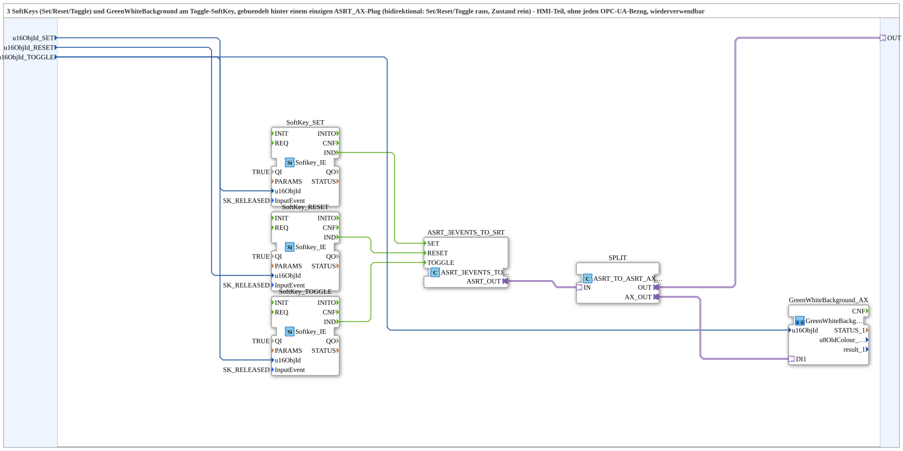

# SoftKeySRT_ASRT_AX

* * * * * * * * * *

## Einleitung

`SoftKeySRT_ASRT_AX` buendelt 3 SoftKeys (Set/Reset/Toggle) und ein `GreenWhiteBackground1_AX` (am Toggle-SoftKey) hinter einem einzigen `ASRT_AX`-Plug (bidirektional: Set/Reset/Toggle gehen raus, Zustand kommt rein). Reiner HMI-Baustein ohne jeden OPC-UA-Bezug - das SR+Toggle-Gegenstueck zu [`SoftKeySR_ASR_AX`](./SoftKeySR_ASR_AX.md).

## Verwendete Funktionsbausteine (FBs)

- **SoftKey_SET / SoftKey_RESET / SoftKey_TOGGLE** (`isobus::UT::io::Softkey::Softkey_IE`, `InputEvent=SK_RELEASED`): die 3 physischen SoftKeys.
- **ASRT_3EVENTS_TO_SRT** (`adapter::conversion::unidirectional::ASRT_3EVENTS_TO_SRT`): wandelt die 3 SoftKey-Events in ein ASRT-Adapter-Ereignistripel.
- **SPLIT** (`adapter::events::bidirectional::ASRT_TO_ASRT_AX_SPLIT`): verzweigt den bidirektionalen `ASRT_AX`-Verkehr auf `OUT` und auf das Background-Element.
- **GreenWhiteBackground_AX** (SubApp, Typ `MyLib::sys::GreenWhiteBackground1_AX`): Statusfarbe am Toggle-SoftKey.

## Zusammenfassung

Wiederverwendbarer Set/Reset/Toggle-mit-Statusanzeige-Baustein, gebuendelt hinter einem `ASRT_AX`-Adapter - das HMI-Gegenstueck zu [`Uebung_010e_PC_A_OPC_Adapter`](./Uebung_010e_PC_A_OPC_Adapter.md)/[`Uebung_010e_PC_B_OPC_Adapter`](./Uebung_010e_PC_B_OPC_Adapter.md).

---

### 🌐 Passende Themen-Unterseiten auf ms-muc-docs.de

- [🌐 Eclipse 4diac IDE & Farb-Referenz auf ms-muc-docs.de](https://www.ms-muc-docs.de/iec-61499/eclipse-4diac/)
