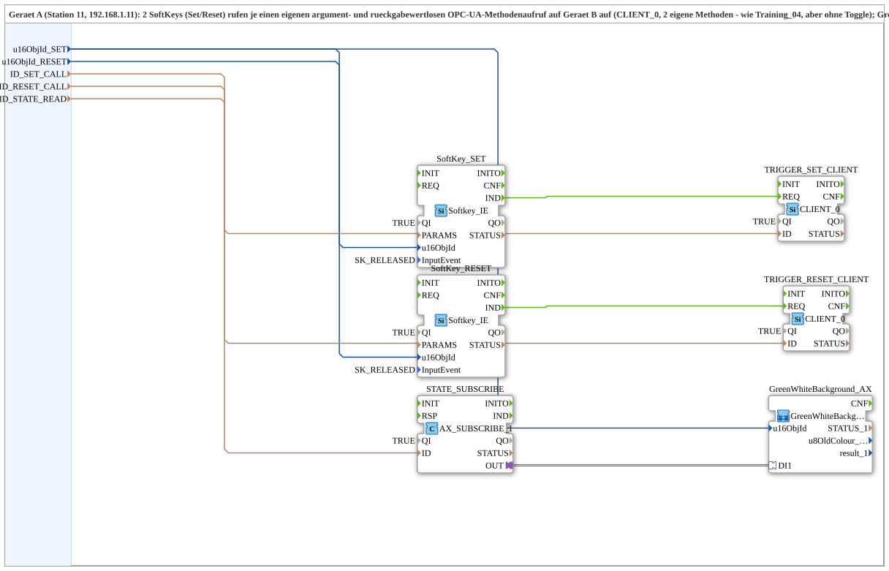

# SoftKeySR_PC_A_OPC

* * * * * * * * * *

## Einleitung

`SoftKeySR_PC_A_OPC` ist die Geraet-A-Seite (Station 11, 192.168.1.11) eines PC-zu-PC-OPC-UA-Set/Reset-Musters: 2 SoftKeys (Set/Reset) rufen je einen eigenen argument- und rueckgabewertlosen OPC-UA-Methodenaufruf auf Geraet B auf (`CLIENT_0`, 2 eigene Methoden - wie Training_04, aber ohne Toggle). `GreenWhiteBackground1_AX` am Set-SoftKey zeigt den von Geraet B lokal ueberwachten Flipflop-Zustand. "SUB style": das Protokoll steckt im `MyLib::sys`-Composite, nicht in der Resource des Geraets - Gegenstueck: [`SoftKeySR_PC_B_OPC`](./SoftKeySR_PC_B_OPC.md).

## Verwendete Funktionsbausteine (FBs)

- **SoftKey_SET / SoftKey_RESET** (`isobus::UT::io::Softkey::Softkey_IE`): die beiden physischen SoftKeys.
- **TRIGGER_SET_CLIENT / TRIGGER_RESET_CLIENT** (`iec61499::net::CLIENT_0`): rufen je eine eigene argumentlose Remote-Methode auf Geraet B auf (`ID_SET_CALL`/`ID_RESET_CALL`).
- **STATE_SUBSCRIBE** (`adapter::net::AX_SUBSCRIBE_1`): abonniert den Flipflop-Zustand unter `ID_STATE_READ`.
- **GreenWhiteBackground_AX** (SubApp, Typ `MyLib::sys::GreenWhiteBackground1_AX`): zeigt den Zustand am Set-SoftKey an.

## Zusammenfassung

Geraet-A-Seite eines Set/Reset-RPC-Musters mit 2 eigenen Methodenaufrufen (statt einem String-Parameter) und Zustandsrueckmeldung.

---

### 🌐 Passende Themen-Unterseiten auf ms-muc-docs.de

- [🌐 Eclipse 4diac IDE & Farb-Referenz auf ms-muc-docs.de](https://www.ms-muc-docs.de/iec-61499/eclipse-4diac/)
