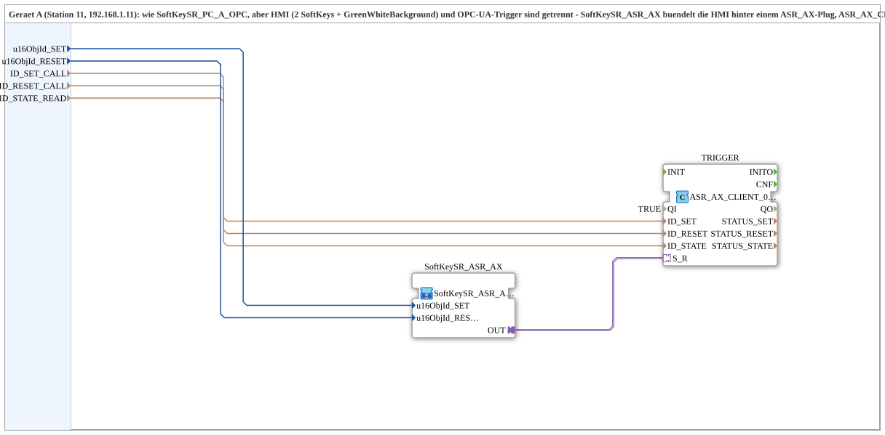

# SoftKeySR_PC_A_OPC_Adapter

* * * * * * * * * *

## Einleitung

`SoftKeySR_PC_A_OPC_Adapter` ist die adapter-gebuendelte Variante von [`SoftKeySR_PC_A_OPC`](./SoftKeySR_PC_A_OPC.md) (Geraet A, Station 11): HMI (2 SoftKeys + `GreenWhiteBackground`) und OPC-UA-Trigger sind getrennt. [`SoftKeySR_ASR_AX`](./SoftKeySR_ASR_AX.md) buendelt die HMI hinter einem `ASR_AX`-Plug; `ASR_AX_CLIENT_0_SUBSCRIBE_1` buendelt die 2 `CLIENT_0`-Instanzen + `AX_SUBSCRIBE_1` hinter einem `ASR_AX`-Socket. Gegenstueck: [`SoftKeySR_PC_B_OPC_Adapter`](./SoftKeySR_PC_B_OPC_Adapter.md).

## Verwendete Funktionsbausteine (FBs)

- **SoftKeySR_ASR_AX** (SubApp, Typ `MyLib::sys::SoftKeySR_ASR_AX`): 2 SoftKeys + Statusanzeige, gebuendelt hinter einem `ASR_AX`-Plug.
- **TRIGGER** (`adapter::net::ASR_AX_CLIENT_0_SUBSCRIBE_1`): buendelt 2 Methodenaufrufe (`ID_SET_CALL`/`ID_RESET_CALL`) und Zustands-Abo (`ID_STATE_READ`) hinter einem einzigen `ASR_AX`-Socket.

## Zusammenfassung

Adapter-gebuendelte Variante von `SoftKeySR_PC_A_OPC`: HMI und Netzwerkprotokoll sauber getrennt, wiederverwendbar ueber [`SoftKeySR_ASR_AX`](./SoftKeySR_ASR_AX.md).

---

### 🌐 Passende Themen-Unterseiten auf ms-muc-docs.de

- [🌐 Eclipse 4diac IDE & Farb-Referenz auf ms-muc-docs.de](https://www.ms-muc-docs.de/iec-61499/eclipse-4diac/)
