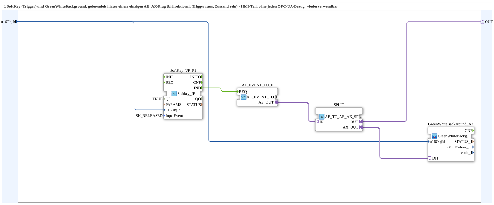

# SoftKeyT_AE_AX

* * * * * * * * * *

## Einleitung

`SoftKeyT_AE_AX` buendelt 1 SoftKey (Trigger) und ein `GreenWhiteBackground1_AX` hinter einem einzigen `AE_AX`-Plug (bidirektional: Trigger geht raus, Zustand kommt rein). Reiner HMI-Baustein ohne jeden OPC-UA-Bezug - wiederverwendbar in jedem Netzwerk, das einen einzelnen Trigger-SoftKey mit Zustandsanzeige braucht.

## Verwendete Funktionsbausteine (FBs)

- **SoftKey_UP_F1** (`isobus::UT::io::Softkey::Softkey_IE`, `InputEvent=SK_RELEASED`): physischer SoftKey.
- **AE_EVENT_TO_E** (`adapter::conversion::unidirectional::AE_EVENT_TO_E`): wandelt den SoftKey-Event in ein AE-Adapter-Ereignis.
- **GreenWhiteBackground_AX** (SubApp, Typ `MyLib::sys::GreenWhiteBackground1_AX`): Statusfarbe direkt auf demselben Objekt.
- **SPLIT** (`adapter::events::bidirectional::AE_TO_AE_AX_SPLIT`): verzweigt den bidirektionalen `AE_AX`-Verkehr auf den externen Plug `OUT` und intern auf das Background-Element.

## Programmablauf und Verbindungen

`SoftKey_UP_F1.IND` -> `AE_EVENT_TO_E.REQ` -> `SPLIT.IN` -> `OUT` (nach aussen) und `SPLIT.AX_OUT` -> `GreenWhiteBackground_AX.DI1` (Zustandsanzeige).

## Zusammenfassung

Wiederverwendbarer Ein-Tasten-Trigger-mit-Statusanzeige-Baustein, gebuendelt hinter einem `AE_AX`-Adapter - das HMI-Gegenstueck zu den PC_A/PC_B-OPC-Netzwerkbausteinen wie [`SoftKeyT_PC_A_OPC_Adapter`](./SoftKeyT_PC_A_OPC_Adapter.md).

---

### 🌐 Passende Themen-Unterseiten auf ms-muc-docs.de

- [🌐 Eclipse 4diac IDE & Farb-Referenz auf ms-muc-docs.de](https://www.ms-muc-docs.de/iec-61499/eclipse-4diac/)
