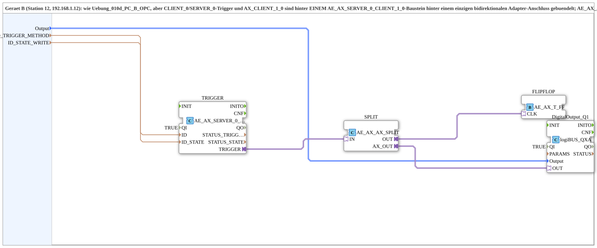

# SoftKeyT_PC_B_OPC_Adapter

* * * * * * * * * *

## Einleitung

`SoftKeyT_PC_B_OPC_Adapter` ist die adapter-gebuendelte Variante von [`Uebung_010d_PC_B_OPC`](./Uebung_010d_PC_B_OPC.md) (Geraet B, Station 12): `CLIENT_0`/`SERVER_0`-Trigger und `AX_CLIENT_1_0` sind hinter EINEM `AE_AX_SERVER_0_CLIENT_1_0`-Baustein hinter einem einzigen bidirektionalen Adapter-Anschluss gebuendelt; `AE_AX_AX_SPLIT` speist sowohl `DigitalOutput_Q1` als auch die Toggle-Flipflop-Logik (`AE_AX_T_FF`). Gegenstueck: [`SoftKeyT_PC_A_OPC_Adapter`](./SoftKeyT_PC_A_OPC_Adapter.md).

## Verwendete Funktionsbausteine (FBs)

- **TRIGGER** (`adapter::net::AE_AX_SERVER_0_CLIENT_1_0`): buendelt Server-Empfang (`ID_TRIGGER_METHOD`) und Zustands-Rueckmeldung (`ID_STATE_WRITE`).
- **SPLIT** (`adapter::events::bidirectional::AE_AX_AX_SPLIT`): verzweigt den Trigger auf physischen Ausgang + Flipflop-Logik.
- **FLIPFLOP** (`adapter::events::bidirectional::AE_AX_T_FF`): Toggle-Flipflop-Logik als Adapter-Baustein.
- **DigitalOutput_Q1** (`logiBUS::io::DQ::logiBUS_QXA`): physischer Ausgang.

## Zusammenfassung

Adapter-gebuendelte Variante von `Uebung_010d_PC_B_OPC`: Netzwerkprotokoll und Flipflop-Logik als wiederverwendbare Adapter-Bausteine statt einzeln verdrahteter FBs.

---

### 🌐 Passende Themen-Unterseiten auf ms-muc-docs.de

- [🌐 Eclipse 4diac IDE & Farb-Referenz auf ms-muc-docs.de](https://www.ms-muc-docs.de/iec-61499/eclipse-4diac/)
