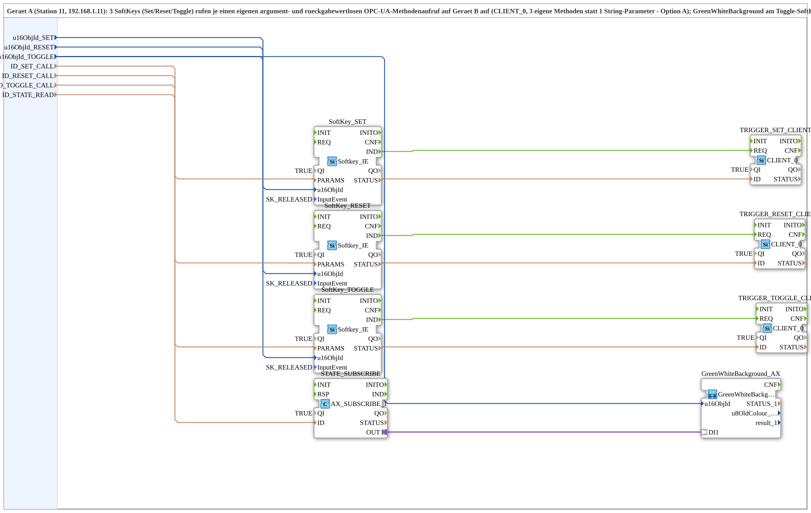

# Uebung_010e_PC_A_OPC

* * * * * * * * * *

## Einleitung

`Uebung_010e_PC_A_OPC` ist die Geraet-A-Seite (Station 11, 192.168.1.11) der PC-zu-PC-OPC-UA-Variante von Uebung 010e (SR+Toggle-Flipflop via 3 SoftKeys): 3 SoftKeys (Set/Reset/Toggle) rufen je einen eigenen argument- und rueckgabewertlosen OPC-UA-Methodenaufruf auf Geraet B auf (`CLIENT_0`, 3 eigene Methoden statt 1 String-Parameter - Option A). `GreenWhiteBackground1_AX` am Toggle-SoftKey zeigt den von Geraet B lokal ueberwachten Flipflop-Zustand. Gegenstueck: [`Uebung_010e_PC_B_OPC`](./Uebung_010e_PC_B_OPC.md).

## Verwendete Funktionsbausteine (FBs)

- **SoftKey_SET / SoftKey_RESET / SoftKey_TOGGLE** (`isobus::UT::io::Softkey::Softkey_IE`): die 3 physischen SoftKeys.
- **TRIGGER_SET_CLIENT / TRIGGER_RESET_CLIENT / TRIGGER_TOGGLE_CLIENT** (`iec61499::net::CLIENT_0`): je eine eigene Remote-Methode (`ID_SET_CALL`/`ID_RESET_CALL`/`ID_TOGGLE_CALL`).
- **STATE_SUBSCRIBE** (`adapter::net::AX_SUBSCRIBE_1`): abonniert den Flipflop-Zustand unter `ID_STATE_READ`.
- **GreenWhiteBackground_AX** (SubApp, Typ `MyLib::sys::GreenWhiteBackground1_AX`): zeigt den Zustand am Toggle-SoftKey an.

## Zusammenfassung

Geraet-A-Seite eines Set/Reset/Toggle-RPC-Musters mit 3 eigenen Methodenaufrufen und Zustandsrueckmeldung.

---

### 🌐 Passende Themen-Unterseiten auf ms-muc-docs.de

- [🌐 Eclipse 4diac IDE & Farb-Referenz auf ms-muc-docs.de](https://www.ms-muc-docs.de/iec-61499/eclipse-4diac/)
