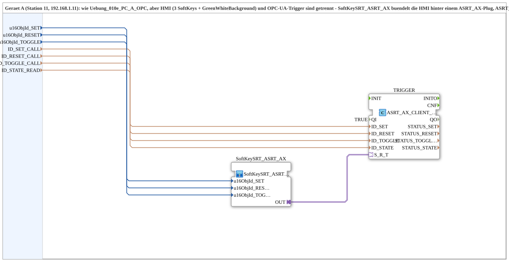

# Uebung_010e_PC_A_OPC_Adapter

* * * * * * * * * *

## Einleitung

`Uebung_010e_PC_A_OPC_Adapter` ist die adapter-gebuendelte Variante von [`Uebung_010e_PC_A_OPC`](./Uebung_010e_PC_A_OPC.md) (Geraet A, Station 11): HMI (3 SoftKeys + `GreenWhiteBackground`) und OPC-UA-Trigger sind getrennt. [`SoftKeySRT_ASRT_AX`](./SoftKeySRT_ASRT_AX.md) buendelt die HMI hinter einem `ASRT_AX`-Plug; `ASRT_AX_CLIENT_0_SUBSCRIBE_1` buendelt die 3 `CLIENT_0`-Instanzen + `AX_SUBSCRIBE_1` hinter einem `ASRT_AX`-Socket. Gegenstueck: [`Uebung_010e_PC_B_OPC_Adapter`](./Uebung_010e_PC_B_OPC_Adapter.md).

## Verwendete Funktionsbausteine (FBs)

- **SoftKeySRT_ASRT_AX** (SubApp, Typ `MyLib::sys::SoftKeySRT_ASRT_AX`): 3 SoftKeys + Statusanzeige, gebuendelt hinter einem `ASRT_AX`-Plug.
- **TRIGGER** (`adapter::net::ASRT_AX_CLIENT_0_SUBSCRIBE_1`): buendelt 3 Methodenaufrufe (`ID_SET_CALL`/`ID_RESET_CALL`/`ID_TOGGLE_CALL`) und Zustands-Abo (`ID_STATE_READ`) hinter einem einzigen `ASRT_AX`-Socket.

## Zusammenfassung

Adapter-gebuendelte Variante von `Uebung_010e_PC_A_OPC`: HMI und Netzwerkprotokoll sauber getrennt, wiederverwendbar ueber [`SoftKeySRT_ASRT_AX`](./SoftKeySRT_ASRT_AX.md).

---

### 🌐 Passende Themen-Unterseiten auf ms-muc-docs.de

- [🌐 Eclipse 4diac IDE & Farb-Referenz auf ms-muc-docs.de](https://www.ms-muc-docs.de/iec-61499/eclipse-4diac/)
