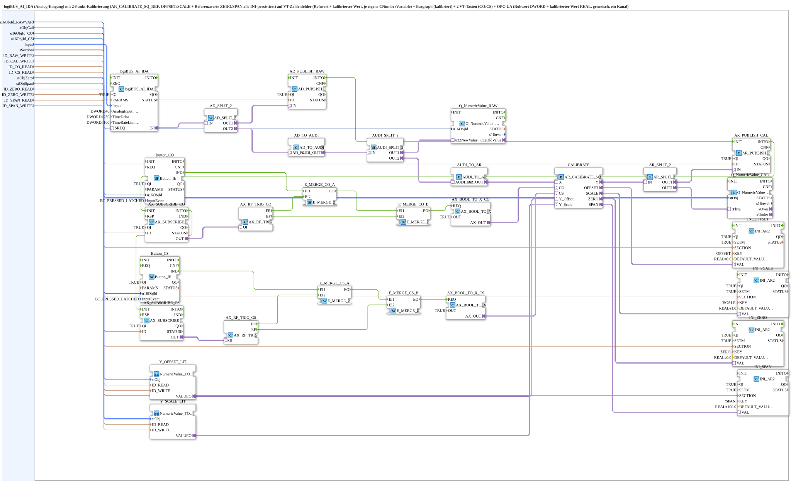

# logiBUS_AI_Calibrate_IDA_OPC

* * * * * * * * * *

## Einleitung

`logiBUS_AI_Calibrate_IDA_OPC` bindet einen physischen Analogeingang (`logiBUS_AI_IDA`) an eine vollstaendige VT- und OPC-UA-gestuetzte 2-Punkt-Kalibrierung (`AR_CALIBRATE_SQ_REF`) an - genutzt vom [AI_Calibrate-Trainingsbeispiel](../../../../Uebungen/test_AX/Meins/InputOutputTester/Button_AI_Calibrate_OPC_UA/InputOutputTesterButton_AI_Calibrate_OPC_UA.md). Der Rohwert des Eingangs wird ueber die Kalibrieradapterkette in einen physikalisch skalierten Wert gewandelt; Nullpunkt (`ZERO`) und Spanne (`SPAN`) sind sowohl per VT als auch per OPC-UA einstellbar und werden per INI-Datei persistiert.

## Verwendete Funktionsbausteine (FBs)

- **logiBUS_AI_IDA** (`logiBUS::io::AI::logiBUS_AI_IDA`): physischer Analogeingang, liefert den Rohwert als Adapter.
- **AR_CALIBRATE_SQ_REF** (Adapter-Composite): 2-Punkt-Kalibrierung (Nullpunkt/Spanne) mit Referenzwert-Unterstuetzung - rechnet den Rohwert in den physikalisch skalierten, kalibrierten Wert um.
- **VT- und OPC-UA-Bruecken** (analog zu [`NumericValue_TO_AR2_OPC`](./NumericValue_TO_AR2_OPC.md)/[`OPC_TO_AR2`](./OPC_TO_AR2.md) und [`INI_IN_AND_STORE_AR2`](./INI_IN_AND_STORE_AR2.md)): stellen `ZERO`/`SPAN` sowohl ueber VT-Eingabefelder als auch ueber OPC-UA bereit und persistieren die Kalibrierwerte per INI-Datei.

## Zusammenfassung

Kompletter Kalibrier-Baustein fuer einen physischen Analogeingang: Rohwert-Erfassung, 2-Punkt-Kalibrierung, VT-Anzeige/-Eingabe und OPC-UA-Anbindung in einem Composite - Kernbaustein des AI_Calibrate-Beispiels.

---

### 🌐 Passende Themen-Unterseiten auf ms-muc-docs.de

- [🌐 Eclipse 4diac IDE & Farb-Referenz auf ms-muc-docs.de](https://www.ms-muc-docs.de/iec-61499/eclipse-4diac/)
