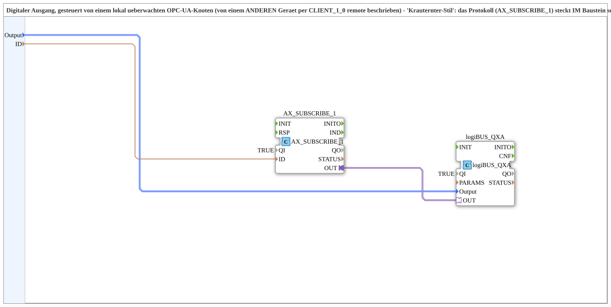

# logiBUS_QXA_FROM_SUBSCRIBE_OPC

* * * * * * * * * *

## Einleitung

`logiBUS_QXA_FROM_SUBSCRIBE_OPC` steuert einen digitalen Ausgang (`logiBUS_QXA`) von einem lokal ueberwachten OPC-UA-Knoten, der von einem ANDEREN Geraet per `AX_CLIENT_1_0` remote beschrieben wird - "Krauternter-Stil" (laut Quellcode-Kommentar): das Protokoll (`AX_SUBSCRIBE_1`) steckt IM Baustein selbst, nicht in der Resource des Geraets.

## Verwendete Funktionsbausteine (FBs)

- **AX_SUBSCRIBE_1** (`adapter::net::AX_SUBSCRIBE_1`): abonniert die lokal ueberwachte Adresse `ID` (BOOL, remote beschrieben).
- **logiBUS_QXA** (`logiBUS::io::DQ::logiBUS_QXA`): physischer digitaler Ausgang, identifiziert ueber `Output_Q1..Q8`.

## Zusammenfassung

Ein-Baustein-Bruecke von einem lokal abonnierten OPC-UA-Wert zu einem physischen digitalen Ausgang - Gegenstueck zu [`logiBUS_IXA_TO_CLIENT_OPC`](./logiBUS_IXA_TO_CLIENT_OPC.md) auf der Sendeseite.

---

### 🌐 Passende Themen-Unterseiten auf ms-muc-docs.de

- [🌐 Eclipse 4diac IDE & Farb-Referenz auf ms-muc-docs.de](https://www.ms-muc-docs.de/iec-61499/eclipse-4diac/)
