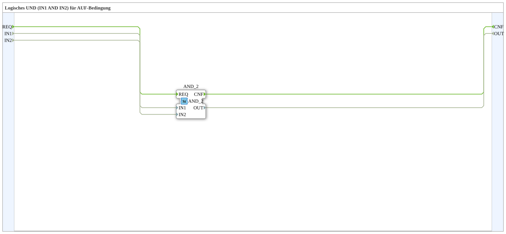

# AND_AUF

* * * * * * * * * *

## Einleitung

`AND_AUF` bildet die logische Verknüpfung `IN1 AND IN2` und liefert damit die Freigabebedingung für eine "AUF"-Bewegung (z. B. Ventil/Klappe öffnen): beide Bedingungen müssen gleichzeitig erfüllt sein. Für die komplementäre "ZU"-Bedingung siehe [`AND_ZU`](./AND_ZU.md).

## Verwendete Funktionsbausteine (FBs)

### Sub-Bausteine: AND_AUF

- **Typ**: SubAppType
- **Verwendete interne FBs**:
    - **AND_2**: `iec61131::bitwiseOperators::AND_2` — bitweises UND, hier auf BOOL-Ebene als logisches UND verwendet.
- **Funktionsweise**: `REQ` löst `AND_2` aus; `IN1` und `IN2` werden verundet und als `OUT` sowie `CNF` zurückgegeben.

## Programmablauf und Verbindungen

1. `REQ` → `AND_2.REQ`.
2. `IN1` → `AND_2.IN1`; `IN2` → `AND_2.IN2`.
3. `AND_2.OUT` → `OUT`; `AND_2.CNF` → `CNF`.

## Anwendungsszenarien

- Freigabelogik für Öffnen-Bewegungen, bei denen zwei unabhängige Bedingungen (z. B. Endschalter ZU nicht aktiv UND Freigabe-Taste) gleichzeitig erfüllt sein müssen.

## Zusammenfassung

Einfacher, wiederverwendbarer UND-Baustein als sprechend benannter Baustein für die AUF-Bedingung einer Ventil-/Klappensteuerung.

---

### 🌐 Passende Themen-Unterseiten auf ms-muc-docs.de

- [🌐 Eclipse 4diac IDE & Farb-Referenz auf ms-muc-docs.de](https://www.ms-muc-docs.de/iec-61499/eclipse-4diac/)
