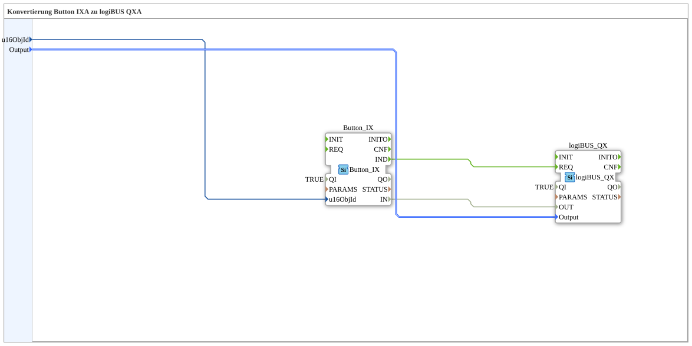

# Button_IX_TO_logiBUS_QX

* * * * * * * * * *

## Einleitung

`Button_IX_TO_logiBUS_QX` ist das test_B-Gegenstück zu [`Button_IXA_TO_logiBUS_QXA`](../../MyLib_AX/sys/Button_IXA_TO_logiBUS_QXA.md): Ein VT-Taster (`Button_IX`) schaltet direkt einen physischen digitalen Ausgang (`logiBUS_QX`) — hier ohne Adapter, mit klassischen Ereignis-/Datenverbindungen.

## Verwendete Funktionsbausteine (FBs)

### Sub-Bausteine: Button_IX_TO_logiBUS_QX

- **Typ**: SubAppType
- **Verwendete interne FBs**:
    - **Button_IX**: `isobus::UT::io::Button::Button_IX` — VT-Taster (Nicht-Adapter-Variante).
    - **logiBUS_QX**: `logiBUS::io::DQ::logiBUS_QX` — physischer digitaler Ausgang (Nicht-Adapter-Variante).
- **Funktionsweise**: `Button_IX.IND` löst `logiBUS_QX.REQ` aus; der Datenwert `Button_IX.IN` wird direkt auf `logiBUS_QX.OUT` verdrahtet.

## Programmablauf und Verbindungen

1. `u16ObjId` → `Button_IX.u16ObjId`; `Output` → `logiBUS_QX.Output`.
2. `Button_IX.IND` → `logiBUS_QX.REQ`; `Button_IX.IN` → `logiBUS_QX.OUT`.

## Anwendungsszenarien

- Minimaler VT-Taster-zu-Ausgang-Baustein für test_B, ohne Statusanzeige.

## Zusammenfassung

test_B-Pendant zu `Button_IXA_TO_logiBUS_QXA`: dieselbe Funktion, klassische Ereignis-/Datenverbindungen statt Adapter.

---

### 🌐 Passende Themen-Unterseiten auf ms-muc-docs.de

- [🌐 Eclipse 4diac IDE & Farb-Referenz auf ms-muc-docs.de](https://www.ms-muc-docs.de/iec-61499/eclipse-4diac/)
