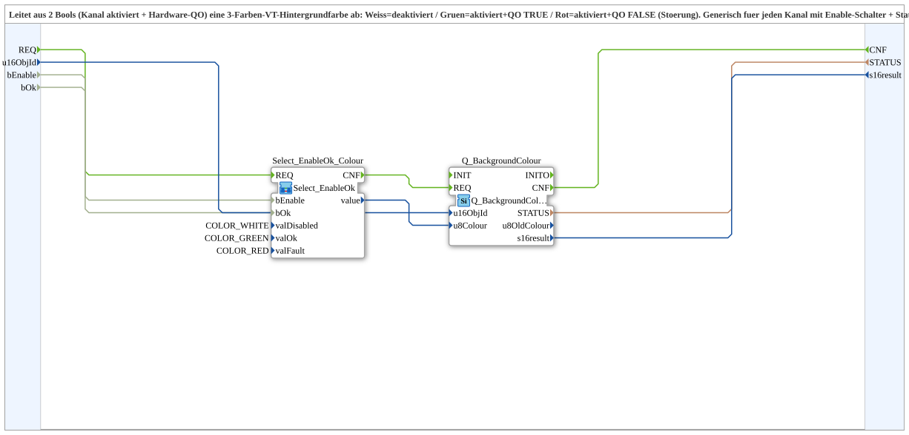

# Q_BackgroundColour_EnableOk

* * * * * * * * * *

## Einleitung

`Q_BackgroundColour_EnableOk` leitet aus 2 Bools (Kanal aktiviert + Hardware-QO) eine 3-Farben-VT-Hintergrundfarbe ab: Weiss = deaktiviert, Gruen = aktiviert und QO TRUE, Rot = aktiviert und QO FALSE (Stoerung). Generisch fuer jeden Kanal mit Enable-Schalter + Status-LED (PWM, PI, ...). Die reine Auswahllogik ist mittlerweile in [`Select_EnableOk`](./Select_EnableOk.md) ausgelagert; dieser Baustein instanziiert sie nur noch mit den 3 Farben als Parameter und haengt `Q_BackgroundColour` dran.

## Verwendete Funktionsbausteine (FBs)

- **Select_EnableOk_Colour** (SubApp, Typ `MyLib::sys::Select_EnableOk`): `valDisabled=COLOR_WHITE`, `valOk=COLOR_GREEN`, `valFault=COLOR_RED`.
- **Q_BackgroundColour** (`isobus::UT::Q::Q_BackgroundColour`): schreibt die berechnete Farbe auf `u16ObjId`.

## Zusammenfassung

Fertig parametrierte Farblogik (Weiss/Gruen/Rot) fuer Enable+Ok-Statusanzeigen, aufgebaut auf der generischen `Select_EnableOk`-Auswahl.

---

### 🌐 Passende Themen-Unterseiten auf ms-muc-docs.de

- [🌐 Eclipse 4diac IDE & Farb-Referenz auf ms-muc-docs.de](https://www.ms-muc-docs.de/iec-61499/eclipse-4diac/)
