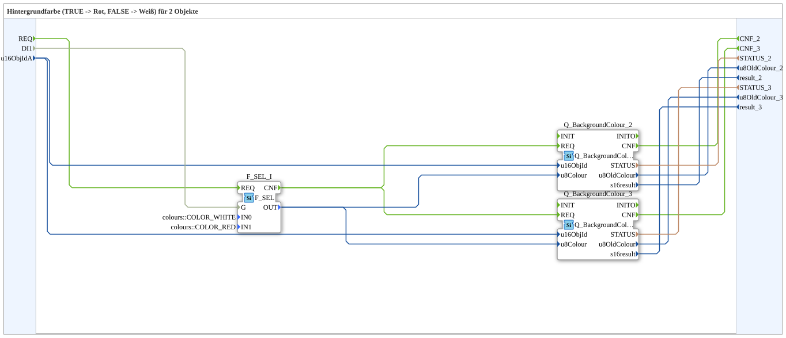

# RedWhiteBackground2

* * * * * * * * * *

## Einleitung

`RedWhiteBackground2` schaltet die VT-Hintergrundfarbe von 2 Objekten anhand eines booleschen Selector-Signals: `TRUE` → **Rot**, `FALSE` → **Weiß**. Das Selector-Signal kommt als einfacher `BOOL`-Dateneingang (`DI1`). Die Objekt-ID wird über die Eingänge `u16ObjIdA` übergeben.

| Position | Objekt-ID-Quelle | Baustein |
|---|---|---|
| 1 | `u16ObjIdA` | `Q_BackgroundColour` (normales Objekt) |
| 2 | `u16ObjIdA` | `Q_BackgroundColourAux` (Auxiliary-Function-Objekt) |

Allgemeines Muster (Selector → `AX_SEL`/`F_SEL` → `Q_BackgroundColour`) siehe [Background-Farbbausteine (gemeinsames Muster)](../../MyLib_AX/sys/Background-Farbbausteine.md).

## Zusammenfassung

Eine von vielen Varianten der Background-Farbbausteine-Familie: Farbpaar Rot/Weiß, 2 Objekte, BOOL-Selector.

---

### 🌐 Passende Themen-Unterseiten auf ms-muc-docs.de

* [🌐 Eclipse 4diac IDE & Farb-Referenz auf ms-muc-docs.de](https://www.ms-muc-docs.de/iec-61499/eclipse-4diac/)
