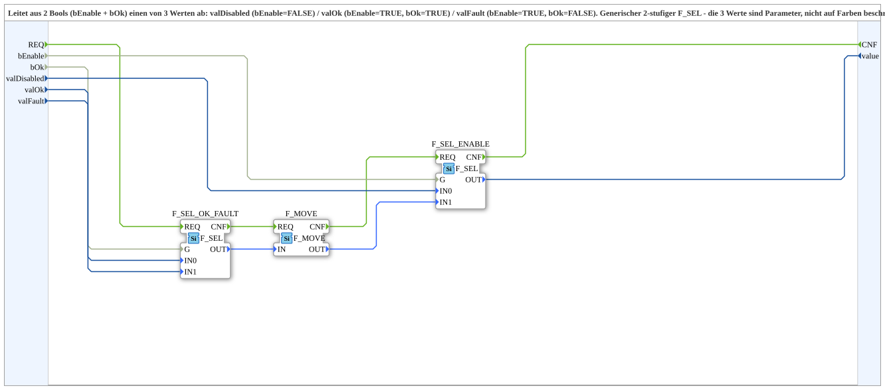

# Select_EnableOk

* * * * * * * * * *

## Einleitung

`Select_EnableOk` leitet aus 2 Bools (`bEnable`, `bOk`) einen von 3 parametrierten USINT-Werten ab: `valDisabled` (bEnable=FALSE), `valOk` (bEnable=TRUE und bOk=TRUE), `valFault` (bEnable=TRUE und bOk=FALSE). Generischer 2-stufiger `F_SEL`, nicht auf Farben beschraenkt - laut Quellcode-Kommentar aus [`Q_BackgroundColour_EnableOk`](./Q_BackgroundColour_EnableOk.md) extrahiert, um die reine Auswahllogik von der VT-Hintergrundfarben-Anwendung zu entkoppeln.

## Verwendete Funktionsbausteine (FBs)

- **F_SEL_OK_FAULT** (`iec61131::selection::F_SEL`): waehlt zwischen `valFault`/`valOk` nach `bOk`.
- **F_MOVE** (`iec61131::selection::F_MOVE`, `DataType=USINT`): reicht den Zwischenwert unveraendert weiter (Ablauf-Kopplung der beiden Selektionsstufen).
- **F_SEL_ENABLE** (`iec61131::selection::F_SEL`): waehlt zwischen `valDisabled`/Zwischenergebnis nach `bEnable`.

## Programmablauf und Verbindungen

`REQ` -> `F_SEL_OK_FAULT.REQ` -> `F_MOVE.REQ` -> `F_SEL_ENABLE.REQ` -> `CNF`. Datenseitig: `bOk`/`valFault`/`valOk` -> `F_SEL_OK_FAULT` -> `F_MOVE` -> `F_SEL_ENABLE.IN1`, parallel `bEnable`/`valDisabled` -> `F_SEL_ENABLE.IN0`/`.G` -> `value`.

## Zusammenfassung

Generische 2-Bool-zu-1-von-3-Werten-Auswahl, wiederverwendbar ueber Hintergrundfarben hinaus (z. B. fuer beliebige Enable/Ok-Statusanzeigen).

---

### 🌐 Passende Themen-Unterseiten auf ms-muc-docs.de

- [🌐 Eclipse 4diac IDE & Farb-Referenz auf ms-muc-docs.de](https://www.ms-muc-docs.de/iec-61499/eclipse-4diac/)
