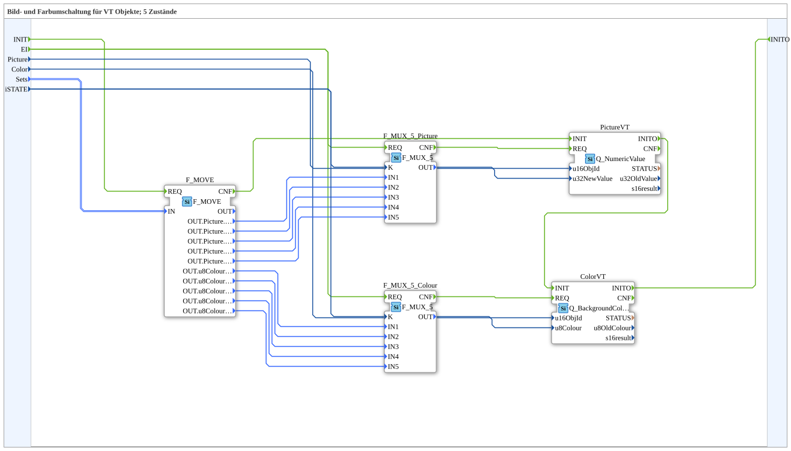

# SwitchPicCol_5_1

* * * * * * * * * *

## Einleitung

`SwitchPicCol_5_1` schaltet zwischen 5 Zuständen (Schieber-/Ventilanimation) sowohl ein VT-Bild (`Picture`, via `Q_NumericValue`) **als auch** eine VT-Hintergrundfarbe (`Color`, via `Q_BackgroundColour`) um — zwei parallele `F_MUX_5`-Multiplexer (einer für Bild-IDs, einer für Farbwerte), beide vom selben `iSTATE`-Wert gesteuert, auf normale (nicht-AUX) Objekte.

Allgemeines Muster siehe [SwitchPic(Col)-Bausteine (gemeinsames Muster)](./SwitchPic-Bausteine.md).

## Zusammenfassung

Kombiniert Bild- und Farbumschaltung (`Col`) für 5 Zustände auf normalen VT-Objekten.

---

### 🌐 Passende Themen-Unterseiten auf ms-muc-docs.de

* [🌐 Eclipse 4diac IDE & Farb-Referenz auf ms-muc-docs.de](https://www.ms-muc-docs.de/iec-61499/eclipse-4diac/)
