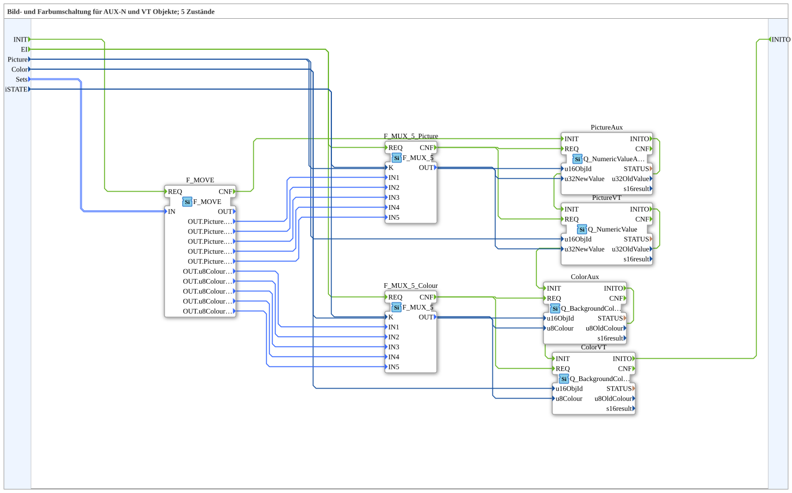

# SwitchPicCol_5_2

* * * * * * * * * *

## Einleitung

`SwitchPicCol_5_2` schaltet zwischen 5 Zuständen sowohl Bild als auch Hintergrundfarbe um — auf **vier** Zielen gleichzeitig: normales Bild-Objekt (`PictureVT`), AUX-Bild-Objekt (`PictureAux`), normales Farb-Objekt (`ColorVT`) und AUX-Farb-Objekt (`ColorAux`), alle über dieselben zwei `F_MUX_5`-Multiplexer (Bild/Farbe) gesteuert.

Allgemeines Muster siehe [SwitchPic(Col)-Bausteine (gemeinsames Muster)](./SwitchPic-Bausteine.md).

## Zusammenfassung

Erweiterung von [`SwitchPicCol_5_1`](./SwitchPicCol_5_1.md) um die AUX-Objekte für Bild und Farbe gleichzeitig — die umfangreichste Variante der `SwitchPicCol`-Reihe.

---

### 🌐 Passende Themen-Unterseiten auf ms-muc-docs.de

* [🌐 Eclipse 4diac IDE & Farb-Referenz auf ms-muc-docs.de](https://www.ms-muc-docs.de/iec-61499/eclipse-4diac/)
