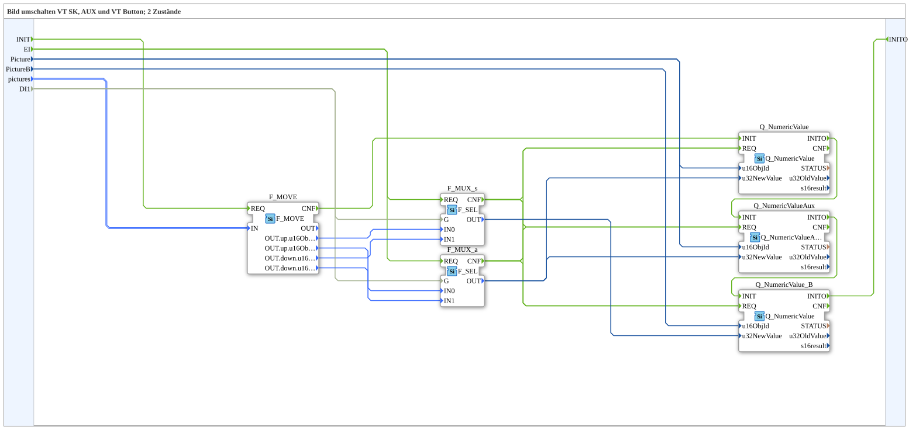

# SwitchPic_2_3

* * * * * * * * * *

## Einleitung

`SwitchPic_2_3` schaltet ein VT-Bild zwischen 2 Zuständen (`up`/`down`) anhand eines booleschen Selectors (`DI1`) um — auf drei Zielen gleichzeitig: einem normalen Softkey-Objekt (`Picture`), einem AUX-Objekt (dieselbe ID `Picture`) und einem zweiten, unabhängigen normalen Objekt ("Button", `PictureB`, eigene Object-ID-Untermenge `u16ObjIdA` in der Struktur).

Allgemeines Muster siehe [SwitchPic(Col)-Bausteine (gemeinsames Muster)](./SwitchPic-Bausteine.md).

## Zusammenfassung

Variante "3" (normales Softkey-Objekt + AUX-Objekt + zweites normales Button-Objekt) der 2-Zustände-Bildumschaltung — die umfangreichste Variante der `SwitchPic_2_*`-Reihe.

---

### 🌐 Passende Themen-Unterseiten auf ms-muc-docs.de

* [🌐 Eclipse 4diac IDE & Farb-Referenz auf ms-muc-docs.de](https://www.ms-muc-docs.de/iec-61499/eclipse-4diac/)
