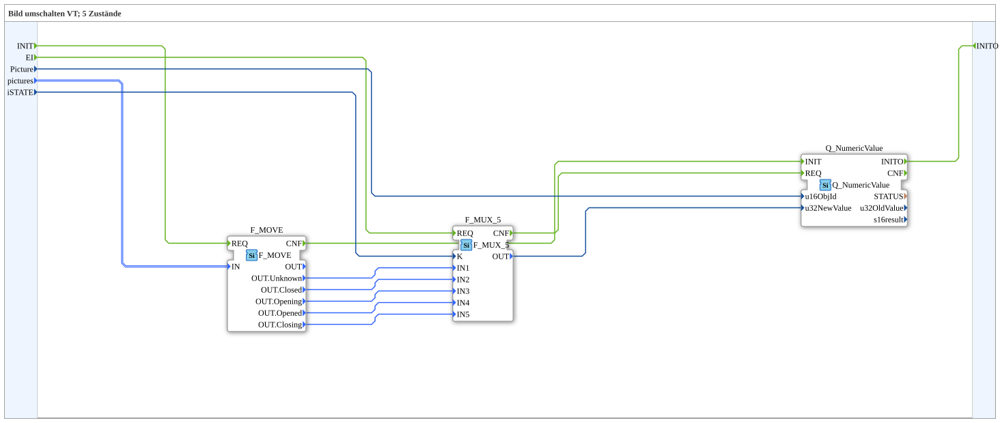

# SwitchPic_5_1

* * * * * * * * * *

## Einleitung

`SwitchPic_5_1` schaltet ein VT-Bild zwischen 5 Zuständen (Schieber-/Ventilanimation: `Unknown`, `Closed`, `Opening`, `Opened`, `Closing`) anhand eines `iSTATE`-Werts (`USINT`) um — nur das normale VT-Objekt (`Picture`, via `Q_NumericValue`), kein AUX-Objekt.

Allgemeines Muster siehe [SwitchPic(Col)-Bausteine (gemeinsames Muster)](./SwitchPic-Bausteine.md).

## Zusammenfassung

Variante "1" (nur normales Objekt) der 5-Zustände-Bildumschaltung — das 5-Zustände-Gegenstück zu [`SwitchPic_2_1`](./SwitchPic_2_1.md).

---

### 🌐 Passende Themen-Unterseiten auf ms-muc-docs.de

* [🌐 Eclipse 4diac IDE & Farb-Referenz auf ms-muc-docs.de](https://www.ms-muc-docs.de/iec-61499/eclipse-4diac/)
