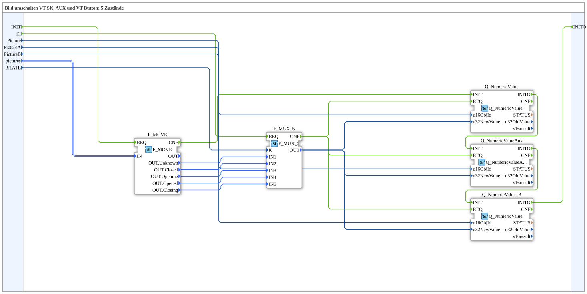

# SwitchPic_5_3

* * * * * * * * * *

## Einleitung

`SwitchPic_5_3` schaltet ein VT-Bild zwischen 5 Zuständen (Schieber-/Ventilanimation) anhand eines `iSTATE`-Werts um — auf drei unabhängigen Zielen gleichzeitig: normales Softkey-Objekt (`Picture`), AUX-Objekt (`PictureA`) und zweites normales Button-Objekt (`PictureB`), jedes mit eigener Object-ID.

Allgemeines Muster siehe [SwitchPic(Col)-Bausteine (gemeinsames Muster)](./SwitchPic-Bausteine.md).

## Zusammenfassung

5-Zustände-Gegenstück zu [`SwitchPic_2_3`](./SwitchPic_2_3.md) — die umfangreichste Variante der `SwitchPic_5_*`-Reihe.

---

### 🌐 Passende Themen-Unterseiten auf ms-muc-docs.de

* [🌐 Eclipse 4diac IDE & Farb-Referenz auf ms-muc-docs.de](https://www.ms-muc-docs.de/iec-61499/eclipse-4diac/)
