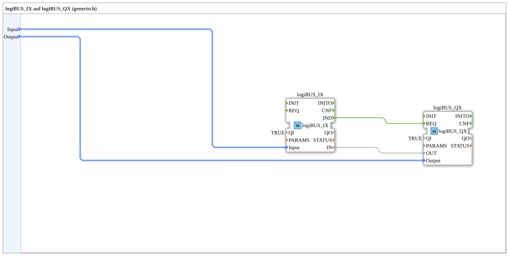

# logiBUS_IX_TO_logiBUS_QX

* * * * * * * * * *

## Einleitung

`logiBUS_IX_TO_logiBUS_QX` verdrahtet einen physischen digitalen Eingang (`logiBUS_IX`) direkt auf einen physischen digitalen Ausgang (`logiBUS_QX`) — funktional äquivalent zu [`logiBUS_IXA_TO_logiBUS_QXA`](./logiBUS_IXA_TO_logiBUS_QXA.md), jedoch mit den nicht-adapterbasierten Bausteinvarianten `logiBUS_IX`/`logiBUS_QX`: die Verbindung erfolgt über eine explizite Ereignis- und eine Datenverbindung statt über einen Adapter.

## Verwendete Funktionsbausteine (FBs)

### Sub-Bausteine: logiBUS_IX_TO_logiBUS_QX

- **Typ**: SubAppType
- **Verwendete interne FBs**:
    - **logiBUS_IX**: `logiBUS::io::DI::logiBUS_IX` — physischer digitaler Eingang, feuert `IND` bei Zustandsänderung, `QI=TRUE`.
    - **logiBUS_QX**: `logiBUS::io::DQ::logiBUS_QX` — physischer digitaler Ausgang, wird über `REQ` angesteuert, `QI=TRUE`.
- **Funktionsweise**: Das Eingangsereignis `IND` löst direkt `REQ` am Ausgang aus; der aktuelle Zustand wird parallel über eine Datenverbindung von `IN` nach `OUT` durchgereicht.

## Programmablauf und Verbindungen

1. `Input` → `logiBUS_IX.Input`; `Output` → `logiBUS_QX.Output`.
2. `logiBUS_IX.IND` → `logiBUS_QX.REQ` (Ereignisverbindung).
3. `logiBUS_IX.IN` → `logiBUS_QX.OUT` (Datenverbindung).

## Anwendungsszenarien

- Hardware-zu-Hardware-Durchschaltung in Trainingssystemen, die (im Gegensatz zu `test_AX`) auf die nicht-adapterbasierten I/O-Bausteine `logiBUS_IX`/`logiBUS_QX` setzen.

## Zusammenfassung

Nicht-adapterbasiertes Gegenstück zu `logiBUS_IXA_TO_logiBUS_QXA`: gleiche Funktion, explizite Ereignis-/Datenverbindung statt Adapterkopplung.

---

### 🌐 Passende Themen-Unterseiten auf ms-muc-docs.de

- [🌐 Eclipse 4diac IDE & Farb-Referenz auf ms-muc-docs.de](https://www.ms-muc-docs.de/iec-61499/eclipse-4diac/)
