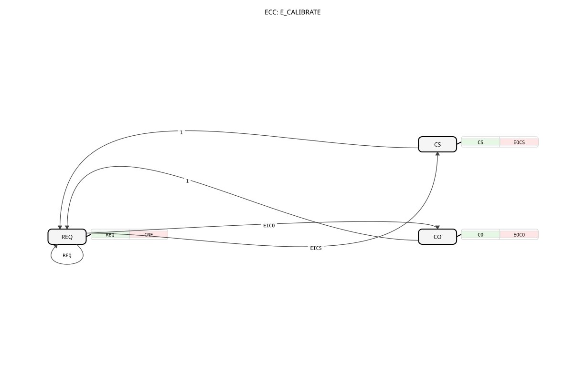

# E_CALIBRATE




* * * * * * * * * *

## Einleitung

`E_CALIBRATE` ist die ereignisgesteuerte Variante von [CALIBRATE](CALIBRATE.md): Die Zwei-Punkt-Kalibrierung (`Y = (X + OFFSET) * SCALE`) wird nicht über boolesche Datenwerte, sondern über die eigenen Ereignisse `EICO`/`EICS` ausgelöst, mit jeweils eigenem Bestätigungsereignis. Reihenfolge (Offset vor Skalierung) wird auch hier nicht erzwungen -- dafür siehe [E_CALIBRATE_SQ](E_CALIBRATE_SQ.md).

## Schnittstellenstruktur

### **Ereignis-Eingänge**

- **REQ**: Normale Ausführungsanforderung -- berechnet `Y`. Liefert `X`, `Y_Offset`, `Y_Scale`, `OFFSET`, `SCALE`.
- **EICO**: Kalibriert den Offset (`OFFSET := Y_Offset - X`). Liefert `X`, `Y_Offset`.
- **EICS**: Kalibriert die Skalierung (`SCALE := Y_Scale / (X + OFFSET)`). Liefert `X`, `Y_Scale`, `OFFSET`.

### **Ereignis-Ausgänge**

- **CNF**: Bestätigt `REQ`, liefert `Y`.
- **EOCO**: Bestätigt die Offset-Kalibrierung, liefert `OFFSET`.
- **EOCS**: Bestätigt die Skalierungs-Kalibrierung, liefert `SCALE`.

### **Daten-Eingänge**

- **X** (REAL): Roheingangswert.
- **Y_Offset** (REAL): Zielausgabewert am unteren Referenzpunkt.
- **Y_Scale** (REAL): Zielausgabewert am oberen Referenzpunkt.

### **Daten-Ausgänge**

- **Y** (REAL): Kalibrierter Ausgangswert.

### **Ein-/Ausgabevariablen (InOut)**

- **OFFSET** (REAL, Startwert `0.0`): Gespeicherter Offset-Wert.
- **SCALE** (REAL, Startwert `1.0`): Gespeicherter Skalierungsfaktor.

## Funktionsweise

`E_CALIBRATE` besitzt drei ECC-Zustände, die alle direkt vom Zustand `REQ` aus erreichbar sind:

- **REQ** (Startzustand): Bei `REQ`-Ereignis wird `Y := (X + OFFSET) * SCALE` berechnet und `CNF` gefeuert; der Baustein bleibt in `REQ`.
- **CO**: Bei `EICO` wechselt der Baustein nach `CO`, führt `OFFSET := Y_Offset - X` aus, feuert `EOCO` und kehrt sofort zu `REQ` zurück.
- **CS**: Bei `EICS` wechselt der Baustein nach `CS`, führt `SCALE := Y_Scale / (X + OFFSET)` aus (nur wenn `X + OFFSET <> 0`), feuert `EOCS` und kehrt sofort zu `REQ` zurück.

Da sowohl `EICO` als auch `EICS` jederzeit aus `REQ` heraus erreichbar sind, erzwingt die ECC keine Reihenfolge -- `EICS` kann auch vor `EICO` ausgelöst werden, liefert dann aber ein inkonsistentes Ergebnis, da `SCALE` auf einem noch nicht kalibrierten `OFFSET` basiert.

**Beispiel** (4-20-mA-Drucksensor über logiBUS, normiert auf `0.0..1.0`, gewünschter Ausgabebereich `0.0..500.0`):

| Schritt | Aktion | Ergebnis |
| --- | --- | --- |
| 1 | 4 mA anlegen (`X=0.0`), `Y_Offset=0.0`, `EICO` feuern | `OFFSET = 0` |
| 2 | 20 mA anlegen (`X=1.0`), `Y_Scale=500.0`, `EICS` feuern | `SCALE = 500` |

Ergebnis: `Y = (X + 0) * 500 = X * 500 = 0..500`.

## Technische Besonderheiten

- **Y nach CO nur korrekt bei SCALE = 1**: Wie bei `CALIBRATE` liefert `OFFSET := Y_Offset - X` nach der Offset-Kalibrierung nur dann exakt `Y = Y_Offset`, wenn `SCALE` noch `1.0` ist. `E_CALIBRATE_SQ` löst dies mit `OFFSET := Y_Offset / SCALE - X`.
- **Keine Reihenfolge-Erzwingung**: `EICO` und `EICS` sind beide direkt aus `REQ` erreichbar -- die ECC unterscheidet nicht, ob bereits kalibriert wurde. Für eine erzwungene Reihenfolge siehe [E_CALIBRATE_SQ](E_CALIBRATE_SQ.md).
- **REQ bleibt jederzeit verfügbar**: Normalbetrieb (`REQ`) ist unabhängig vom Kalibrierstatus jederzeit möglich, auch zwischen `EICO` und `EICS`.

## Zustandsübersicht

```
REQ --EICO--> CO --1--> REQ     (Offset-Kalibrierung)
REQ --EICS--> CS --1--> REQ     (Skalierungs-Kalibrierung)
REQ --REQ---> REQ --1--> REQ    (Normalbetrieb)
```

Alle drei Zustände sind Durchgangszustände: Der Baustein kehrt nach jeder Aktion sofort zu `REQ` zurück.

## Anwendungsszenarien

- Zwei-Punkt-Kalibrierung analoger Sensoren in Systemen, die Kalibrierauslösung bereits als Ereignis bereitstellen (z. B. per Knopfdruck-Event statt Datenwert)
- Anwendungen, in denen Offset- und Skalierungskalibrierung jeweils eine eigene, sofortige Bestätigung (`EOCO`/`EOCS`) benötigen
- Systeme mit gelegentlicher Nachkalibrierung des Offsets, ohne die Skalierung neu zu bestimmen

## ⚖️ Vergleich mit ähnlichen Bausteinen

Vergleich mit [CALIBRATE](CALIBRATE.md), das dieselbe Formel booleangesteuert statt ereignisgesteuert anwendet, sowie mit [E_CALIBRATE_SQ](E_CALIBRATE_SQ.md), das dieselbe Ereignisschnittstelle nutzt, aber die Reihenfolge Offset-vor-Skalierung per ECC erzwingt und `Y` nach der Offset-Kalibrierung unabhängig von `SCALE` korrekt liefert.

## Fazit

`E_CALIBRATE` bietet eine ereignisgesteuerte Zwei-Punkt-Kalibrierung mit eigenen Bestätigungsereignissen pro Kalibrierschritt, überlässt die korrekte Reihenfolge (Offset vor Skalierung) aber weiterhin dem Aufrufer.
