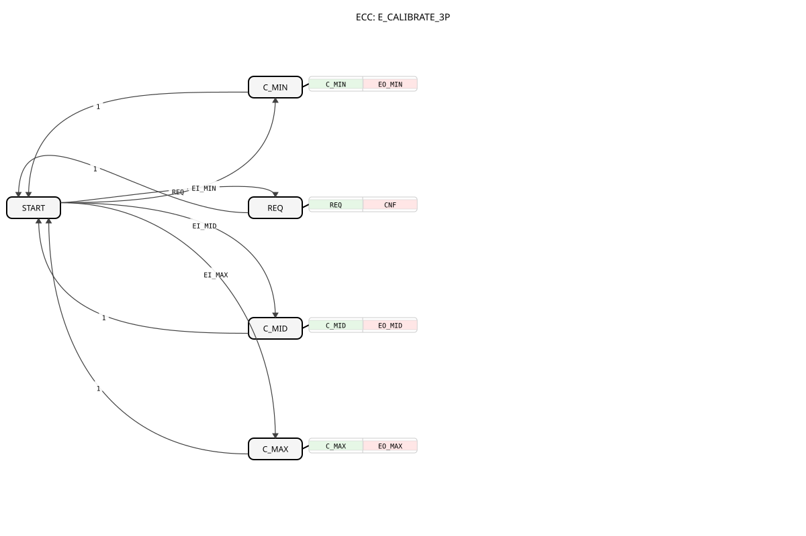
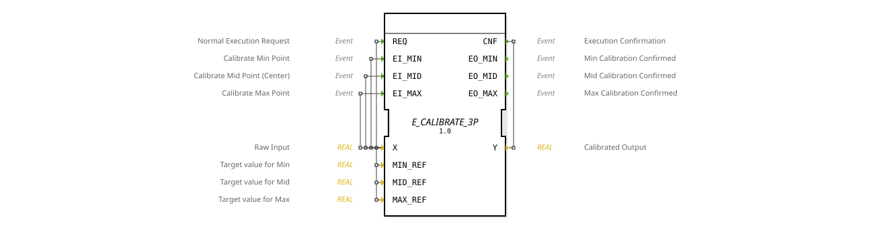

# E_CALIBRATE_3P





* * * * * * * * * *

## Einleitung

`E_CALIBRATE_3P` ist die ereignisgesteuerte Variante von [CALIBRATE_3P](CALIBRATE_3P.md): Die Drei-Punkt-Kalibrierung mit stückweiser linearer Interpolation (Min/Mid/Max) wird über die eigenen Ereignisse `EI_MIN`/`EI_MID`/`EI_MAX` ausgelöst, jeweils mit eigenem Bestätigungsereignis.

## Schnittstellenstruktur

### **Ereignis-Eingänge**

- **REQ**: Normale Ausführungsanforderung -- berechnet `Y`. Liefert `X`, `MIN_REF`, `MID_REF`, `MAX_REF`, `X_MIN`, `X_MID`, `X_MAX`.
- **EI_MIN**: Kalibriert den Minimalpunkt (`X_MIN := X`). Liefert `X`.
- **EI_MID**: Kalibriert den Mittelpunkt (`X_MID := X`). Liefert `X`.
- **EI_MAX**: Kalibriert den Maximalpunkt (`X_MAX := X`). Liefert `X`.

### **Ereignis-Ausgänge**

- **CNF**: Bestätigt `REQ`, liefert `Y`.
- **EO_MIN**: Bestätigt die Minimalpunkt-Kalibrierung, liefert `X_MIN`.
- **EO_MID**: Bestätigt die Mittelpunkt-Kalibrierung, liefert `X_MID`.
- **EO_MAX**: Bestätigt die Maximalpunkt-Kalibrierung, liefert `X_MAX`.

### **Daten-Eingänge**

- **X** (REAL): Roheingangswert.
- **MIN_REF** (REAL, Startwert `0.0`): Zielausgabewert für den Minimalpunkt.
- **MID_REF** (REAL, Startwert `50.0`): Zielausgabewert für den Mittelpunkt.
- **MAX_REF** (REAL, Startwert `100.0`): Zielausgabewert für den Maximalpunkt.

### **Daten-Ausgänge**

- **Y** (REAL): Kalibrierter, interpolierter und auf `MIN_REF..MAX_REF` begrenzter Ausgangswert.

### **Ein-/Ausgabevariablen (InOut)**

- **X_MIN** (REAL, Startwert `0.0`): Gespeicherter Rohwert am Minimalpunkt.
- **X_MID** (REAL, Startwert `50.0`): Gespeicherter Rohwert am Mittelpunkt.
- **X_MAX** (REAL, Startwert `100.0`): Gespeicherter Rohwert am Maximalpunkt.

## Funktionsweise

`E_CALIBRATE_3P` besitzt einen Startzustand `START` sowie vier direkt daraus erreichbare Aktionszustände:

- **REQ**: Interpoliert `Y` stückweise linear zwischen den gespeicherten Punkten (wie bei [CALIBRATE_3P](CALIBRATE_3P.md)) und feuert `CNF`.
- **C_MIN**/**C_MID**/**C_MAX**: Speichern den aktuellen Rohwert `X` im jeweiligen `X_MIN`/`X_MID`/`X_MAX` und feuern das zugehörige Bestätigungsereignis (`EO_MIN`/`EO_MID`/`EO_MAX`).

Jeder dieser vier Zustände kehrt unmittelbar zu `START` zurück, von wo aus alle vier Ereignisse wieder gleichberechtigt erreichbar sind -- die Kalibrierpunkte können also in beliebiger Reihenfolge und beliebig oft einzeln angefahren werden.

**Beispiel** (Joystick mit Mittelpunkt-Drift, Rohbereich `0..1000`, gewünschter Ausgabebereich `-100..0..100`):

| Schritt | Aktion | Ergebnis |
| --- | --- | --- |
| 1 | Joystick auf **Minimum**, `EI_MIN` feuern | `X_MIN = 50` (Drift gegenüber ideal `0`) |
| 2 | Joystick auf **Mitte**, `EI_MID` feuern | `X_MID = 520` (Drift gegenüber ideal `500`) |
| 3 | Joystick auf **Maximum**, `EI_MAX` feuern | `X_MAX = 980` (Drift gegenüber ideal `1000`) |

Ergebnis: `Y` wird zwischen `MIN_REF=-100`, `MID_REF=0` und `MAX_REF=100` interpoliert und begrenzt.

## Technische Besonderheiten

- **Vier gleichberechtigte Aktionen aus einem gemeinsamen Startzustand**: Anders als bei [E_CALIBRATE_SQ](E_CALIBRATE_SQ.md) gibt es keine Abhängigkeit zwischen den Kalibrierschritten -- jeder Punkt kann unabhängig und in beliebiger Reihenfolge neu gesetzt werden.
- **Ausgabe stets begrenzt**: `Y` wird nach der Interpolation auf `MIN_REF..MAX_REF` geklippt.
- **Degenerierte Kalibrierpunkte**: Wie bei `CALIBRATE_3P` liefert eine Interpolation mit `X_MID <= X_MIN` bzw. `X_MAX <= X_MID` konstant `MIN_REF` bzw. `MID_REF` statt einer Division durch Null.

## Zustandsübersicht

```
START --REQ-----> REQ    --1--> START   (Normalbetrieb)
START --EI_MIN--> C_MIN  --1--> START   (Minimalpunkt kalibrieren)
START --EI_MID--> C_MID  --1--> START   (Mittelpunkt kalibrieren)
START --EI_MAX--> C_MAX  --1--> START   (Maximalpunkt kalibrieren)
```

Alle vier Kalibrierereignisse sind unabhängig voneinander aus `START` erreichbar -- keine erzwungene Reihenfolge.

## Anwendungsszenarien

- Drei-Punkt-Kalibrierung von Joysticks in Systemen, die Kalibrierauslösung bereits als Ereignis bereitstellen
- Anwendungen, in denen jeder Kalibrierpunkt eine eigene, sofortige Bestätigung benötigt (z. B. zur UI-Rückmeldung "Punkt X kalibriert")
- Nachjustage einzelner Punkte (z. B. nur `EI_MID` nach Drift), ohne die anderen beiden neu kalibrieren zu müssen

## ⚖️ Vergleich mit ähnlichen Bausteinen

Vergleich mit [CALIBRATE_3P](CALIBRATE_3P.md), das dieselbe Drei-Punkt-Logik booleangesteuert statt ereignisgesteuert anwendet, sowie mit [E_CALIBRATE](E_CALIBRATE.md)/[E_CALIBRATE_SQ](E_CALIBRATE_SQ.md), die eine lineare Zwei-Punkt- statt Drei-Punkt-Kalibrierung durchführen.

## Fazit

`E_CALIBRATE_3P` bietet eine ereignisgesteuerte Drei-Punkt-Kalibrierung mit unabhängig ansteuerbaren, eigenständig bestätigten Kalibrierpunkten und eignet sich besonders für Joysticks und ähnliche Bedienelemente mit Mittelstellung.
