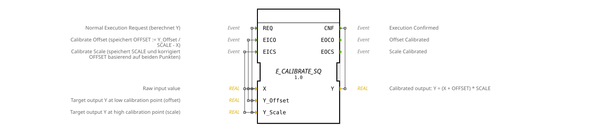

# E_CALIBRATE_SQ




* * * * * * * * * *
## Einleitung

`E_CALIBRATE_SQ` ist die Variante von [E_CALIBRATE](E_CALIBRATE.md) mit **erzwungener Reihenfolge**: Die Skalierungskalibrierung (`EICS`) ist erst erreichbar, nachdem die Offset-Kalibrierung (`EICO`) mindestens einmal durchlaufen wurde. Zusätzlich verwendet er eine robustere Formel, die `Y` nach der Offset-Kalibrierung unabhängig vom aktuellen `SCALE`-Wert korrekt liefert.

## Schnittstellenstruktur

### **Ereignis-Eingänge**

- **REQ**: Normale Ausführungsanforderung -- berechnet `Y`. Liefert `X`, `Y_Offset`, `Y_Scale`, `OFFSET`, `SCALE`.
- **EICO**: Kalibriert den Offset. Liefert `X`, `Y_Offset`, `SCALE`.
- **EICS**: Kalibriert die Skalierung und korrigiert dabei `OFFSET` anhand beider Referenzpunkte. Nur erreichbar, nachdem `EICO` bereits ausgeführt wurde. Liefert `X`, `Y_Scale`, `OFFSET`.

### **Ereignis-Ausgänge**

- **CNF**: Bestätigt `REQ`, liefert `Y`.
- **EOCO**: Bestätigt die Offset-Kalibrierung, liefert `OFFSET`.
- **EOCS**: Bestätigt die Skalierungs-Kalibrierung, liefert `SCALE`, `OFFSET`.

### **Daten-Eingänge**

- **X** (REAL): Roheingangswert.
- **Y_Offset** (REAL): Zielausgabewert am unteren Referenzpunkt.
- **Y_Scale** (REAL): Zielausgabewert am oberen Referenzpunkt.

### **Daten-Ausgänge**

- **Y** (REAL): Kalibrierter Ausgangswert.

### **Ein-/Ausgabevariablen (InOut)**

- **OFFSET** (REAL, Startwert `0.0`): Gespeicherter Offset-Wert.
- **SCALE** (REAL, Startwert `1.0`): Gespeicherter Skalierungsfaktor.

### **Interne Variablen**

- **X_LOW_INT** (REAL): Bei `EICO` gespeicherter Rohwert des unteren Referenzpunkts -- wird bei der späteren `EICS`-Berechnung als zweiter Stützpunkt verwendet.
- **Y_LOW_INT** (REAL): Bei `EICO` gespeicherter Zielwert (`Y_Offset`) des unteren Referenzpunkts.

## Funktionsweise

`E_CALIBRATE_SQ` besitzt einen Startzustand `START` und modelliert die Zwei-Punkt-Kalibrierung als erzwungene Sequenz:

- Aus `START` ist `EICO` erreichbar (Zustand `CO`): Speichert den aktuellen Rohwert und Zielwert in `X_LOW_INT`/`Y_LOW_INT` und berechnet `OFFSET := Y_Offset / SCALE - X` (bei `SCALE = 0` ersatzweise `Y_Offset - X`). Anders als bei `E_CALIBRATE` gilt danach **immer** `Y = Y_Offset`, unabhängig vom aktuellen `SCALE`.
- Nach `CO` wechselt der Baustein automatisch nach `WAIT_CS` -- **erst von hier aus ist `EICS` erreichbar**.
- In `WAIT_CS` bleibt `REQ` weiterhin verfügbar (über den Zwischenzustand `REQ_WAIT`, der sofort wieder nach `WAIT_CS` zurückkehrt) und `EICO` kann erneut ausgelöst werden, um den Offset neu zu kalibrieren.
- `EICS` (nur aus `WAIT_CS` erreichbar) berechnet `SCALE := (Y_Scale - Y_LOW_INT) / (X - X_LOW_INT)` aus **beiden** Referenzpunkten und korrigiert anschließend `OFFSET := Y_LOW_INT / SCALE - X_LOW_INT` -- die resultierende Gerade verläuft exakt durch beide kalibrierten Punkte. Danach kehrt der Baustein nach `START` zurück (Kalibrierung abgeschlossen).

**Beispiel** (4-20-mA-Drucksensor über logiBUS, normiert auf `0.0..1.0`, gewünschter Ausgabebereich `0.0..500.0`):

| Schritt | Aktion | Ergebnis |
|---|---|---|
| 1 | 4 mA anlegen (`X=0.0`), `Y_Offset=0.0`, `EICO` feuern | `OFFSET = 0/1 - 0 = 0` |
| 2 | 20 mA anlegen (`X=1.0`), `Y_Scale=500.0`, `EICS` feuern | `SCALE = 500/(1+0) = 500` |

Ergebnis: `Y = (X + 0) * 500 = X * 500 = 0..500`.

## Technische Besonderheiten

- **ECC-erzwungene Reihenfolge**: `EICS` ist ausschließlich aus `WAIT_CS` erreichbar, das nur über eine erfolgreiche `EICO`-Kalibrierung erreicht wird -- im Gegensatz zu `E_CALIBRATE`, wo beide Ereignisse jederzeit aus `REQ` auslösbar sind.
- **`Y` nach CO immer korrekt**: Durch `OFFSET := Y_Offset / SCALE - X` gilt nach der Offset-Kalibrierung stets `Y = Y_Offset`, unabhängig vom aktuellen `SCALE`-Wert -- im Unterschied zu `E_CALIBRATE`, wo dies nur bei `SCALE = 1` zutrifft.
- **Zwei-Punkt-Berechnung bei CS**: `EICS` verwendet nicht nur den aktuellen Referenzpunkt, sondern rechnet `SCALE` und `OFFSET` gemeinsam aus den bei `EICO` gespeicherten Werten (`X_LOW_INT`/`Y_LOW_INT`) und dem aktuellen Punkt -- die resultierende Gerade trifft exakt beide Referenzpunkte.
- **Erneute Offset-Kalibrierung jederzeit möglich**: `EICO` ist auch aus `WAIT_CS` heraus erneut erreichbar, ohne dass die Sequenz von vorn beginnen muss.

## Zustandsübersicht

```
START   --REQ-----> REQ      --1--> START     (Normalbetrieb)
START   --EICO----> CO       --1--> WAIT_CS   (Offset kalibriert)
WAIT_CS --REQ-----> REQ_WAIT --1--> WAIT_CS   (Normalbetrieb mit Offset)
WAIT_CS --EICO----> CO       --1--> WAIT_CS   (Offset neu kalibrieren)
WAIT_CS --EICS----> CS       --1--> START     (Skalierung kalibriert, fertig)
```

## Anwendungsszenarien

- Kalibrierprozesse, bei denen eine falsche Reihenfolge (Skalierung vor Offset) zuverlässig ausgeschlossen werden muss
- Sensoren, bei denen `Y` bereits direkt nach der Offset-Kalibrierung korrekt sein muss (z. B. für eine Zwischenanzeige), unabhängig vom noch nicht kalibrierten `SCALE`
- Geführte Kalibrier-Assistenten in der Bedienoberfläche, die den Benutzer Schritt für Schritt durch Offset- und Skalierungskalibrierung führen

## ⚖️ Vergleich mit ähnlichen Bausteinen

| Merkmal | [CALIBRATE](CALIBRATE.md) | [E_CALIBRATE](E_CALIBRATE.md) | `E_CALIBRATE_SQ` |
|---|---|---|---|
| CO-Formel | `OFFSET := Y_Offset - X` | `OFFSET := Y_Offset - X` | `OFFSET := Y_Offset / SCALE - X` |
| Y nach CO | korrekt nur bei `SCALE = 1` | korrekt nur bei `SCALE = 1` | immer korrekt |
| Reihenfolge erzwungen | Nein (`SimpleFB`) | Nein (ECC, beide aus `REQ`) | Ja (ECC: `EICS` nur aus `WAIT_CS`) |
| Auslösung | BOOL-Eingänge (`CO`, `CS`) | Ereignisse | Ereignisse |

## Fazit

`E_CALIBRATE_SQ` ist die robusteste der vier Kalibrier-Varianten: Die ECC erzwingt die korrekte Reihenfolge Offset-vor-Skalierung, und die Zwei-Punkt-Berechnung bei `EICS` liefert eine Gerade, die exakt durch beide Referenzpunkte verläuft -- geeignet überall dort, wo eine fehlerhafte Kalibrierreihenfolge zuverlässig verhindert werden muss.
