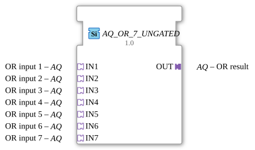

# AQ_OR_7_UNGATED

> ℹ️ **UNGATED-Variante:** Dieser Baustein ist die ungegatete Version von [`AQ_OR_7`](AQ_OR_7.md). Er unterdrückt **keine** unveränderten Wiederholungen – jedes neu berechnete Ergebnis wird bedingungslos weitergegeben, auch ohne Wertänderung. Das ist wichtig für Verbraucher, die eine periodische Kadenz unabhängig von Wertänderung brauchen (z. B. Ableitungs-/Frequenzberechnungen, die sonst nicht gegen Null abklingen). Alle Angaben zu Änderungserkennung/Change-Gating weiter unten auf dieser Seite gelten **nicht** für diesen Baustein.

* * * * * * * * * *

## Einleitung

Der **AQ_OR_7_UNGATED** ist ein generischer Funktionsblock zur bitweisen ODER-Verknüpfung von 7 Eingangswerten vom Typ `BYTE` (2-Bit-Wert (Viertel-Byte, als Byte übertragen)). Im Gegensatz zur booleschen Verknüpfung einzelner Wahrheitswerte (wie bei den `AX_OR`-Bausteinen) wird hier jedes einzelne Bit des Datenworts unabhängig verknüpft.

## Schnittstellenstruktur

### **Ereignis-Eingänge**

Keine Ereignis-Eingänge vorhanden

### **Ereignis-Ausgänge**

Keine Ereignis-Ausgänge vorhanden

### **Daten-Eingänge**

Keine direkten Daten-Eingänge vorhanden

### **Daten-Ausgänge**

Keine direkten Daten-Ausgänge vorhanden

### **Adapter**

**Eingangsadapter:**

- **IN1**: ODER-Eingang 1 (Typ: adapter::types::unidirectional::AQ)
- **IN2**: ODER-Eingang 2 (Typ: adapter::types::unidirectional::AQ)
- **IN3**: ODER-Eingang 3 (Typ: adapter::types::unidirectional::AQ)
- **IN4**: ODER-Eingang 4 (Typ: adapter::types::unidirectional::AQ)
- **IN5**: ODER-Eingang 5 (Typ: adapter::types::unidirectional::AQ)
- **IN6**: ODER-Eingang 6 (Typ: adapter::types::unidirectional::AQ)
- **IN7**: ODER-Eingang 7 (Typ: adapter::types::unidirectional::AQ)

**Ausgangsadapter:**

- **OUT**: ODER-Ergebnis (Typ: adapter::types::unidirectional::AQ)

## Funktionsweise

Sobald an einem der 7 Eingangsadapter (`IN1` … `IN7`) ein Ereignis eintrifft, verknüpft der Baustein die Bitmuster aller 7 Eingänge bitweise mit **ODER** und schreibt das Ergebnis auf den Ausgangsadapter `OUT`. Als Startwert der Verknüpfung dient das neutrale Element (alle Bits gelöscht / 0 (Nullelement der ODER-Verknüpfung)), sodass bei nur einem tatsächlich angeschlossenen Eingang dessen Wert unverändert durchgereicht wird.

Nur wenn sich das neu berechnete Ergebnis vom aktuell auf `OUT` gehaltenen Wert unterscheidet, wird `OUT` neu beschrieben und dessen Adapter-Event gesendet (siehe „Änderungserkennung" unten).

## Technische Besonderheiten

- **Generischer Baustein**: Der FB ist als generischer Typ (`GEN_AQ_OR`) definiert und deckt über den GenericClassName-Mechanismus alle Aritäten (2 bis 10 Eingänge) derselben Grundlogik ab.
- **Bitweise Verknüpfung**: Anders als bei den booleschen `AX_OR`-Bausteinen wird hier jedes Bit des `BYTE`-Datenworts einzeln verknüpft, nicht nur ein einzelner Wahrheitswert.
- **Unidirektionale Adapter**: Alle Adapter sind vom Typ `unidirectional::AQ` – die Daten fließen nur vom Socket zum Plug.
- **Normkonformität**: Der Baustein implementiert die Verknüpfung gemäß IEC 61499-2 / IEC 61131-3.

## Zustandsübersicht

Da es sich um einen kombinatorischen Logikbaustein handelt, besitzt der AQ_OR_7_UNGATED keine internen Zustände. Die Ausgabe wird bei jedem eingehenden Ereignis direkt aus den aktuellen Eingangswerten neu berechnet.

## Anwendungsszenarien

- **Bitmasken-Verknüpfung**: Kombinieren mehrerer Statusregister oder Flag-Bytes vom Typ `BYTE` zu einem Gesamtergebnis.
- **Signalaggregation**: Zusammenführen mehrerer `BYTE`-Datenquellen (z. B. aus verschiedenen Modulen) über eine gemeinsame ODER-Verknüpfung.
- **Diagnose- und Statusauswertung**: Prüfen von Bitmustern auf gemeinsame oder unterschiedliche gesetzte Bits.

## ⚖️ Vergleich mit ähnlichen Bausteinen

Im Gegensatz zu `AX_OR_7`, der einzelne boolesche Wahrheitswerte verknüpft, arbeitet `AQ_OR_7_UNGATED` auf dem vollständigen Bitmuster eines `BYTE`-Werts. Verglichen mit dem Standard-Baustein [OR_2](../../../StandardLibraries/iec61131-3/bitwiseOperators/OR_2.md) verwendet `AQ_OR_7_UNGATED` Adapter-basierte Schnittstellen anstelle direkter Daten-/Ereignisein-/ausgänge, was eine flexiblere Integration in Adapter-basierte Systemarchitekturen ermöglicht.

- **[`AQ_OR_7`](AQ_OR_7.md)**: Die gegatete Variante – aktualisiert den Ausgang nur bei tatsächlicher Wertänderung.

## Änderungserkennung

Dieser Baustein führt **keine** Änderungserkennung durch. Jedes neu berechnete Ergebnis wird bedingungslos auf den Ausgang geschrieben und das zugehörige Adapter-Event gesendet, unabhängig davon, ob sich der Wert gegenüber dem vorherigen Durchlauf geändert hat.

## Fazit

Der **AQ_OR_7_UNGATED** bietet eine zuverlässige, generische Implementierung der bitweisen ODER-Funktion für `BYTE`-Werte mit Adapter-basierten Schnittstellen. Seine generische Natur macht ihn vielseitig einsetzbar in Automatisierungsprojekten, die nach IEC 61499-Standard entwickelt werden und mehrere Bitmuster desselben Datentyps kombinieren müssen.
