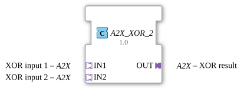

# A2X_XOR_2

* * * * * * * * * *

## Einleitung

Der Funktionsblock A2X_XOR_2 berechnet die logische EXKLUSIV-ODER-Verknüpfung zweier [A2X](../types/unidirectional/BOOL/A2X.md)-Adapter – getrennt für den UP- und den DOWN-Kanal. Wie [A2X_AND_2](A2X_AND_2.md) und [A2X_OR_2](A2X_OR_2.md) ist er ein handgebauter Composite-Funktionsblock, der zwei Standard-Bausteine `XOR_BOOL_2` intern verdrahtet, einen je Kanal.

## Schnittstellenstruktur

### **Ereignis-Eingänge**

Der Funktionsblock verfügt über keine direkten Ereignis-Eingänge – die Ereignisse laufen über die Adapter `IN1`/`IN2`.

### **Ereignis-Ausgänge**

Der Funktionsblock verfügt über keine direkten Ereignis-Ausgänge – die Ereignisse laufen über den Adapter `OUT`.

### **Daten-Eingänge**

Der Funktionsblock verfügt über keine direkten Daten-Eingänge.

### **Daten-Ausgänge**

Der Funktionsblock verfügt über keine direkten Daten-Ausgänge.

### **Adapter**

**Eingangsadapter:**

- **IN1**: XOR-Eingang 1 (Typ: `adapter::types::unidirectional::A2X`)
- **IN2**: XOR-Eingang 2 (Typ: `adapter::types::unidirectional::A2X`)

**Ausgangsadapter:**

- **OUT**: XOR-Ergebnis (Typ: `adapter::types::unidirectional::A2X`)

## Funktionsweise

Der Baustein enthält zwei interne Instanzen von `iec61131::booleanOperators::XOR_BOOL_2`: `XOR_UP` verknüpft die UP-Kanäle von `IN1` und `IN2`, `XOR_DOWN` die DOWN-Kanäle. Trifft an `IN1` oder `IN2` ein UP-Ereignis (`E_UP`) ein, wird `XOR_UP.REQ` ausgelöst, das Ergebnis von `IN1.UP XOR IN2.UP` berechnet und über `OUT.E_UP`/`OUT.UP` ausgegeben. Für den DOWN-Kanal läuft dieselbe Logik unabhängig über `XOR_DOWN`.

## Technische Besonderheiten

- Echter Composite-Baustein (kein generischer `GenericClassName`-Mechanismus), aufgebaut aus zwei Standard-`XOR_BOOL_2`-Instanzen
- Zwei unabhängige Kanäle (UP/DOWN), jeweils mit eigenem Ereignispaar – kein gemeinsamer Zustand zwischen den Kanälen
- Da IEC 61499 mehrere Quellen auf ein Ereignisziel erlaubt, aber nicht auf ein Datenziel, wird pro Kanal genau ein Logikbaustein zwischengeschaltet, statt die beiden Eingangsdaten direkt auf eine gemeinsame Variable zu verdrahten

## Zustandsübersicht

Der Baustein ist ein kombinatorischer Logikbaustein ohne internen Zustand; jedes eintreffende Ereignis berechnet das Ergebnis direkt neu:

- IN1.E_UP, IN2.E_UP → XOR_UP.REQ; IN1.UP, IN2.UP → XOR_UP.IN1/IN2; XOR_UP.CNF → OUT.E_UP; XOR_UP.OUT → OUT.UP
- IN1.E_DOWN, IN2.E_DOWN → XOR_DOWN.REQ; IN1.DOWN, IN2.DOWN → XOR_DOWN.IN1/IN2; XOR_DOWN.CNF → OUT.E_DOWN; XOR_DOWN.OUT → OUT.DOWN

## Anwendungsszenarien

- Erkennen von Widersprüchen zwischen zwei UP/DOWN-Signalquellen, die eigentlich synchron laufen sollten
- Umschalt- oder Wechsellogik, bei der genau ein Signal aktiv sein darf
- Kombinatorische Logik in Steuerungen, die auf A2X-Adaptern statt auf einfachen BOOL-Signalen basieren

## ⚖️ Vergleich mit ähnlichen Bausteinen

[A2X_AND_2](A2X_AND_2.md) und [A2X_OR_2](A2X_OR_2.md) sind baugleich, verwenden aber `AND_BOOL_2` bzw. `OR_BOOL_2` statt `XOR_BOOL_2`. Der einkanalige Vorgänger [AX_XOR_2](AX_XOR_2.md) verknüpft nur ein einzelnes Bool-Signal. Im Unterschied zu bitweisen Bausteinen wie [AB_AND_2](../bitwiseOperators/AB_AND_2.md) verarbeitet A2X_XOR_2 einzelne boolesche Wahrheitswerte je Kanal.

## Fazit

A2X_XOR_2 bringt die logische EXKLUSIV-ODER-Verknüpfung auf die zweikanalige A2X-Welt: zwei unabhängige, ereignisgesteuerte XOR-Verknüpfungen für UP und DOWN, sauber getrennt und ohne Mehrfachschreiber auf einer gemeinsamen Variable.
