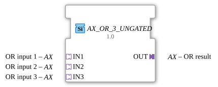

# AX_OR_3_UNGATED

> ℹ️ **UNGATED-Variante:** Dieser Baustein ist die ungegatete Version von [`AX_OR_3`](AX_OR_3.md). Er unterdrückt **keine** unveränderten Wiederholungen – jedes neu berechnete Ergebnis wird bedingungslos weitergegeben, auch ohne Wertänderung. Das ist wichtig für Verbraucher, die eine periodische Kadenz unabhängig von Wertänderung brauchen (z. B. Ableitungs-/Frequenzberechnungen, die sonst nicht gegen Null abklingen). Alle Angaben zu Änderungserkennung/Change-Gating weiter unten auf dieser Seite gelten **nicht** für diesen Baustein.

* * * * * * * * * *

## Einleitung

Der AX_OR_3_UNGATED Funktionsblock ist ein generischer Baustein zur Berechnung der logischen ODER-Verknüpfung mit drei Eingängen. Er dient zur Verarbeitung von booleschen Signalen in Steuerungsanwendungen und ermöglicht die flexible Kombination mehrerer Eingangssignale zu einem Ausgangssignal.

## Schnittstellenstruktur

### **Ereignis-Eingänge**

Keine Ereigniseingänge vorhanden.

### **Ereignis-Ausgänge**

Keine Ereignisausgänge vorhanden.

### **Daten-Eingänge**

Keine direkten Dateneingänge vorhanden.

### **Daten-Ausgänge**

Keine direkten Datenausgänge vorhanden.

### **Adapter**

**Eingangsadapter:**

- **IN1**: OR-Eingang 1 (Typ: adapter::types::unidirectional::AX)
- **IN2**: OR-Eingang 2 (Typ: adapter::types::unidirectional::AX)
- **IN3**: OR-Eingang 3 (Typ: adapter::types::unidirectional::AX)

**Ausgangsadapter:**

- **OUT**: OR-Ergebnis (Typ: adapter::types::unidirectional::AX)

## Funktionsweise

Der Funktionsblock berechnet kontinuierlich die logische ODER-Verknüpfung der drei Eingangssignale. Das Ausgangssignal ist wahr (TRUE), wenn mindestens einer der drei Eingänge wahr ist. Nur wenn alle drei Eingänge falsch (FALSE) sind, wird der Ausgang ebenfalls falsch.

Die logische Funktion lässt sich wie folgt darstellen:
OUT = IN1 OR IN2 OR IN3

## Technische Besonderheiten

- Verwendet unidirektionale Adapter für die Signalübertragung
- Implementiert als generischer Funktionsblock mit der Klasse 'GEN_AX_OR'
- Arbeitet ohne Ereignissteuerung, berechnet kontinuierlich
- Optimiert für die Verwendung in Adapter-basierten Architekturen

## Zustandsübersicht

Da es sich um einen kombinatorischen Baustein ohne Speicherfunktion handelt, besitzt AX_OR_3_UNGATED keine internen Zustände. Die Ausgabe wird ausschließlich durch die aktuellen Eingangswerte bestimmt.

## Anwendungsszenarien

- Sicherheitskreise mit mehreren Not-Aus-Tastern
- Überwachungssysteme mit mehreren Sensoren
- Steuerungslogik mit alternativen Aktivierungsbedingungen
- Verknüpfung von Statusmeldungen aus verschiedenen Quellen

## ⚖️ Vergleich mit ähnlichen Bausteinen

Im Vergleich zu Standard-ODER-Bausteinen bietet AX_OR_3_UNGATED den Vorteil von drei Eingängen in einem einzigen Baustein, was die Verdrahtung vereinfacht. Gegenüber Bausteinen mit variabler Eingangsanzahl ist AX_OR_3_UNGATED spezifisch optimiert für den dreifachen ODER-Einsatz.

Vergleich mit [OR_3](../../../StandardLibraries/iec61131-3/bitwiseOperators/OR_3.md)

- **[`AX_OR_3`](AX_OR_3.md)**: Die gegatete Variante – aktualisiert den Ausgang nur bei tatsächlicher Wertänderung.

## 🛠️ Zugehörige Übungen

- [Uebung_002a5_AX](../../../../Uebungen/test_AX/Uebungen_doc/Uebung_002a5_AX.md)
- [Uebung_002a5b_AX](../../../../Uebungen/test_AX/Uebungen_doc/Uebung_002a5b_AX.md)

## Änderungserkennung

Dieser Baustein führt **keine** Änderungserkennung durch. Jedes neu berechnete Ergebnis wird bedingungslos auf den Ausgang geschrieben und das zugehörige Adapter-Event gesendet, unabhängig davon, ob sich der Wert gegenüber dem vorherigen Durchlauf geändert hat.

## Fazit

Der AX_OR_3_UNGATED Funktionsblock stellt eine effiziente Lösung für ODER-Verknüpfungen mit drei Eingängen dar. Durch die Adapter-basierte Schnittstelle ermöglicht er eine flexible Integration in verschiedene Steuerungsarchitekturen und eignet sich besonders für Anwendungen, bei denen mehrere Bedingungen alternativ erfüllt sein können.
