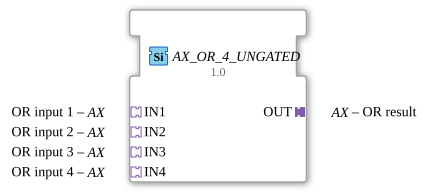

# AX_OR_4_UNGATED

> ℹ️ **UNGATED-Variante:** Dieser Baustein ist die ungegatete Version von [`AX_OR_4`](AX_OR_4.md). Er unterdrückt **keine** unveränderten Wiederholungen – jedes neu berechnete Ergebnis wird bedingungslos weitergegeben, auch ohne Wertänderung. Das ist wichtig für Verbraucher, die eine periodische Kadenz unabhängig von Wertänderung brauchen (z. B. Ableitungs-/Frequenzberechnungen, die sonst nicht gegen Null abklingen). Alle Angaben zu Änderungserkennung/Change-Gating weiter unten auf dieser Seite gelten **nicht** für diesen Baustein.

* * * * * * * * * *

## Einleitung

Der AX_OR_4_UNGATED ist ein generischer Funktionsblock zur Berechnung einer logischen ODER-Verknüpfung mit vier Eingängen. Der Baustein dient zur Verarbeitung von booleschen Signalen und gibt das Ergebnis der ODER-Operation über einen Adapter-Ausgang aus.

## Schnittstellenstruktur

### **Ereignis-Eingänge**

Keine Ereignis-Eingänge vorhanden.

### **Ereignis-Ausgänge**

Keine Ereignis-Ausgänge vorhanden.

### **Daten-Eingänge**

Keine direkten Daten-Eingänge vorhanden.

### **Daten-Ausgänge**

Keine direkten Daten-Ausgänge vorhanden.

### **Adapter**

**Eingehende Adapter (Sockets):**

- **IN1**: ODER-Eingang 1 (Typ: adapter::types::unidirectional::AX)
- **IN2**: ODER-Eingang 2 (Typ: adapter::types::unidirectional::AX)
- **IN3**: ODER-Eingang 3 (Typ: adapter::types::unidirectional::AX)
- **IN4**: ODER-Eingang 4 (Typ: adapter::types::unidirectional::AX)

**Ausgehende Adapter (Plugs):**

- **OUT**: ODER-Ergebnis (Typ: adapter::types::unidirectional::AX)

## Funktionsweise

Der Funktionsblock berechnet kontinuierlich die logische ODER-Verknüpfung der vier Eingangssignale. Das Ergebnis wird über den ausgehenden Adapter OUT ausgegeben. Die ODER-Operation liefert ein logisches TRUE, wenn mindestens einer der vier Eingänge TRUE ist. Nur wenn alle vier Eingänge FALSE sind, wird das Ergebnis FALSE.

## Technische Besonderheiten

- Verwendet unidirektionale Adapter für die Kommunikation
- Implementiert als generischer Funktionsblock mit der Klasse 'GEN_AX_OR'
- Arbeitet mit dem Adapter-Typ AX für boolesche Werte
- Keine Ereignissteuerung - arbeitet kontinuierlich

## Zustandsübersicht

Da es sich um einen kombinatorischen Baustein ohne Ereignissteuerung handelt, besitzt der AX_OR_4_UNGATED keine Zustandsmaschine. Die Ausgabe wird kontinuierlich basierend auf den aktuellen Eingangswerten berechnet.

## Anwendungsszenarien

- Sicherheitskreise mit mehreren Not-Aus-Tastern
- Überwachungssysteme mit mehreren Sensoren
- Steuerungslogik mit parallelen Bedingungen
- Alarmierungsysteme mit mehreren Auslösern

## ⚖️ Vergleich mit ähnlichen Bausteinen

Im Vergleich zu einfacheren ODER-Bausteinen bietet AX_OR_4_UNGATED den Vorteil von vier Eingängen in einem einzigen Baustein, was die Verdrahtung vereinfacht und Platz spart. Gegenüber Bausteinen mit Ereignissteuerung arbeitet AX_OR_4_UNGATED kontinuierlich ohne explizite Auslöseereignisse.

Vergleich mit [OR_4](../../../StandardLibraries/iec61131-3/bitwiseOperators/OR_4.md)

- **[`AX_OR_4`](AX_OR_4.md)**: Die gegatete Variante – aktualisiert den Ausgang nur bei tatsächlicher Wertänderung.

## Änderungserkennung

Dieser Baustein führt **keine** Änderungserkennung durch. Jedes neu berechnete Ergebnis wird bedingungslos auf den Ausgang geschrieben und das zugehörige Adapter-Event gesendet, unabhängig davon, ob sich der Wert gegenüber dem vorherigen Durchlauf geändert hat.

## Fazit

Der AX_OR_4_UNGATED ist ein effizienter und kompakter Baustein für logische ODER-Verknüpfungen mit vier Eingängen. Seine Adapter-basierte Schnittstelle ermöglicht eine flexible Integration in größere Steuerungssysteme, während die kontinuierliche Arbeitsweise eine sofortige Reaktion auf Eingangsänderungen gewährleistet.
