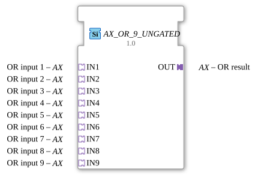

# AX_OR_9_UNGATED

> ℹ️ **UNGATED-Variante:** Dieser Baustein ist die ungegatete Version von [`AX_OR_9`](AX_OR_9.md). Er unterdrückt **keine** unveränderten Wiederholungen – jedes neu berechnete Ergebnis wird bedingungslos weitergegeben, auch ohne Wertänderung. Das ist wichtig für Verbraucher, die eine periodische Kadenz unabhängig von Wertänderung brauchen (z. B. Ableitungs-/Frequenzberechnungen, die sonst nicht gegen Null abklingen). Alle Angaben zu Änderungserkennung/Change-Gating weiter unten auf dieser Seite gelten **nicht** für diesen Baustein.

* * * * * * * * * *

## Einleitung

Der AX_OR_9_UNGATED ist ein generischer Funktionsblock zur Berechnung der booleschen ODER-Verknüpfung mit neun Eingängen. Der Baustein dient zur logischen Verarbeitung von Signalen in Automatisierungssystemen und gibt das Ergebnis der ODER-Operation aller Eingangssignale aus.

## Schnittstellenstruktur

### **Ereignis-Eingänge**

*Keine Ereignis-Eingänge vorhanden*

### **Ereignis-Ausgänge**

*Keine Ereignis-Ausgänge vorhanden*

### **Daten-Eingänge**

*Keine direkten Daten-Eingänge vorhanden*

### **Daten-Ausgänge**

*Keine direkten Daten-Ausgänge vorhanden*

### **Adapter**

**Sockets (Eingänge):**

- **IN1** - ODER Eingang 1
- **IN2** - ODER Eingang 2
- **IN3** - ODER Eingang 3
- **IN4** - ODER Eingang 4
- **IN5** - ODER Eingang 5
- **IN6** - ODER Eingang 6
- **IN7** - ODER Eingang 7
- **IN8** - ODER Eingang 8
- **IN9** - ODER Eingang 9

**Plugs (Ausgang):**

- **OUT** - ODER Ergebnis

## Funktionsweise

Der Funktionsblock berechnet kontinuierlich die boolesche ODER-Verknüpfung aller neun Eingangssignale. Das Ausgangssignal ist TRUE (1), wenn mindestens einer der neun Eingänge TRUE (1) ist. Nur wenn alle Eingänge FALSE (0) sind, wird der Ausgang ebenfalls FALSE (0).

## Technische Besonderheiten

- Generischer Funktionsblock mit fest konfigurierter Anzahl von 9 Eingängen
- Verwendet unidirektionale AX-Adapter für Ein- und Ausgänge
- Keine Ereignissteuerung - arbeitet kontinuierlich
- Implementiert als generischer Baustein mit spezifischem Klassennamen

## Zustandsübersicht

Der Funktionsblock besitzt keinen internen Zustand und arbeitet stateless. Die Ausgabe wird ausschließlich auf Basis der aktuellen Eingangswerte berechnet.

## Anwendungsszenarien

- Sicherheitskreise mit mehreren Not-Aus-Tastern
- Überwachungssysteme mit mehreren Sensoren
- Steuerungslogik mit redundanten Eingangssignalen
- Alarmierungssysteme mit mehreren Auslösern

## ⚖️ Vergleich mit ähnlichen Bausteinen

Im Vergleich zu Standard-ODER-Bausteinen mit weniger Eingängen bietet AX_OR_9_UNGATED die Möglichkeit, bis zu neun Signale gleichzeitig zu verarbeiten, was die Verdrahtung komplexerer Logiken vereinfacht. Gegenüber konfigurierbaren ODER-Bausteinen hat dieser FB eine feste Anzahl an Eingängen, was bei bekannten Anforderungen die Konfiguration vereinfacht.

Vergleich mit [OR_9](../../../StandardLibraries/iec61131-3/bitwiseOperators/OR_9.md)

- **[`AX_OR_9`](AX_OR_9.md)**: Die gegatete Variante – aktualisiert den Ausgang nur bei tatsächlicher Wertänderung.

## Änderungserkennung

Dieser Baustein führt **keine** Änderungserkennung durch. Jedes neu berechnete Ergebnis wird bedingungslos auf den Ausgang geschrieben und das zugehörige Adapter-Event gesendet, unabhängig davon, ob sich der Wert gegenüber dem vorherigen Durchlauf geändert hat.

## Fazit

Der AX_OR_9_UNGATED ist ein spezialisierter ODER-Baustein für Anwendungen, die genau neun Eingangssignale logisch verknüpfen müssen. Durch die feste Eingangsanzahl und die einfache Funktionsweise eignet er sich besonders für klar definierte Steuerungsaufgaben mit redundanten Eingangssignalen.
