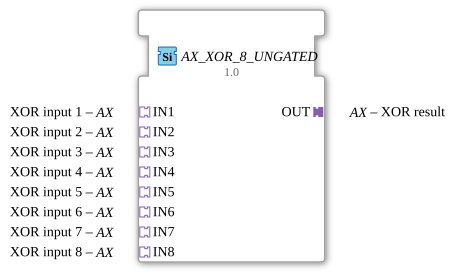

# AX_XOR_8_UNGATED

> ℹ️ **UNGATED-Variante:** Dieser Baustein ist die ungegatete Version von [`AX_XOR_8`](AX_XOR_8.md). Er unterdrückt **keine** unveränderten Wiederholungen – jedes neu berechnete Ergebnis wird bedingungslos weitergegeben, auch ohne Wertänderung. Das ist wichtig für Verbraucher, die eine periodische Kadenz unabhängig von Wertänderung brauchen (z. B. Ableitungs-/Frequenzberechnungen, die sonst nicht gegen Null abklingen). Alle Angaben zu Änderungserkennung/Change-Gating weiter unten auf dieser Seite gelten **nicht** für diesen Baustein.

* * * * * * * * * *

## Einleitung

Der AX_XOR_8_UNGATED Funktionsblock ist ein generischer Baustein zur Berechnung der booleschen XOR-Verknüpfung mit 8 Eingängen. Er ermöglicht die Verarbeitung von logischen Signalen nach dem Exklusiv-ODER-Prinzip und ist für den Einsatz in Steuerungsanwendungen konzipiert.

## Schnittstellenstruktur

### **Ereignis-Eingänge**

Keine Ereignis-Eingänge vorhanden

### **Ereignis-Ausgänge**

Keine Ereignis-Ausgänge vorhanden

### **Daten-Eingänge**

Keine direkten Daten-Eingänge vorhanden

### **Daten-Ausgänge**

Keine direkten Daten-Ausgänge vorhanden

### **Adapter**

**Plug-Adapter:**

- **OUT**: Unidirektionaler Adapter für das XOR-Ergebnis

**Socket-Adapter:**

- **IN1**: Unidirektionaler Adapter für XOR-Eingang 1
- **IN2**: Unidirektionaler Adapter für XOR-Eingang 2
- **IN3**: Unidirektionaler Adapter für XOR-Eingang 3
- **IN4**: Unidirektionaler Adapter für XOR-Eingang 4
- **IN5**: Unidirektionaler Adapter für XOR-Eingang 5
- **IN6**: Unidirektionaler Adapter für XOR-Eingang 6
- **IN7**: Unidirektionaler Adapter für XOR-Eingang 7
- **IN8**: Unidirektionaler Adapter für XOR-Eingang 8

## Funktionsweise

Der Funktionsblock berechnet die XOR-Verknüpfung über alle 8 Eingänge. Die XOR-Operation (Exklusiv-ODER) liefert genau dann ein TRUE-Signal, wenn eine ungerade Anzahl der Eingänge TRUE ist. Bei einer geraden Anzahl von TRUE-Eingängen wird FALSE ausgegeben.

## Technische Besonderheiten

- Generischer Funktionsblock mit der Klasse 'GEN_AX_XOR'
- Verwendet unidirektionale Adapter für alle Ein- und Ausgänge
- Keine direkten Ereignis- oder Datenschnittstellen
- Adapter-basierte Architektur für flexible Anbindung

## Zustandsübersicht

Da es sich um einen kombinatorischen Logikbaustein handelt, besitzt der AX_XOR_8_UNGATED keinen internen Zustand. Die Ausgabe wird ausschließlich von den aktuellen Eingangswerten bestimmt.

## Anwendungsszenarien

- Paritätsprüfung in Datenübertragungssystemen
- Sicherheitskritische Steuerungen mit Mehrfachredundanz
- Logische Verknüpfungen in Automatisierungssystemen
- Fehlererkennung in binären Signalketten

## ⚖️ Vergleich mit ähnlichen Bausteinen

Im Vergleich zu einfachen XOR-Bausteinen mit weniger Eingängen bietet AX_XOR_8_UNGATED die Möglichkeit, bis zu 8 Signale gleichzeitig zu verknüpfen. Die ausschließliche Verwendung von Adaptern statt direkter Daten- und Ereigniseingänge ermöglicht eine höhere Flexibilität in komplexen Systemarchitekturen.

Vergleich mit [XOR_8](../../../StandardLibraries/iec61131-3/bitwiseOperators/XOR_8.md)

- **[`AX_XOR_8`](AX_XOR_8.md)**: Die gegatete Variante – aktualisiert den Ausgang nur bei tatsächlicher Wertänderung.

## Änderungserkennung

Dieser Baustein führt **keine** Änderungserkennung durch. Jedes neu berechnete Ergebnis wird bedingungslos auf den Ausgang geschrieben und das zugehörige Adapter-Event gesendet, unabhängig davon, ob sich der Wert gegenüber dem vorherigen Durchlauf geändert hat.

## Fazit

Der AX_XOR_8_UNGATED ist ein spezialisierter Logikbaustein für anspruchsvolle XOR-Operationen mit mehreren Eingängen. Seine Adapter-basierte Schnittstelle macht ihn besonders geeignet für modulare Systemdesigns, bei denen flexible Verbindungen zwischen Funktionsblöcken erforderlich sind.
