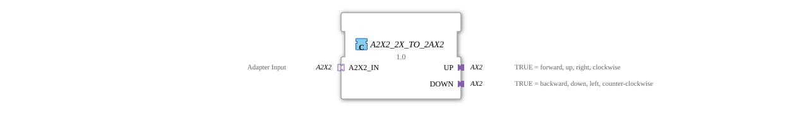

# A2X2_2X_TO_2AX2

* * * * * * * * * *

## Einleitung

Der Funktionsblock A2X2_2X_TO_2AX2 ist die Umkehrung von [A2X2_2AX2_TO_2X](A2X2_2AX2_TO_2X.md): Er zerlegt einen [A2X2](../../../types/bidirectional/BOOL/A2X2.md)-Socket in zwei [AX2](../../../types/bidirectional/BOOL/AX2.md)-Plugs – einen für UP, einen für DOWN.

## Schnittstellenstruktur

### **Ereignis-Eingänge**

Der Funktionsblock verfügt über keine direkten Ereignis-Eingänge – die Kommunikation läuft ausschließlich über die Adapter.

### **Ereignis-Ausgänge**

Der Funktionsblock verfügt über keine direkten Ereignis-Ausgänge.

### **Daten-Eingänge**

Der Funktionsblock verfügt über keine direkten Daten-Eingänge.

### **Daten-Ausgänge**

Der Funktionsblock verfügt über keine direkten Daten-Ausgänge.

### **Adapter**

- **A2X2_IN** (Socket): zu zerlegender Eingang vom Typ `adapter::types::bidirectional::A2X2`
- **UP** (Plug): Kanal UP, vom Typ `adapter::types::bidirectional::AX2` – TRUE = vorwärts, hoch, rechts, im Uhrzeigersinn
- **DOWN** (Plug): Kanal DOWN, vom Typ `adapter::types::bidirectional::AX2` – TRUE = rückwärts, runter, links, gegen den Uhrzeigersinn

## Funktionsweise

Für jeden Kanal wird die komplette bidirektionale Verdrahtung zwischen dem A2X2-Socket und dem zugehörigen AX2-Plug hergestellt: Was `A2X2_IN` auf seiner Indikations-Seite empfängt (`EO_UP`/`DO_UP`), wird an `UP.EO1`/`UP.DO1` weitergegeben; was am `UP`-Plug auf dessen Anfrage-Seite eintrifft (`EI1`/`DI1`), wird an `A2X2_IN.EI_UP`/`DI_UP` zurückgemeldet. Für DOWN gilt dieselbe Verdrahtung mit dem `DOWN`-Plug. Beide Kanäle sind vollständig unabhängig.

## Technische Besonderheiten

- Nutzt die Bidirektionalität von AX2 direkt aus – jeder Kanal braucht nur einen einzigen Adapter, nicht zwei
- Reine Verdrahtung ohne Logik oder Zustand
- Jede Zielvariable hat genau einen Schreiber, keine Mehrfach-Datenverbindungen

## Zustandsübersicht

Der Baustein ist zustandslos:

- A2X2_IN.EO_UP → UP.EO1, A2X2_IN.DO_UP → UP.DO1
- UP.EI1 → A2X2_IN.EI_UP, UP.DI1 → A2X2_IN.DI_UP
- A2X2_IN.EO_DOWN → DOWN.EO1, A2X2_IN.DO_DOWN → DOWN.DO1
- DOWN.EI1 → A2X2_IN.EI_DOWN, DOWN.DI1 → A2X2_IN.DI_DOWN

## Anwendungsszenarien

- Aufsplitten eines A2X2-Bussignals in zwei unabhängig weiterverarbeitbare AX2-Kanäle
- Anbindung vorhandener AX2-basierter Teilsysteme an ein zentrales A2X2
- Testaufbauten, die jeden Kanal einzeln beobachten oder steuern müssen

## ⚖️ Vergleich mit ähnlichen Bausteinen

Das Gegenstück [A2X2_2AX2_TO_2X](A2X2_2AX2_TO_2X.md) komponiert statt zu zerlegen. Für dieselbe Aufgabe gibt es mit [A2X2_4AX_TO_2X](A2X2_4AX_TO_2X.md) / [A2X2_2X_TO_4AX](A2X2_2X_TO_4AX.md) eine Alternative mit vier unidirektionalen [AX](../../../types/unidirectional/BOOL/AX.md)-Adaptern statt zwei bidirektionalen AX2. Der unidirektionale Vorgänger [A2X_2X_TO_2AX](../../unidirectional/BOOL/A2X_2X_TO_2AX.md) zerlegt analog in zwei einfache [AX](../../../types/unidirectional/BOOL/AX.md)-Adapter.

## Fazit

A2X2_2X_TO_2AX2 ist der effizienteste Weg, ein A2X2-Signal in zwei unabhängige AX2-Kanäle aufzuteilen, da beide Adapter bereits bidirektional sind und keine zusätzliche Logik nötig ist.
