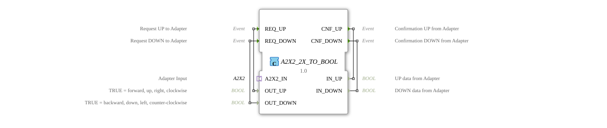

# A2X2_2X_TO_BOOL

* * * * * * * * * *

## Einleitung

Der Funktionsblock A2X2_2X_TO_BOOL ist das Socket-Gegenstück zu [A2X2_BOOL_TO_2X](A2X2_BOOL_TO_2X.md): Er übersetzt das bidirektionale [A2X2](../../../types/bidirectional/BOOL/A2X2.md)-Adapterformat zurück in zwei einfache BOOL-Kanäle (UP und DOWN), indem er einen A2X2-Socket bereitstellt.

## Schnittstellenstruktur

### **Ereignis-Eingänge**

- **REQ_UP**: Anfrage-Ereignis für den UP-Kanal, liefert `OUT_UP`
- **REQ_DOWN**: Anfrage-Ereignis für den DOWN-Kanal, liefert `OUT_DOWN`

### **Ereignis-Ausgänge**

- **CNF_UP**: Bestätigungs-Ereignis für den UP-Kanal, liefert `IN_UP`
- **CNF_DOWN**: Bestätigungs-Ereignis für den DOWN-Kanal, liefert `IN_DOWN`

### **Daten-Eingänge**

- **OUT_UP**: BOOL, TRUE = vorwärts, hoch, rechts, im Uhrzeigersinn
- **OUT_DOWN**: BOOL, TRUE = rückwärts, runter, links, gegen den Uhrzeigersinn

### **Daten-Ausgänge**

- **IN_UP**: BOOL, UP-Daten vom Adapter
- **IN_DOWN**: BOOL, DOWN-Daten vom Adapter

### **Adapter**

- **A2X2_IN** (Socket): Adapter-Eingang vom Typ `adapter::types::bidirectional::A2X2`

## Funktionsweise

Empfängt der Socket `A2X2_IN` auf seiner Indikations-Seite Ereignisse (`EO_UP`/`DO_UP` bzw. `EO_DOWN`/`DO_DOWN`), werden diese unmittelbar als `CNF_UP`/`IN_UP` bzw. `CNF_DOWN`/`IN_DOWN` nach außen gemeldet. Trifft umgekehrt ein `REQ_UP`- oder `REQ_DOWN`-Ereignis ein, wird der zugehörige `OUT_UP`/`OUT_DOWN`-Wert über den Socket (`EI_UP`/`DI_UP` bzw. `EI_DOWN`/`DI_DOWN`) nach außen gesendet. Beide Kanäle laufen komplett unabhängig voneinander.

## Technische Besonderheiten

- Reine 1:1-Durchleitung, kein interner Zustand, keine Gatter oder Logikbausteine nötig
- Nutzt einen A2X2-Socket, d. h. dieser Baustein ist das Gegenstück, an das ein A2X2-Plug angeschlossen wird
- Identische Schnittstelle zu [A2X2_BOOL_TO_2X](A2X2_BOOL_TO_2X.md), nur die Adapter-Rolle (Socket statt Plug) unterscheidet sich

## Zustandsübersicht

Der Baustein ist zustandslos, jede Verbindung wirkt sofort und direkt:

- A2X2_IN.EO_UP → CNF_UP, A2X2_IN.DO_UP → IN_UP
- A2X2_IN.EO_DOWN → CNF_DOWN, A2X2_IN.DO_DOWN → IN_DOWN
- REQ_UP → A2X2_IN.EI_UP, OUT_UP → A2X2_IN.DI_UP
- REQ_DOWN → A2X2_IN.EI_DOWN, OUT_DOWN → A2X2_IN.DI_DOWN

## Anwendungsszenarien

- Auslesen zweier UP/DOWN-Kanäle eines A2X2-Busteilnehmers als einfache BOOL-Signale
- Integration eines A2X2-Endgeräts in eine klassisch verdrahtete Steuerung
- Testbausteine, die als Gegenstelle für A2X2_BOOL_TO_2X dienen

## ⚖️ Vergleich mit ähnlichen Bausteinen

Das Plug-Gegenstück ist [A2X2_BOOL_TO_2X](A2X2_BOOL_TO_2X.md). Für den unidirektionalen Fall existiert [A2X_2X_TO_BOOL](../../unidirectional/BOOL/A2X_2X_TO_BOOL.md). Der einkanalige bidirektionale Vorgänger ist [AX2_X_TO_BOOL](AX2_X_TO_BOOL.md).

## Fazit

A2X2_2X_TO_BOOL ist das direkte Gegenstück zu A2X2_BOOL_TO_2X und macht ein A2X2-Bussignal als zwei einfache BOOL-Kanäle für die restliche Anwendung nutzbar.
