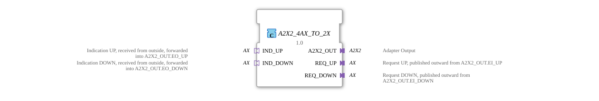

# A2X2_4AX_TO_2X

* * * * * * * * * *

## Einleitung

Der Funktionsblock A2X2_4AX_TO_2X ist die Umkehrung von [A2X2_2X_TO_4AX](A2X2_2X_TO_4AX.md): Er setzt aus **vier** unidirektionalen [AX](../../../types/unidirectional/BOOL/AX.md)-Adaptern einen [A2X2](../../../types/bidirectional/BOOL/A2X2.md)-Plug zusammen. Zwei Kanäle (UP/DOWN) × zwei Richtungen (Indikation/Anfrage) = vier AX.

## Schnittstellenstruktur

### **Ereignis-Eingänge**

Der Funktionsblock verfügt über keine direkten Ereignis-Eingänge – die Kommunikation läuft ausschließlich über die Adapter.

### **Ereignis-Ausgänge**

Der Funktionsblock verfügt über keine direkten Ereignis-Ausgänge.

### **Daten-Eingänge**

Der Funktionsblock verfügt über keine direkten Daten-Eingänge.

### **Daten-Ausgänge**

Der Funktionsblock verfügt über keine direkten Daten-Ausgänge.

### **Adapter**

- **A2X2_OUT** (Plug): zusammengesetzter Ausgang vom Typ `adapter::types::bidirectional::A2X2`
- **REQ_UP** (Plug): Anfrage UP, aus `A2X2_OUT.EI_UP` nach außen veröffentlicht, Typ `adapter::types::unidirectional::AX`
- **REQ_DOWN** (Plug): Anfrage DOWN, aus `A2X2_OUT.EI_DOWN` nach außen veröffentlicht, Typ `adapter::types::unidirectional::AX`
- **IND_UP** (Socket): Indikation UP, von außen empfangen und an `A2X2_OUT.EO_UP` weitergereicht, Typ `adapter::types::unidirectional::AX`
- **IND_DOWN** (Socket): Indikation DOWN, von außen empfangen und an `A2X2_OUT.EO_DOWN` weitergereicht, Typ `adapter::types::unidirectional::AX`

## Funktionsweise

Was an den unidirektionalen Sockets `IND_UP`/`IND_DOWN` von außen ankommt, wird auf die Indikations-Seite des A2X2-Plugs (`EO_UP`/`DO_UP` bzw. `EO_DOWN`/`DO_DOWN`) durchgereicht. Umgekehrt wird alles, was der A2X2-Plug auf seiner Anfrage-Seite empfängt (`EI_UP`/`DI_UP` bzw. `EI_DOWN`/`DI_DOWN`), über die unidirektionalen Plugs `REQ_UP`/`REQ_DOWN` veröffentlicht.

## Technische Besonderheiten

- Vier separate AX-Adapter statt zwei AX2, weil AX kein `EventInputs`/`EventOutputs`-Paar in einem Adapter vereint – jede Richtung braucht ihren eigenen Adapter
- Reine Verdrahtung ohne Logik oder Zustand
- Jede Zielvariable hat genau einen Schreiber, keine Mehrfach-Datenverbindungen

## Zustandsübersicht

Der Baustein ist zustandslos:

- IND_UP.E1 → A2X2_OUT.EO_UP, IND_UP.D1 → A2X2_OUT.DO_UP
- IND_DOWN.E1 → A2X2_OUT.EO_DOWN, IND_DOWN.D1 → A2X2_OUT.DO_DOWN
- A2X2_OUT.EI_UP → REQ_UP.E1, A2X2_OUT.DI_UP → REQ_UP.D1
- A2X2_OUT.EI_DOWN → REQ_DOWN.E1, A2X2_OUT.DI_DOWN → REQ_DOWN.D1

## Anwendungsszenarien

- Aufbau eines A2X2-Endgeräts aus vier bereits vorhandenen, unidirektionalen AX-Signalen
- Migrationsszenarien, in denen eine bestehende AX-Infrastruktur schrittweise auf A2X2 umgestellt wird
- Systeme, in denen bidirektionale AX2-Adapter nicht verfügbar oder nicht gewünscht sind

## ⚖️ Vergleich mit ähnlichen Bausteinen

Für dieselbe Aufgabe (A2X2 komponieren) gibt es mit [A2X2_2AX2_TO_2X](A2X2_2AX2_TO_2X.md) eine einfachere Alternative, die nur zwei bidirektionale [AX2](../../../types/bidirectional/BOOL/AX2.md) statt vier unidirektionaler AX benötigt – wo AX2-Infrastruktur zur Verfügung steht, ist das die schlankere Lösung. Das Gegenstück zu diesem Baustein ist [A2X2_2X_TO_4AX](A2X2_2X_TO_4AX.md), das ein A2X2 wieder in vier AX zerlegt.

## Fazit

A2X2_4AX_TO_2X ist die richtige Wahl, wenn ein A2X2-Endgerät aus rein unidirektionaler AX-Infrastruktur aufgebaut werden muss – auf Kosten von doppelt so vielen Adaptern wie bei der AX2-basierten Alternative.
