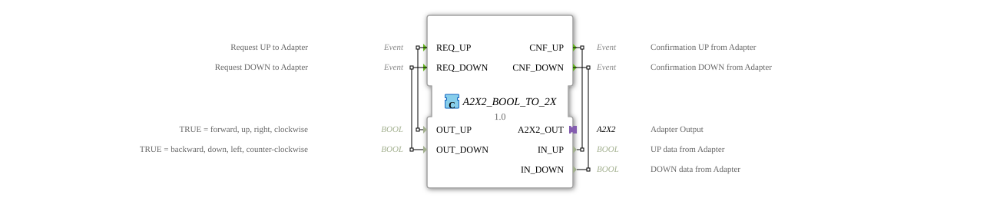

# A2X2_BOOL_TO_2X

* * * * * * * * * *

## Einleitung

Der Funktionsblock A2X2_BOOL_TO_2X ist ein Composite-Funktionsblock, der zwei einfache BOOL-Kanäle (UP und DOWN) in das bidirektionale [A2X2](../../../types/bidirectional/BOOL/A2X2.md)-Adapterformat übersetzt. Er stellt dazu einen A2X2-Plug bereit und bildet jeden der beiden Kanäle unabhängig über ein eigenes Anfrage-/Bestätigungs-Ereignispaar ab.

## Schnittstellenstruktur

### **Ereignis-Eingänge**

- **REQ_UP**: Anfrage-Ereignis für den UP-Kanal, liefert `OUT_UP`
- **REQ_DOWN**: Anfrage-Ereignis für den DOWN-Kanal, liefert `OUT_DOWN`

### **Ereignis-Ausgänge**

- **CNF_UP**: Bestätigungs-Ereignis für den UP-Kanal, liefert `IN_UP`
- **CNF_DOWN**: Bestätigungs-Ereignis für den DOWN-Kanal, liefert `IN_DOWN`

### **Daten-Eingänge**

- **OUT_UP**: BOOL, TRUE = vorwärts, hoch, rechts, im Uhrzeigersinn
- **OUT_DOWN**: BOOL, TRUE = rückwärts, runter, links, gegen den Uhrzeigersinn

### **Daten-Ausgänge**

- **IN_UP**: BOOL, UP-Daten vom Adapter
- **IN_DOWN**: BOOL, DOWN-Daten vom Adapter

### **Adapter**

- **A2X2_OUT** (Plug): Adapter-Ausgang vom Typ `adapter::types::bidirectional::A2X2`

## Funktionsweise

Trifft ein `REQ_UP`-Ereignis ein, wird der aktuelle Wert von `OUT_UP` über `A2X2_OUT.EO_UP`/`A2X2_OUT.DO_UP` gesendet; analog für `REQ_DOWN`/`OUT_DOWN` über `EO_DOWN`/`DO_DOWN`. Umgekehrt wird alles, was der Adapter auf seiner Anfrage-Seite empfängt (`A2X2_OUT.EI_UP`/`A2X2_OUT.EI_DOWN` mit `DI_UP`/`DI_DOWN`), unverändert als `CNF_UP`/`IN_UP` bzw. `CNF_DOWN`/`IN_DOWN` nach außen weitergereicht. Beide Kanäle laufen komplett unabhängig voneinander.

## Technische Besonderheiten

- Reine 1:1-Durchleitung, kein interner Zustand, keine Gatter oder Logikbausteine nötig
- Jeder Kanal (UP/DOWN) hat sein eigenes Ereignispaar – es gibt keine geteilte Variable, die von zwei Quellen gleichzeitig beschrieben werden müsste
- Nutzt den A2X2-Plug, d. h. dieser Baustein tritt als "Endgerät" auf, an das ein A2X2-Socket angeschlossen wird

## Zustandsübersicht

Der Baustein ist zustandslos, jede Verbindung wirkt sofort und direkt:

- REQ_UP → A2X2_OUT.EO_UP, OUT_UP → A2X2_OUT.DO_UP
- REQ_DOWN → A2X2_OUT.EO_DOWN, OUT_DOWN → A2X2_OUT.DO_DOWN
- A2X2_OUT.EI_UP → CNF_UP, A2X2_OUT.DI_UP → IN_UP
- A2X2_OUT.EI_DOWN → CNF_DOWN, A2X2_OUT.DI_DOWN → IN_DOWN

## Anwendungsszenarien

- Anschluss zweier einfacher BOOL-Signale (z. B. zweier Taster oder Endschalter für UP/DOWN) an ein A2X2-Bussystem
- Testbausteine, die A2X2-Verkehr ohne echte Hardware simulieren
- Brücke zwischen klassischer BOOL-Verdrahtung und Adapter-basierten Subnetzen

## ⚖️ Vergleich mit ähnlichen Bausteinen

Das Socket-Gegenstück [A2X2_2X_TO_BOOL](A2X2_2X_TO_BOOL.md) hat dieselbe Schnittstelle, verwendet aber einen A2X2-Socket statt eines Plugs. Für den unidirektionalen Fall existiert mit [A2X_BOOL_TO_2X](../../unidirectional/BOOL/A2X_BOOL_TO_2X.md) ein Baustein mit identischer Grundidee, aber ohne Anfrage-Seite (nur `E_UP`/`E_DOWN`). Der einkanalige bidirektionale Vorgänger ist [AX2_BOOL_TO_X](AX2_BOOL_TO_X.md), von dem dieser Baustein das Muster auf zwei unabhängige Kanäle verdoppelt.

## Fazit

A2X2_BOOL_TO_2X ist die einfachste Möglichkeit, plain-BOOL-Signale mit einem A2X2-Adapter zu verbinden – ohne Zustand, ohne Logik, ein direkter 1:1-Durchgriff pro Kanal.
