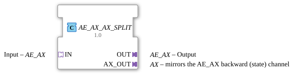

# AE_AX_AX_SPLIT

* * * * * * * * * *

## Einleitung

Der AE_AX_AX_SPLIT ist ein Composite-Funktionsblock, der ein eingehendes AE_AX-Ereignis unverändert von seinem Socket `IN` an den Plug `OUT` durchreicht und zusätzlich den auf dem Rückkanal von `OUT` gemeldeten Zustand (Event + Bool) über einen dritten, unidirektionalen `AX_OUT`-Plug nach außen spiegelt. Damit lässt sich der Zustand einer nachgeschalteten Kette parallel an einer zweiten Stelle abgreifen, ohne die eigentliche AE_AX-Verbindung zu unterbrechen.

## Schnittstellenstruktur

### **Ereignis-Eingänge**

*Keine direkten Ereignis-Eingänge vorhanden – Ereignisse kommen über die Adapter-Sockets/-Plugs*

### **Ereignis-Ausgänge**

*Keine direkten Ereignis-Ausgänge vorhanden*

### **Daten-Eingänge**

*Keine Daten-Eingänge vorhanden*

### **Daten-Ausgänge**

*Keine Daten-Ausgänge vorhanden*

### **Adapter**

- **IN**: Bidirektionaler Adapter-Socket vom Typ `adapter::types::bidirectional::AE_AX` (Eingang)
- **OUT**: Bidirektionaler Adapter-Plug vom Typ `adapter::types::bidirectional::AE_AX` (Ausgang)
- **AX_OUT**: Unidirektionaler Adapter-Plug vom Typ `adapter::types::unidirectional::AX`, spiegelt den Rückkanal (Zustand) von AE_AX

## Funktionsweise

1. Jedes an `IN.E1` eintreffende Ereignis wird unverändert an `OUT.E1` weitergeleitet – die Vorwärtsrichtung wird 1:1 durchgeschleift.
2. Das Rückkanal-Ereignis `OUT.EI1` (samt zugehörigem Datum `OUT.DI1`) wird sowohl an `IN.EI1`/`IN.DI1` zurückgemeldet als auch gleichzeitig an `AX_OUT.E1`/`AX_OUT.D1` weitergegeben.
3. Dadurch ist der über `OUT` gemeldete Zustand an zwei Stellen sichtbar: am ursprünglichen Socket `IN` (wie es ein reiner Passthrough auch täte) und zusätzlich isoliert am `AX_OUT`-Plug.

## Technische Besonderheiten

- Reine Ereignis-/Datenverbindungen (`FBNetwork`), keine eigene Logik oder Zustandsverwaltung
- Vorwärtsrichtung (Socket → Plug) ist ein einfacher 1:1-Passthrough
- Rückkanal wird verdoppelt statt aufgeteilt: beide Ziele (`IN` und `AX_OUT`) erhalten dieselbe Information

## Zustandsübersicht

Der Funktionsblock besitzt keinen internen Zustand und arbeitet stateless. Jedes eingehende Ereignis wird sofort weitergeleitet bzw. gespiegelt.

## Anwendungsszenarien

- Zusätzliches, isoliertes Abgreifen des AE_AX-Rückkanals (z. B. für eine separate Anzeige oder Protokollierung) ohne die eigentliche Verbindung zwischen `IN` und `OUT` zu verändern
- Aufbau von Diagnose-/Monitoring-Pfaden in AE_AX-basierten Steuerungsnetzwerken

## ⚖️ Vergleich mit ähnlichen Bausteinen

Im Vergleich zu [AE2_SPLIT_MERGE](AE2_SPLIT_MERGE.md), das Vorwärts- und Rückwärtsrichtung zwischen zwei getrennten, isolierten Adaptern verteilt bzw. zusammenführt, ist der AE_AX_AX_SPLIT ein reiner Passthrough zwischen `IN` und `OUT` mit einem zusätzlichen Mirror-Ausgang für den Rückkanal – die ASR_AX- und ASRT_AX-Varianten [ASR_AX_AX_SPLIT](ASR_AX_AX_SPLIT.md) und [ASRT_AX_AX_SPLIT](ASRT_AX_AX_SPLIT.md) folgen demselben Muster mit zwei bzw. drei Vorwärts-Ereignissen.

## Fazit

Der AE_AX_AX_SPLIT ermöglicht es, den AX-Rückkanal eines AE_AX-Adapterpaares zusätzlich an einer zweiten Stelle im Netzwerk verfügbar zu machen, ohne die eigentliche Signalkette zu unterbrechen oder zu verändern.
