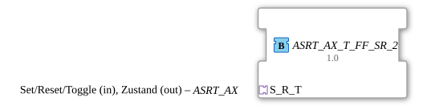

# ASRT_AX_T_FF_SR_2



* * * * * * * * * *

## Einleitung

Der ASRT_AX_T_FF_SR_2 ist ein ereignisgesteuertes bistabiles Flipflop mit Toggle-Funktionalität und einem einzigen bidirektionalen `ASRT_AX`-Socket: Set/Reset/Toggle kommen am selben Adapter an, über den auch der neue Zustand zurückgemeldet wird. Er ist damit die bidirektionale Entsprechung von [ASRT_AX_T_FF_SR](../unidirectional/BOOL/ASRT_AX_T_FF_SR.md) (unidirektionaler ASRT-Socket + separater AX-Plug) und die um Toggle erweiterte Variante von [ASR_AX_SR_2](ASR_AX_SR_2.md).

## Schnittstellenstruktur

### **Ereignis-Eingänge**

*Keine direkten Ereignis-Eingänge vorhanden – Set/Reset/Toggle kommen über den Adapter-Socket `S_R_T`*

### **Ereignis-Ausgänge**

*Keine direkten Ereignis-Ausgänge vorhanden*

### **Daten-Eingänge**

*Keine Dateneingänge vorhanden*

### **Daten-Ausgänge**

*Keine Datenausgänge vorhanden*

### **Adapter**

- **S_R_T**: Bidirektionaler Adapter-Socket vom Typ `adapter::types::bidirectional::ASRT_AX` – Set/Reset/Toggle (Eingang), Zustand (Ausgang) über denselben Adapter

## Funktionsweise

Der ASRT_AX_T_FF_SR_2 verfügt über drei Betriebszustände:

- **START**: Initialzustand
- **SET**: Zustand TRUE
- **RESET**: Zustand FALSE

Die Zustandsübergänge werden durch die am Socket `S_R_T` eintreffenden Adapterereignisse gesteuert:

- `S_R_T.SET` führt von jedem Zustand in den SET-Zustand
- `S_R_T.RESET` führt von jedem Zustand in den RESET-Zustand
- `S_R_T.TOGGLE` toggelt den aktuellen Zustand (SET → RESET bzw. RESET → SET, aus START heraus nach SET)

Bei jedem Zustandswechsel wird der entsprechende Algorithmus ausgeführt, der `S_R_T.DI1` setzt (`TRUE` im SET-, `FALSE` im RESET-Zustand) und damit über `S_R_T.EI1` den Zustand zurück über denselben Adapter meldet.

## Technische Besonderheiten

- Bidirektionale Kommunikation über einen einzigen Adapter-Socket statt getrenntem ASRT-Socket + AX-Plug
- Identische ECC-Struktur wie [ASRT_AX_T_FF_SR](../unidirectional/BOOL/ASRT_AX_T_FF_SR.md); einziger Unterschied ist die Adapterrichtung (bidirektional statt unidirektional + separater Plug)
- Direkter Ersatz für [ASRT_AX_T_FF_SR](../unidirectional/BOOL/ASRT_AX_T_FF_SR.md) in durchgängig adapterbasierten (ASRT_AX-)Anwendungen

## Zustandsübersicht

```
START (Initialzustand)
    │
    ├── S_R_T.SET ────→ SET (S_R_T.DI1 = TRUE)
    │
    └── S_R_T.TOGGLE ─→ SET (S_R_T.DI1 = TRUE)

SET (S_R_T.DI1 = TRUE)
    │
    ├── S_R_T.RESET ──→ RESET (S_R_T.DI1 = FALSE)
    │
    └── S_R_T.TOGGLE ─→ RESET (S_R_T.DI1 = FALSE)

RESET (S_R_T.DI1 = FALSE)
    │
    ├── S_R_T.SET ────→ SET (S_R_T.DI1 = TRUE)
    │
    └── S_R_T.TOGGLE ─→ SET (S_R_T.DI1 = TRUE)
```

## Anwendungsszenarien

- Zustandsspeicherung mit Set/Reset/Toggle über eine einzige bidirektionale Adapterverbindung, ohne separaten Zustandsausgang verdrahten zu müssen
- Ersatz für [ASRT_AX_T_FF_SR](../unidirectional/BOOL/ASRT_AX_T_FF_SR.md) in Netzwerken, die durchgängig ASRT_AX-Adapter verwenden

## ⚖️ Vergleich mit ähnlichen Bausteinen

Im Vergleich zu [ASRT_AX_T_FF_SR](../unidirectional/BOOL/ASRT_AX_T_FF_SR.md), das einen unidirektionalen ASRT-Socket und einen separaten AX-Plug für den Zustand nutzt, bündelt ASRT_AX_T_FF_SR_2 beide Richtungen in einem einzigen ASRT_AX-Socket. [ASR_AX_SR_2](ASR_AX_SR_2.md) ist dieselbe Baureihe ohne Toggle-Eingang.

## Fazit

Der ASRT_AX_T_FF_SR_2 überträgt das bewährte Set/Reset/Toggle-Flipflop-Muster in die bidirektionale Adapterwelt: Steuer-Eingang und Zustands-Rückmeldung teilen sich denselben ASRT_AX-Socket, was die Verdrahtung in adapterbasierten Netzwerken vereinfacht.
