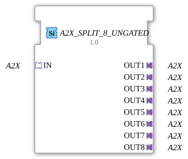

# A2X_SPLIT_8_UNGATED

> ℹ️ **UNGATED-Variante:** Dieser Baustein ist die ungegatete Version von [`A2X_SPLIT_8`](A2X_SPLIT_8.md). Er unterdrückt **keine** unveränderten Wiederholungen – jedes neu berechnete Ergebnis wird bedingungslos weitergegeben, auch ohne Wertänderung. Das ist wichtig für Verbraucher, die eine periodische Kadenz unabhängig von Wertänderung brauchen (z. B. Ableitungs-/Frequenzberechnungen, die sonst nicht gegen Null abklingen). Alle Angaben zu Änderungserkennung/Change-Gating weiter unten auf dieser Seite gelten **nicht** für diesen Baustein.

* * * * * * * * * *

## Einleitung

Der Funktionsblock A2X_SPLIT_8_UNGATED dient als generischer Baustein, um einen eingehenden A2X-Adapter (Socket) auf acht identische A2X-Adapter-Ausgänge (Plugs) zu verteilen. Er wird in der industriellen Automatisierung eingesetzt, wenn ein Signal mehrfach benötigt wird.

## Schnittstellenstruktur

### **Ereignis-Eingänge**

Nicht vorhanden.

### **Ereignis-Ausgänge**

Nicht vorhanden.

### **Daten-Eingänge**

Nicht vorhanden.

### **Daten-Ausgänge**

Nicht vorhanden.

### **Adapter**

Der FB besitzt folgende Adapter-Schnittstellen:

**Socket (Eingang):**

- `IN` (Typ: `adapter::types::unidirectional::A2X`)

**Plugs (Ausgänge):**

- `OUT1` bis `OUT8` (jeweils Typ: `adapter::types::unidirectional::A2X`)

## Funktionsweise

Der FB leitet die über den Socket `IN` empfangenen Daten unverändert an alle acht Plugs `OUT1` bis `OUT8` weiter. Es findet keine Bearbeitung oder Umwandlung der Daten statt. Der FB fungiert als reiner Verteiler (Splitter) für A2X-Adapter.

## Technische Besonderheiten

- Der Baustein ist als generischer FB (GenericClassName: `GEN_A2X_SPLIT`) implementiert, was eine flexible Wiederverwendung in verschiedenen Kontexten ermöglicht.
- Es sind keine Ereignisse oder Datenpunkte vorhanden; die gesamte Kommunikation erfolgt über die A2X-Adapter.
- Der FB ist kompatibel mit der Norm IEC 61499-2.
- Die Ausgänge sind voneinander unabhängig und können einzeln mit anderen FBs verbunden werden.

## Zustandsübersicht

Da der FB weder Ereigniseingänge noch einen Ausführungszustand besitzt, existiert keine Zustandsmaschine. Der FB arbeitet kontinuierlich ohne internen Zustand.

## Anwendungsszenarien

- Verteilung eines Sensorsignals (z. B. Temperatur, Druck) an mehrere Verbraucher oder Steuerungen.
- Parallelschaltung eines Steuersignals an mehrere Aktoren.
- Bereitstellung eines Referenzwertes für mehrere Regelkreise.

## Vergleich mit ähnlichen Bausteinen

- **A2X_SPLIT_2**, **A2X_SPLIT_4**: Bausteine mit geringerer Ausgangsanzahl, die je nach Bedarf eingesetzt werden können.
- **A2X_MERGE**: Führt mehrere A2X-Eingänge zu einem Ausgang zusammen – gegensätzliche Funktion.
- **A2X_SELECT**: Selektiert einen von mehreren A2X-Eingängen, während der Splitter alle Ausgänge gleichzeitig bedient.

- **[`A2X_SPLIT_8`](A2X_SPLIT_8.md)**: Die gegatete Variante – aktualisiert den Ausgang nur bei tatsächlicher Wertänderung.

## Fazit

Der A2X_SPLIT_8_UNGATED ist ein einfacher, aber nützlicher Baustein zur Vervielfältigung von A2X-Signalen in Automatisierungsprojekten. Durch seine generische Auslegung und die klare Trennung von Eingang und Ausgängen bietet er eine saubere und wiederverwendbare Lösung.

---

### 🌐 Passende Themen-Unterseiten auf ms-muc-docs.de

- [🌐 Gesamtwiderstand in Reihen- & Parallelschaltung auf ms-muc-docs.de](https://www.ms-muc-docs.de/elektrotechnik/elektrik/widerstand/widerstand-theorie/gesamtwiderstand-reihen-parallelschaltung/)
