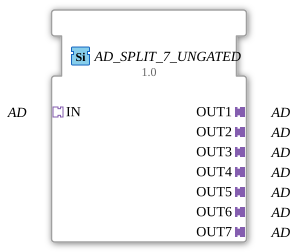

# AD_SPLIT_7_UNGATED

> ℹ️ **UNGATED-Variante:** Dieser Baustein ist die ungegatete Version von [`AD_SPLIT_7`](AD_SPLIT_7.md). Er unterdrückt **keine** unveränderten Wiederholungen – jedes neu berechnete Ergebnis wird bedingungslos weitergegeben, auch ohne Wertänderung. Das ist wichtig für Verbraucher, die eine periodische Kadenz unabhängig von Wertänderung brauchen (z. B. Ableitungs-/Frequenzberechnungen, die sonst nicht gegen Null abklingen). Alle Angaben zu Änderungserkennung/Change-Gating weiter unten auf dieser Seite gelten **nicht** für diesen Baustein.

* * * * * * * * * *

## Einleitung

Der Funktionsblock **AD_SPLIT_7_UNGATED** ist ein generischer Baustein zur Aufteilung eines eingehenden Adapters vom Typ `AD` (unidirektional) auf sieben separate Ausgangsadapter. Er ermöglicht es, ein einzelnes Adaptersignal parallel an mehrere nachfolgende Komponenten weiterzuleiten, ohne die Daten zu verändern oder zu puffern. Der Baustein ist speziell für den Einsatz in der Steuerungstechnik (z. B. Landmaschinen) konzipiert und unterliegt der Eclipse Public License 2.0.

---

## Schnittstellenstruktur

### **Ereignis-Eingänge**

Keine.

### **Ereignis-Ausgänge**

Keine.

### **Daten-Eingänge**

Keine.

### **Daten-Ausgänge**

Keine.

### **Adapter**

| Richtung | Name | Typ | Beschreibung |
| ---------- | ------ | ----- | -------------- |
| Socket (Eingang) | `IN` | `adapter::types::unidirectional::AD` | Empfängt das zu verteilende Adaptersignal. |
| Plug (Ausgang) 1 | `OUT1` | `adapter::types::unidirectional::AD` | Erster Ausgang – identische Kopie des Eingangssignals. |
| Plug (Ausgang) 2 | `OUT2` | `adapter::types::unidirectional::AD` | Zweiter Ausgang. |
| Plug (Ausgang) 3 | `OUT3` | `adapter::types::unidirectional::AD` | Dritter Ausgang. |
| Plug (Ausgang) 4 | `OUT4` | `adapter::types::unidirectional::AD` | Vierter Ausgang. |
| Plug (Ausgang) 5 | `OUT5` | `adapter::types::unidirectional::AD` | Fünfter Ausgang. |
| Plug (Ausgang) 6 | `OUT6` | `adapter::types::unidirectional::AD` | Sechster Ausgang. |
| Plug (Ausgang) 7 | `OUT7` | `adapter::types::unidirectional::AD` | Siebter Ausgang. |

---

## Funktionsweise

Der Baustein leitet das am Socket `IN` anliegende Adaptersignal (Typ `AD`) unverändert an alle sieben Plugs (`OUT1` … `OUT7`) weiter. Es findet keine Datenmanipulation, Synchronisation oder Pufferung statt. Die Ausgänge sind stets zeitgleich und identisch zum Eingang. Der Baustein arbeitet rein datenflussbasiert ohne Ereignisse oder Zustandslogik.

---

## Technische Besonderheiten

- **Generischer Baustein**: Der FB ist als generischer Typ deklariert (GenericClassName = `'GEN_AD_SPLIT'`), was eine Wiederverwendung mit verschiedenen Adapter-Varianten ermöglicht.
- **Unidirektionale Adapter**: Alle verwendeten Adapter sind unidirektional (Richtung vom Socket zu den Plugs).
- **Keine internen Zustände**: Es existiert keine Zustandsmaschine – die Ausgaben werden kontinuierlich aus der Eingabe abgeleitet.
- **Typ-Hash**: Ein leerer TypeHash (`''`) ist gesetzt, kann aber bei Bedarf für Versionskontrolle verwendet werden.

---

## Zustandsübersicht

Der Baustein besitzt keine Zustände oder Zustandsautomaten. Das Verhalten ist rein kombinatorisch: Sobald ein gültiges Signal am Eingang anliegt, wird es sofort auf alle Ausgänge gespiegelt.

---

## Anwendungsszenarien

- **Verteilen von Sensordaten**: Ein einziger Sensor (z. B. Drehzahl, Druck) soll mehrere unabhängige Auswerteeinheiten parallel versorgen.
- **Parallelbetrieb von Aktoren**: Ein Steuersignal wird gleichzeitig an mehrere identische Aktoren (z. B. Ventile, Motoren) weitergegeben.
- **Redundanzaufbau**: Derselbe Datenstrom wird an mehrere redundante Verarbeitungspfade gesendet.
- **Test- und Simulationsumgebungen**: Ein simuliertes Adaptersignal wird auf verschiedene Testmodule aufgeteilt.

---

## Vergleich mit ähnlichen Bausteinen

| Baustein | Anzahl Ausgänge | Besonderheit |
| ---------- | ----------------- | -------------- |
| `AD_SPLIT_2` | 2 | Einfache 1:2-Verteilung |
| `AD_SPLIT_4` | 4 | Typisch für 4‑kanalige Systeme |
| **`AD_SPLIT_7_UNGATED`** | **7** | Erweiterte Verteilung für sieben parallele Pfade |
| `AD_MERGE` | – | Führt mehrere Eingänge zu einem Ausgang zusammen |

Gegensätzlich zu einem Merge-Baustein dient `AD_SPLIT_7_UNGATED` ausschließlich der Vervielfältigung eines Signals ohne Datenkombination.

---

- **[`AD_SPLIT_7_UNGATED`](AD_SPLIT_7_UNGATED.md)**: Ungegatete Variante – aktualisiert den Ausgang bei jedem Durchlauf, auch ohne Wertänderung.

- **[`AD_SPLIT_7`](AD_SPLIT_7.md)**: Die gegatete Variante – aktualisiert den Ausgang nur bei tatsächlicher Wertänderung.

## Änderungserkennung

Dieser Baustein führt **keine** Änderungserkennung durch. Jedes neu berechnete Ergebnis wird bedingungslos auf den Ausgang geschrieben und das zugehörige Adapter-Event gesendet, unabhängig davon, ob sich der Wert gegenüber dem vorherigen Durchlauf geändert hat.

## Fazit

`AD_SPLIT_7_UNGATED` ist ein einfacher, aber nützlicher Baustein zur passiven Signalvervielfachung in adapterbasierten 4diac-Anwendungen. Seine generische Natur und die Unabhängigkeit von Ereignissen machen ihn ideal für reine Datenflussarchitekturen. Für Anwendungen, die eine höhere Anzahl paralleler Ausgänge benötigen, kann der Baustein durch Anpassung des GenericClassName erweitert werden.

---

### 🌐 Passende Themen-Unterseiten auf ms-muc-docs.de

- [🌐 Eclipse 4diac IDE & Farb-Referenz auf ms-muc-docs.de](https://www.ms-muc-docs.de/iec-61499/eclipse-4diac/)
