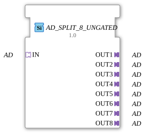

# AD_SPLIT_8_UNGATED

> ℹ️ **UNGATED-Variante:** Dieser Baustein ist die ungegatete Version von [`AD_SPLIT_8`](AD_SPLIT_8.md). Er unterdrückt **keine** unveränderten Wiederholungen – jedes neu berechnete Ergebnis wird bedingungslos weitergegeben, auch ohne Wertänderung. Das ist wichtig für Verbraucher, die eine periodische Kadenz unabhängig von Wertänderung brauchen (z. B. Ableitungs-/Frequenzberechnungen, die sonst nicht gegen Null abklingen). Alle Angaben zu Änderungserkennung/Change-Gating weiter unten auf dieser Seite gelten **nicht** für diesen Baustein.

* * * * * * * * * *

## Einleitung

Der Funktionsblock **AD_SPLIT_8_UNGATED** ist ein generischer Baustein zur Aufteilung eines eingehenden unidirektionalen AD-Adapter-Signals auf acht separate Ausgänge. Er ermöglicht die Verteilung eines analogen oder digitalen Signals an mehrere nachfolgende Komponenten, ohne dass eine Signalveränderung stattfindet.

## Schnittstellenstruktur

### **Ereignis-Eingänge**

Keine

### **Ereignis-Ausgänge**

Keine

### **Daten-Eingänge**

Keine

### **Daten-Ausgänge**

Keine

### **Adapter**

| Richtung | Name | Typ | Beschreibung |
| ---------- | ------ | ----- | -------------- |
| Socket | **IN** | `adapter::types::unidirectional::AD` | Eingangsadapter – aufzuteilendes Signal |
| Plug | **OUT1** | `adapter::types::unidirectional::AD` | Erster Ausgang |
| Plug | **OUT2** | `adapter::types::unidirectional::AD` | Zweiter Ausgang |
| Plug | **OUT3** | `adapter::types::unidirectional::AD` | Dritter Ausgang |
| Plug | **OUT4** | `adapter::types::unidirectional::AD` | Vierter Ausgang |
| Plug | **OUT5** | `adapter::types::unidirectional::AD` | Fünfter Ausgang |
| Plug | **OUT6** | `adapter::types::unidirectional::AD` | Sechster Ausgang |
| Plug | **OUT7** | `adapter::types::unidirectional::AD` | Siebter Ausgang |
| Plug | **OUT8** | `adapter::types::unidirectional::AD` | Achter Ausgang |

## Funktionsweise

Der Baustein leitet das am Socket **IN** anliegende Signal unverändert an alle acht Plugs **OUT1** bis **OUT8** weiter. Es findet keine Signalverarbeitung, Verzögerung oder logische Änderung statt. Die Verteilung erfolgt kontinuierlich und ohne Triggerung durch Ereignisse.

## Technische Besonderheiten

- **Generischer Typ**: Der Adaptertyp `adapter::types::unidirectional::AD` kann je nach Projektdefinition ein beliebiges unidirektionales Signal repräsentieren (z. B. analogen Wert, Byte, Struktur).
- **Keine Ereignissteuerung**: Der FB arbeitet rein datengetrieben (Adapterfluss) – keine INIT-, RSP- oder anderen Ereignisse erforderlich.
- **Kompatibilität**: Erforderliche Import-Deklarationen für `eclipse4diac::core::GenericClassName` und `eclipse4diac::core::TypeHash` sind im CompilerInfo enthalten.
- **Skalierbarkeit**: Durch Anpassung der generischen Parameter können ähnliche Bausteine mit anderer Ausgangsanzahl erstellt werden.

## Zustandsübersicht

Der Funktionsblock besitzt keine Zustandsmaschine (ECC). Er arbeitet statisch und passt sein Ausgangsverhalten nicht an unterschiedliche Betriebsmodi an.

## Anwendungsszenarien

- **Sensorverteilung**: Ein einzelner analoger Sensorwert (z. B. Temperatur) wird an mehrere Steuerungsmodule parallel weitergegeben.
- **Signalbereitstellung für Visualisierung und Regelung**: Das gleiche AD-Signal wird gleichzeitig an eine übergeordnete Steuerung und ein Bedienpanel gesendet.
- **Redundante Datenversorgung**: In sicherheitskritischen Anwendungen kann das Signal auf mehrere unabhängige Pfade aufgeteilt werden.

## Vergleich mit ähnlichen Bausteinen

- **AD_SPLIT_2, AD_SPLIT_4** – Bausteine mit ähnlicher Funktion, aber geringerer Ausgangsanzahl.
- **AD_ROUTER** – Ein Baustein, der das eingehende Signal wahlweise auf einen von mehreren Ausgängen legt (Selektion).
- **AD_MULTIPLEXER** – Fasst mehrere Eingänge zu einem Ausgang zusammen (Gegenrichtung).

Im Gegensatz zu diesen Bausteinen erfolgt bei **AD_SPLIT_8_UNGATED** keine Auswahl – alle Ausgänge erhalten stets das gleiche Signal.

- **[`AD_SPLIT_8`](AD_SPLIT_8.md)**: Die gegatete Variante – aktualisiert den Ausgang nur bei tatsächlicher Wertänderung.

## Änderungserkennung

Dieser Baustein führt **keine** Änderungserkennung durch. Jedes neu berechnete Ergebnis wird bedingungslos auf den Ausgang geschrieben und das zugehörige Adapter-Event gesendet, unabhängig davon, ob sich der Wert gegenüber dem vorherigen Durchlauf geändert hat.

## Fazit

**AD_SPLIT_8_UNGATED** ist ein einfacher, aber essenzieller Funktionsblock in IEC-61499-Systemen, der die Signalverteilung über Adapter-Schnittstellen ohne zusätzliche Logik oder Laufzeitkosten realisiert. Seine generische Natur macht ihn flexibel einsetzbar und erleichtert die modulare Strukturierung von Automatisierungsprojekten.

---

### 🌐 Passende Themen-Unterseiten auf ms-muc-docs.de

- [🌐 Eclipse 4diac IDE & Farb-Referenz auf ms-muc-docs.de](https://www.ms-muc-docs.de/iec-61499/eclipse-4diac/)
