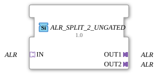

# ALR_SPLIT_2_UNGATED

> ℹ️ **UNGATED-Variante:** Dieser Baustein ist die ungegatete Version von [`ALR_SPLIT_2`](ALR_SPLIT_2.md). Er unterdrückt **keine** unveränderten Wiederholungen – jedes neu berechnete Ergebnis wird bedingungslos weitergegeben, auch ohne Wertänderung. Das ist wichtig für Verbraucher, die eine periodische Kadenz unabhängig von Wertänderung brauchen (z. B. Ableitungs-/Frequenzberechnungen, die sonst nicht gegen Null abklingen). Alle Angaben zu Änderungserkennung/Change-Gating weiter unten auf dieser Seite gelten **nicht** für diesen Baustein.

* * * * * * * * * *

## Einleitung

Der Funktionsblock ALR_SPLIT_2_UNGATED dient zum Aufteilen eines eingehenden ALR-Adapter-Signals in zwei identische Ausgangssignale. Er ist generisch ausgelegt (`GEN_ALR_SPLIT`) und eignet sich für die Verteilung von Alarm- oder Lebenszyklus-Signalen.

## Schnittstellenstruktur

### **Ereignis-Eingänge**

Keine

### **Ereignis-Ausgänge**

Keine

### **Daten-Eingänge**

Keine

### **Daten-Ausgänge**

Keine

### **Adapter**

- **IN** (Socket): Typ `adapter::types::unidirectional::ALR` – Eingangsadapter für das ALR-Signal.
- **OUT1** (Plug): Typ `adapter::types::unidirectional::ALR` – erster Ausgangsadapter.
- **OUT2** (Plug): Typ `adapter::types::unidirectional::ALR` – zweiter Ausgangsadapter.

## Funktionsweise

Der Baustein leitet das über den Socket `IN` empfangene ALR-Signal unverändert an beide Plugs `OUT1` und `OUT2` weiter. Es findet keine Transformation oder Verzögerung statt. Das Signal wird passiv aufgeteilt.

## Technische Besonderheiten

- Der Baustein ist als generischer Funktionsblock implementiert (Attribut `GenericClassName` = `'GEN_ALR_SPLIT'`).
- Verwendet werden unidirektionale Adapter des Typs `ALR`, die nur eine Datenflussrichtung unterstützen.
- Keine internen Timer, Zustände oder Ereignisse – reine Signalverteilung.

## Zustandsübersicht

Der Baustein besitzt keine Zustandsautomaten. Das Verhalten ist ausschließlich durch die Adapterdefinition bestimmt.

## Anwendungsszenarien

- Verteilung eines ALR-Signals (z.B. Alarm, Temperaturgrenzwert) an zwei unterschiedliche Empfänger.
- Als Bestandteil einer Logik, die ein Alarmsignal mehrfach auswerten muss.
- Einsatz in Steuerungssystemen, die ein Signal parallel an zwei Funktionsbausteine weiterleiten.

## Vergleich mit ähnlichen Bausteinen

- **ALR_SPLIT_2_UNGATED** teilt ein ALR-Signal auf zwei Ausgänge; vergleichbar mit Ereignis-Splittern wie `E_SWITCH` oder `E_SPLIT`, jedoch für ALR-Adapter.
- Im Gegensatz zu datenbasierten Splittern (`MUX`, `F_SPLIT`) findet hier keine Datenmanipulation statt.
- Es existieren möglicherweise Varianten mit mehr Ausgängen (z.B. `ALR_SPLIT_4`), die eine höhere Anzahl an Verteilungen erlauben.

- **[`ALR_SPLIT_2`](ALR_SPLIT_2.md)**: Die gegatete Variante – aktualisiert den Ausgang nur bei tatsächlicher Wertänderung.

## Änderungserkennung

Dieser Baustein führt **keine** Änderungserkennung durch. Jedes neu berechnete Ergebnis wird bedingungslos auf den Ausgang geschrieben und das zugehörige Adapter-Event gesendet, unabhängig davon, ob sich der Wert gegenüber dem vorherigen Durchlauf geändert hat.

## Fazit

`ALR_SPLIT_2_UNGATED` ist ein einfacher und effektiver Baustein zur Aufteilung eines eingehenden ALR-Adapter-Signals auf zwei Ausgänge. Aufgrund seiner generischen Natur und der fehlenden Logik eignet er sich ideal für die saubere Signalverteilung in IEC 61499-Systemen.
