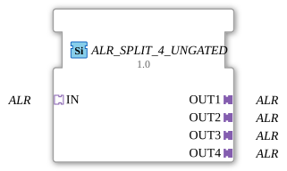

# ALR_SPLIT_4_UNGATED

> ℹ️ **UNGATED-Variante:** Dieser Baustein ist die ungegatete Version von [`ALR_SPLIT_4`](ALR_SPLIT_4.md). Er unterdrückt **keine** unveränderten Wiederholungen – jedes neu berechnete Ergebnis wird bedingungslos weitergegeben, auch ohne Wertänderung. Das ist wichtig für Verbraucher, die eine periodische Kadenz unabhängig von Wertänderung brauchen (z. B. Ableitungs-/Frequenzberechnungen, die sonst nicht gegen Null abklingen). Alle Angaben zu Änderungserkennung/Change-Gating weiter unten auf dieser Seite gelten **nicht** für diesen Baustein.

* * * * * * * * * *

## Einleitung

Der Funktionsbaustein **ALR_SPLIT_4_UNGATED** dient der Aufteilung eines eingehenden ALR-Adapter-Signals auf vier identische Ausgänge. Es handelt sich um einen generischen Baustein (generic FB), der mit verschiedenen ALR-Adaptertypen verwendet werden kann.

## Schnittstellenstruktur

### **Ereignis-Eingänge**

Keine Ereignis-Eingänge vorhanden. Die Ereignissteuerung erfolgt über den Eingangsadapter.

### **Ereignis-Ausgänge**

Keine Ereignis-Ausgänge vorhanden. Ereignisse werden über die Ausgangsadapter weitergeleitet.

### **Daten-Eingänge**

Keine Daten-Eingänge vorhanden. Daten werden über den Eingangsadapter bereitgestellt.

### **Daten-Ausgänge**

Keine Daten-Ausgänge vorhanden. Daten werden über die Ausgangsadapter ausgegeben.

### **Adapter**

- **Socket (Eingang)**:
  - **IN**: Unidirektionaler ALR-Adapter (Typ `adapter::types::unidirectional::ALR`). Nimmt das eingehende Signal auf.
- **Plugs (Ausgänge)**:
  - **OUT1**, **OUT2**, **OUT3**, **OUT4**: Jeweils ein unidirektionaler ALR-Adapter (gleicher Typ). Geben das verteilte Signal aus.

## Funktionsweise

Der Baustein besitzt eine direkte Durchschaltung: Alle am Eingangsadapter **IN** ankommenden Ereignisse und Daten werden unverändert und gleichzeitig an die vier Ausgangsadapter **OUT1** bis **OUT4** weitergegeben. Es findet keine Verarbeitung, Pufferung oder Filterung statt. Der Baustein arbeitet rein kombinatorisch.

## Technische Besonderheiten

- **Generischer Typ**: Der konkrete ALR-Adatper-Typ kann zur Entwurfszeit durch das Attribut `eclipse4diac::core::GenericClassName` festgelegt werden (z. B. `'GEN_ALR_SPLIT'`).
- **Unidirektional**: Die Datenflussrichtung ist fest vom Eingang zu den Ausgängen definiert. Rückwärtige Kommunikation wird nicht unterstützt.
- **Keine Zustandslogik**: Der Baustein enthält keine Ereignisgesteuerte Zustandsmaschine (ECC) und keine zeitlichen Verzögerungen.

## Zustandsübersicht

Der Baustein besitzt keine eigenen Zustände. Die Signalweitergabe erfolgt kontinuierlich und ohne Verzögerung.

## Anwendungsszenarien

- Verteilung eines ALR‑Signals (z. B. Steuerbefehle, Statusmeldungen) an mehrere parallele Module oder Aktoren.
- Erzeugung von Abzweigungen in einer Adapter-basierten Kommunikation, wenn mehrere nachgelagerte Komponenten dieselben Informationen benötigen.
- Einsatz in modularen Automatisierungssystemen, bei denen ein gemeinsames Signal auf mehrere gleichartige Einheiten aufgeteilt werden muss.

## Vergleich mit ähnlichen Bausteinen

- **ALR_SPLIT_2 / ALR_SPLIT_N**: Split-Bausteine mit anderer Anzahl an Ausgängen (z. B. 2 oder 8).
- **Event‑Splitter**: Teilen Ereignisse auf, arbeiten aber auf reiner Event‑Ebene. ALR_SPLIT_4_UNGATED hingegen verteilt komplette Adapter‑Signale (Ereignisse und Daten gekapselt).
- **Daten‑Splitter**: Verteilen einzelne Datenwerte, jedoch ohne Adapter‑Kapselung. ALR_SPLIT_4_UNGATED ist speziell für die Verwendung mit unidirektionalen ALR‑Adaptertypen optimiert.

- **[`ALR_SPLIT_4`](ALR_SPLIT_4.md)**: Die gegatete Variante – aktualisiert den Ausgang nur bei tatsächlicher Wertänderung.

## Änderungserkennung

Dieser Baustein führt **keine** Änderungserkennung durch. Jedes neu berechnete Ergebnis wird bedingungslos auf den Ausgang geschrieben und das zugehörige Adapter-Event gesendet, unabhängig davon, ob sich der Wert gegenüber dem vorherigen Durchlauf geändert hat.

## Fazit

**ALR_SPLIT_4_UNGATED** ist ein einfacher, aber essentieller Baustein zur Vervielfachung von Adapterverbindungen. Seine generische Auslegung ermöglicht den Einsatz mit verschiedenen ALR‑Adaptertypen, ohne dass eine Anpassung der Bausteinlogik erforderlich ist. Er eignet sich besonders für modulare Architekturen, in denen ein Signal parallel an mehrere Empfänger verteilt werden muss.

---

### 🌐 Passende Themen-Unterseiten auf ms-muc-docs.de

- [🌐 Eclipse 4diac IDE & Farb-Referenz auf ms-muc-docs.de](https://www.ms-muc-docs.de/iec-61499/eclipse-4diac/)
