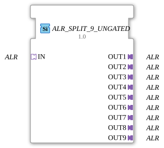

# ALR_SPLIT_9_UNGATED

> ℹ️ **UNGATED-Variante:** Dieser Baustein ist die ungegatete Version von [`ALR_SPLIT_9`](ALR_SPLIT_9.md). Er unterdrückt **keine** unveränderten Wiederholungen – jedes neu berechnete Ergebnis wird bedingungslos weitergegeben, auch ohne Wertänderung. Das ist wichtig für Verbraucher, die eine periodische Kadenz unabhängig von Wertänderung brauchen (z. B. Ableitungs-/Frequenzberechnungen, die sonst nicht gegen Null abklingen). Alle Angaben zu Änderungserkennung/Change-Gating weiter unten auf dieser Seite gelten **nicht** für diesen Baustein.

* * * * * * * * * *

## Einleitung

Der **ALR_SPLIT_9_UNGATED** ist ein generischer Funktionsblock, der ein eingehendes ALR‑Signal (unidirektionaler Adapter) auf genau neun identische Ausgänge verteilt. Er fungiert als 1:9-Splitter für den Adaptertyp `ALR` aus dem Paket `adapter::types::unidirectional`.

## Schnittstellenstruktur

### **Ereignis-Eingänge**

Keine.

### **Ereignis-Ausgänge**

Keine.

### **Daten-Eingänge**

Keine.

### **Daten-Ausgänge**

Keine.

### **Adapter**

| Richtung | Name | Typ |
|----------|------|-----|
| **Socket** | `IN` | `ALR` (unidirectional) – Der Eingang, der auf die neun Ausgänge verteilt wird. |
| **Plug** | `OUT1` … `OUT9` | `ALR` (unidirectional) – Die neun Ausgänge, an denen das eingehende Signal bereitgestellt wird. |

## Funktionsweise

Der Baustein leitet das am Socket `IN` anliegende ALR‑Signal unverändert und ohne Verzögerung an alle neun Plugs (`OUT1` bis `OUT9`) weiter. Es findet keine Verarbeitung, Umwandlung oder Zustandslogik statt – der FB realisiert eine reine Signalverteilung auf der Adapterebene.

## Technische Besonderheiten

- Der FB ist generisch und besitzt die Attribute `GenericClassName` (Wert: `'GEN_ALR_SPLIT'`) sowie `TypeHash`.
- Er verwendet ausschließlich Adapter-Schnittstellen; es sind keine Ereignisse oder Ein-/Ausgangsdaten definiert.
- Da keinerlei Algorithmus oder Zustandsautomat implementiert ist, arbeitet der FB passiv und ressourcenschonend.

## Zustandsübersicht

Der FB besitzt keine Zustandsmaschine, da er keine interne Logik oder Speicherverhalten aufweist.

## Anwendungsszenarien

- **Signalverteilung:** Ein von einer Steuerung erzeugtes ALR‑Ereignis soll gleichzeitig mehrere Aktoren oder Komponenten erreichen.
- **Redundante Ansteuerung:** Mehrere identische Verbraucher müssen das gleiche Ausgangssignal erhalten (z. B. parallele Hydraulikventile in der Landtechnik).
- **Monitoring:** Ein Signal soll ohne Beeinflussung an eine überwachende Einheit und gleichzeitig an den eigentlichen Verbraucher gehen.

## Vergleich mit ähnlichen Bausteinen

- **ALR_SPLIT_4 / ALR_SPLIT_8:** Analoge Bausteine mit anderer Anzahl von Ausgängen.
- **Daten‑Typ‑Splittern (z. B. `SPLIT_INT`):** Diese arbeiten auf Datenebene, während `ALR_SPLIT_9_UNGATED` auf der Adapterebene (Signal‑/Ereignisweitergabe) operiert.
- **Adapter‑Multiplexer/Demultiplexer:** Im Gegensatz zu diesen wählt oder kombiniert `ALR_SPLIT_9_UNGATED` keine Signale, sondern leitet das eingehende Signal ausschließlich 1:9 weiter.

- **[`ALR_SPLIT_9`](ALR_SPLIT_9.md)**: Die gegatete Variante – aktualisiert den Ausgang nur bei tatsächlicher Wertänderung.

## Änderungserkennung

Dieser Baustein führt **keine** Änderungserkennung durch. Jedes neu berechnete Ergebnis wird bedingungslos auf den Ausgang geschrieben und das zugehörige Adapter-Event gesendet, unabhängig davon, ob sich der Wert gegenüber dem vorherigen Durchlauf geändert hat.

## Fazit

Der **ALR_SPLIT_9_UNGATED** ist ein einfacher, aber praktischer Funktionsblock zur Verteilung eines unidirektionalen ALR‑Signals auf neun parallele Pfade. Er ist leicht verständlich, benötigt keine Ressourcen für Logik oder Zustände und lässt sich direkt in Steuerungsprogramme integrieren, die eine Signalvervielfältigung erfordern.
