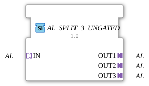

# AL_SPLIT_3_UNGATED

> ℹ️ **UNGATED-Variante:** Dieser Baustein ist die ungegatete Version von [`AL_SPLIT_3`](AL_SPLIT_3.md). Er unterdrückt **keine** unveränderten Wiederholungen – jedes neu berechnete Ergebnis wird bedingungslos weitergegeben, auch ohne Wertänderung. Das ist wichtig für Verbraucher, die eine periodische Kadenz unabhängig von Wertänderung brauchen (z. B. Ableitungs-/Frequenzberechnungen, die sonst nicht gegen Null abklingen). Alle Angaben zu Änderungserkennung/Change-Gating weiter unten auf dieser Seite gelten **nicht** für diesen Baustein.

* * * * * * * * * *

## Einleitung

Der Funktionsblock **AL_SPLIT_3_UNGATED** dient der Aufteilung eines eingehenden unidirektionalen Adapter-Signals (AL – Adapter Label) auf drei gleichartige Ausgangs-Adapter. Er ist als generischer Baustein konzipiert und ermöglicht die mehrfache Weiterleitung eines Adapter-basierten Daten- oder Ereignisflusses innerhalb einer IEC 61499 Anwendung.

## Schnittstellenstruktur

### **Ereignis-Eingänge**

Keine.

### **Ereignis-Ausgänge**

Keine.

### **Daten-Eingänge**

Keine.

### **Daten-Ausgänge**

Keine.

### **Adapter**

| Typ | Name | Richtung | Beschreibung |
| ----- | ------ | ---------- | -------------- |
| `adapter::types::unidirectional::AL` | IN | Socket | Eingangs-Adapter, der das zu verteilende Signal bereitstellt. |
| `adapter::types::unidirectional::AL` | OUT1 | Plug | Erster Ausgangs-Adapter – identische Kopie des Eingangssignals. |
| `adapter::types::unidirectional::AL` | OUT2 | Plug | Zweiter Ausgangs-Adapter – identische Kopie des Eingangssignals. |
| `adapter::types::unidirectional::AL` | OUT3 | Plug | Dritter Ausgangs-Adapter – identische Kopie des Eingangssignals. |

## Funktionsweise

Der FB leitet das am Socket **IN** anliegende unidirektionale Adapter-Signal **unverändert und verzögerungsfrei** an die drei Plugs **OUT1**, **OUT2** und **OUT3** weiter. Es findet keine logische oder zeitliche Manipulation statt – die Verteilung ist rein struktureller Natur. Das Verhalten entspricht einer passiven Verdrahtung („Fan-Out“) auf Adapterebene.

## Technische Besonderheiten

- **Generische Implementierung:** Der Baustein verwendet den generischen Klassennamen `'GEN_AL_SPLIT'`, sodass er für verschiedene Ausprägungen des unidirektionalen AL-Typs wiederverwendet werden kann, solange der konkrete Typ zur Entwurfszeit festgelegt wird.
- **Keine Zustandslogik:** Es existieren keine internen Zustände, Ereignisse oder Datenvariablen. Der FB ist vollständig passiv und benötigt keine aktive Verarbeitung.
- **Keine Laufzeitabhängigkeiten:** Die Funktionalität wird bereits zur Entwurfszeit durch das Verschaltungssystem der 4diac-IDE realisiert.

## Zustandsübersicht

Der FB besitzt **keinen internen Zustand** und keine Zustandsmaschine. Er führt keine sequenziellen Abläufe aus. Das Ausgangssignal ist jederzeit eine direkte Kopie des Eingangssignals.

## Anwendungsszenarien

- **Mehrfachnutzung eines Adapters:** Ein von einer Komponente bereitgestelltes unidirektionales AL-Signal soll an mehrere nachfolgende Funktionsblöcke verteilt werden (z. B. Sensorsignal an verschiedene Auswerteeinheiten).
- **Architektur-Strukturierung:** Aufteilung eines Datenstroms zur parallelen Verarbeitung oder Überwachung, ohne dass die Quellkomponente die Anzahl der Senken kennen muss.
- **Test- und Diagnosezwecke:** Anbinden zusätzlicher Überwachungs- oder Logging-Blöcke an eine bestehende Adapter-Verbindung.

## Vergleich mit ähnlichen Bausteinen

- **Ereignis-basierte Splitter (z. B. E_SPLIT):** Diese teilen Ereignisse auf, während AL_SPLIT_3_UNGATED Adapter-Objekte (komplexe Datenstrukturen) verteilt. Ereignis-Splitter benötigen oft eine Behandlung von Ereignis-Reihenfolgen.
- **Adapter-Merger (z. B. AL_MERGE):** Führen mehrere Adapter-Signale zu einem zusammen – das Gegenteil der hier beschriebenen Funktion.
- **Individuelle AL-Splitter:** Für andere Ausgangsanzahlen (z. B. AL_SPLIT_2, AL_SPLIT_4) existieren ebenfalls generische Varianten, die sich nur in der Anzahl der Plugs unterscheiden.

- **[`AL_SPLIT_3`](AL_SPLIT_3.md)**: Die gegatete Variante – aktualisiert den Ausgang nur bei tatsächlicher Wertänderung.

## Änderungserkennung

Dieser Baustein führt **keine** Änderungserkennung durch. Jedes neu berechnete Ergebnis wird bedingungslos auf den Ausgang geschrieben und das zugehörige Adapter-Event gesendet, unabhängig davon, ob sich der Wert gegenüber dem vorherigen Durchlauf geändert hat.

## Fazit

**AL_SPLIT_3_UNGATED** ist ein einfacher, aber nützlicher generischer Funktionsblock zur Vervielfältigung eines unidirektionalen Adapter-Signals auf drei unabhängige Ausgänge. Aufgrund seiner passiven Natur ist er ressourcenschonend und eignet sich ideal zur flexiblen Gestaltung von IEC 61499 Anwendungen, in denen ein Signal mehrfach benötigt wird, ohne die Quelllogik zu verändern.

---

### 🌐 Passende Themen-Unterseiten auf ms-muc-docs.de

- [🌐 Eclipse 4diac IDE & Farb-Referenz auf ms-muc-docs.de](https://www.ms-muc-docs.de/iec-61499/eclipse-4diac/)
