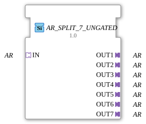

# AR_SPLIT_7_UNGATED

> ℹ️ **UNGATED-Variante:** Dieser Baustein ist die ungegatete Version von [`AR_SPLIT_7`](AR_SPLIT_7.md). Er unterdrückt **keine** unveränderten Wiederholungen – jedes neu berechnete Ergebnis wird bedingungslos weitergegeben, auch ohne Wertänderung. Das ist wichtig für Verbraucher, die eine periodische Kadenz unabhängig von Wertänderung brauchen (z. B. Ableitungs-/Frequenzberechnungen, die sonst nicht gegen Null abklingen). Alle Angaben zu Änderungserkennung/Change-Gating weiter unten auf dieser Seite gelten **nicht** für diesen Baustein.

* * * * * * * * * *

## Einleitung

Der **AR_SPLIT_7_UNGATED** ist ein generischer Funktionsblock, der einen eingehenden AR‑Adapter-Socket (vom Typ `adapter::types::unidirectional::AR`) auf sieben separate AR‑Adapter-Plugs verteilt. Er dient dazu, ein AR‑Signal an bis zu sieben verschiedene Empfänger weiterzuleiten, ohne dass die Daten mehrfach bereitgestellt werden müssen.

## Schnittstellenstruktur

### **Ereignis-Eingänge**

Keine.

### **Ereignis-Ausgänge**

Keine.

### **Daten-Eingänge**

Keine.

### **Daten-Ausgänge**

Keine.

### **Adapter**

| Typ | Name | Richtung | Beschreibung |
|-----|------|----------|--------------|
| `adapter::types::unidirectional::AR` | IN | Socket | Eingehender AR‑Adapter, der auf die sieben Ausgänge verteilt wird. |
| `adapter::types::unidirectional::AR` | OUT1 … OUT7 | Plug | Sieben Ausgabeadapter, an die der eingehende AR‑Adapter unverändert weitergegeben wird. |

## Funktionsweise

Der FB empfängt über den Socket `IN` einen AR‑Adapter. Sobald eine Verbindung zu diesem Socket hergestellt ist, leitet der Baustein den kompletten Adapter – einschließlich aller darin enthaltenen Daten und Ereignisse – an alle sieben Plug‑Adapter (`OUT1` bis `OUT7`) weiter. Es findet keine Transformation, Filterung oder Pufferung der Daten statt; der AR‑Adapter wird **1:1 auf alle Ausgänge gespiegelt**.

Der FB ist als **generischer Baustein** realisiert (siehe Attribut `eclipse4diac::core::GenericClassName = 'GEN_AR_SPLIT'`), sodass er unabhängig von der konkreten Parametrierung des AR‑Adapters arbeitet.

## Technische Besonderheiten

- **Generische Ausführung** – Der FB benötigt keine spezifische Typinformationen des AR‑Adapters; er arbeitet rein über die Adapterschnittstelle.
- **Kein Zustandsautomat** – Der FB besitzt keinen ECC (Execution Control Chart) und ist rein datenflusstechnisch; er reagiert direkt auf Adapterverbindungen.
- **Copyright & Lizenz** – Der Baustein unterliegt der Eclipse Public License 2.0 (EPL‑2.0) und wurde von HR Agrartechnik GmbH bereitgestellt (Version 1.0, 2025‑01‑24).

## Zustandsübersicht

Der FB verfügt über keine Zustandsmaschine (ECC). Die Verteilung erfolgt statisch und ohne Laufzeitlogik.

## Anwendungsszenarien

- **Signalverteilung in Automatisierungssystemen** – Ein Sensor‑ oder Steueradapter (AR) muss mehrere nachgelagerte Bausteine parallel versorgen.
- **Monitor- oder Diagnoseanbindung** – Ein AR‑Signal wird gleichzeitig an einen Steuerungs‑ und einen Überwachungszweig weitergegeben.
- **Test- und Simulationsumgebungen** – Ein Adapter wird an mehrere Test‑ oder Mock‑Bausteine verteilt, ohne die Quelle mehrfach zu instanziieren.

## Vergleich mit ähnlichen Bausteinen

- **AR_SPLIT_2, AR_SPLIT_3, …** – Diese Bausteine bieten die gleiche Funktionalität mit einer unterschiedlichen Anzahl von Ausgängen (2, 3, …). Der `AR_SPLIT_7_UNGATED` ist die Variante mit genau sieben Ausgängen.
- **AR_MERGE** – Ein Zusammenführen mehrerer AR‑Adapter auf einen, also die inverse Operation.
- **AR_COPY** – Oft als dedizierter FB für eine einzelne 1:1‑Verteilung, während `AR_SPLIT_7_UNGATED` mehrere Ausgänge auf einmal bedient.

- **[`AR_SPLIT_7`](AR_SPLIT_7.md)**: Die gegatete Variante – aktualisiert den Ausgang nur bei tatsächlicher Wertänderung.

## Änderungserkennung

Dieser Baustein führt **keine** Änderungserkennung durch. Jedes neu berechnete Ergebnis wird bedingungslos auf den Ausgang geschrieben und das zugehörige Adapter-Event gesendet, unabhängig davon, ob sich der Wert gegenüber dem vorherigen Durchlauf geändert hat.

## Fazit

Der **AR_SPLIT_7_UNGATED** ist ein schlanker, generischer Funktionsblock zur einfachen Verteilung eines AR‑Adapters auf bis zu sieben Zieladapter. Dank seiner generischen Natur ist er ohne Anpassung der Typinformationen sofort einsetzbar und eignet sich besonders für lose gekoppelte, datenflussorientierte Architekturen in der Automatisierungstechnik.

---

### 🌐 Passende Themen-Unterseiten auf ms-muc-docs.de

- [🌐 Eclipse 4diac IDE & Farb-Referenz auf ms-muc-docs.de](https://www.ms-muc-docs.de/iec-61499/eclipse-4diac/)
