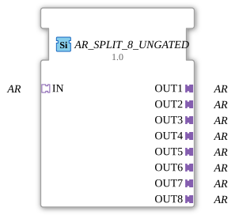

# AR_SPLIT_8_UNGATED

> ℹ️ **UNGATED-Variante:** Dieser Baustein ist die ungegatete Version von [`AR_SPLIT_8`](AR_SPLIT_8.md). Er unterdrückt **keine** unveränderten Wiederholungen – jedes neu berechnete Ergebnis wird bedingungslos weitergegeben, auch ohne Wertänderung. Das ist wichtig für Verbraucher, die eine periodische Kadenz unabhängig von Wertänderung brauchen (z. B. Ableitungs-/Frequenzberechnungen, die sonst nicht gegen Null abklingen). Alle Angaben zu Änderungserkennung/Change-Gating weiter unten auf dieser Seite gelten **nicht** für diesen Baustein.

* * * * * * * * * *

## Einleitung

Der Funktionsblock AR_SPLIT_8_UNGATED dient zur Aufteilung eines einzelnen unidirektionalen AR-Adapter-Signals auf acht identische AR-Ausgänge. Er ist als generischer Baustein implementiert und ermöglicht eine einfache Signalverteilung ohne zusätzliche Logik.

## Schnittstellenstruktur

### **Ereignis-Eingänge**

Keine.

### **Ereignis-Ausgänge**

Keine.

### **Daten-Eingänge**

Keine.

### **Daten-Ausgänge**

Keine.

### **Adapter**

| Bezeichnung | Typ | Richtung |
|-------------|-----|----------|
| **IN** | `adapter::types::unidirectional::AR` | Socket (Eingang) |
| **OUT1** – **OUT8** | `adapter::types::unidirectional::AR` | Plug (Ausgang) |

## Funktionsweise

Der Baustein empfängt über den Socket **IN** die vollständige Schnittstelle eines unidirektionalen AR-Adapters. Die an dieser Schnittstelle anliegenden Ereignisse und Daten werden ohne Verzögerung oder Modifikation auf alle acht Ausgangsadapter (**OUT1** bis **OUT8**) repliziert. Somit kann ein einzelner Daten-/Ereignisstrom parallel an bis zu acht nachgeschaltete Komponenten verteilt werden.

## Technische Besonderheiten

- Der Baustein ist generisch (generic FB) und wird durch das Attribut `eclipse4diac::core::GenericClassName` mit dem Wert `'GEN_AR_SPLIT'` als solcher gekennzeichnet.
- Es ist kein internes Zustandsdiagramm (ECC) vorhanden – die Weiterleitung erfolgt direkt und zu jedem Zeitpunkt zustandslos.
- Die Implementierung ist auf unidirektionale AR‑Adapter ausgelegt; eine Verwendung mit bidirektionalen Adaptern ist nicht vorgesehen.

## Zustandsübersicht

Der Funktionsblock besitzt kein explizites Zustandsdiagramm und arbeitet zustandslos. Die Adapterverteilung erfolgt kontinuierlich, ohne zeitliche Abhängigkeiten oder innere Logik.

## Anwendungsszenarien

- **Verteilung von Steuerungssignalen**: Ein zentraler Steuerungsalgorithmus (z.B. ein PID-Regler) gibt seinen Ausgang über AR an mehrere parallele Aktoren weiter.
- **Broadcast in sternförmigen Anlagenteilen**: Signale von einer übergeordneten Steuerung werden an acht gleichartige Unterstationen verteilt.
- **Test- und Simulationsumgebungen**: Ein Signalgenerator speist mehrere Testobjekte gleichzeitig mit dem gleichen Adaptersignal.

## Vergleich mit ähnlichen Bausteinen

- **AR_SPLIT_2, AR_SPLIT_4**: Analoge Bausteine mit 2 bzw. 4 Ausgängen; AR_SPLIT_8_UNGATED erweitert die Anzahl auf acht Ausgänge.
- **AR_MERGE_X**: Führt mehrere AR-Signale zu einem zusammen – gegensätzliche Funktion.
- **SPLIT_* für andere Adaptertypen**: Es existieren Split-Bausteine für andere unidirektionale bzw. bidirektionale Adapterdefinitionen, die eine ähnliche Aufteilungslogik umsetzen.

- **[`AR_SPLIT_8`](AR_SPLIT_8.md)**: Die gegatete Variante – aktualisiert den Ausgang nur bei tatsächlicher Wertänderung.

## Änderungserkennung

Dieser Baustein führt **keine** Änderungserkennung durch. Jedes neu berechnete Ergebnis wird bedingungslos auf den Ausgang geschrieben und das zugehörige Adapter-Event gesendet, unabhängig davon, ob sich der Wert gegenüber dem vorherigen Durchlauf geändert hat.

## Fazit

Der AR_SPLIT_8_UNGATED ist ein einfacher, aber äußerst nützlicher Baustein zum Verteilen von unidirektionalen AR-Adaptersignalen auf bis zu acht parallele Pfade. Seine generische Implementierung ermöglicht den flexiblen Einsatz in verschiedenen Automatisierungsprojekten, ohne dass zusätzliche Logik zur Signalvervielfachung implementiert werden muss.

---

### 🌐 Passende Themen-Unterseiten auf ms-muc-docs.de

- [🌐 Eclipse 4diac IDE & Farb-Referenz auf ms-muc-docs.de](https://www.ms-muc-docs.de/iec-61499/eclipse-4diac/)
